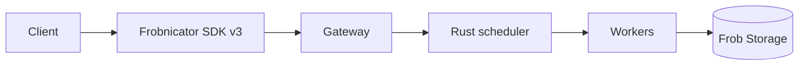

# [BRK000] Example session — how to fill this template

!!! note "이 파일은 예시입니다"
    실제 Build 2026 세션이 아니라 템플릿 사용법을 보여주기 위한 더미 콘텐츠입니다.
    새 세션을 추가할 때 `sessions/_TEMPLATE.md` 를 복사해 사용하세요.

## TL;DR

> Contoso Frobnicator 3.0이 GA로 발표되었고, 기존 v2 대비 처리량이 2배, 비용은 30% 절감됨.

## Why it matters

- 기존 v2 사용 고객은 v3 전환 시 코드 변경 없이 처리량 개선을 얻음.
- 신규 도입 고객에게는 PoC 진입 장벽이 크게 낮아짐 (free tier 제공).
- 단, 일부 리전에서만 GA — 도입 전 리전 가용성 확인 필요.

## Key announcements

| 항목 | 상태 | 날짜 | 비고 |
|------|------|------|------|
| Frobnicator v3 Core | GA | 2026-06-18 | East US, West Europe 우선 |
| Frobnicator SDK 3.0 (Python, .NET) | GA | 2026-06-18 | v2 와 wire-compatible |
| Frobnicator Studio (web UI) | Public Preview | 2026-06-18 | 무료 |
| Frobnicator Enterprise Tier | Roadmap | 2026 Q4 (계획) | private link, BYOK |

## Session summary

### 1. v2 → v3 변경점

- 내부 스케줄러를 Rust로 재작성 → cold start 800ms → 120ms.
- 메시지 포맷은 호환 유지, 단 helper API 일부 deprecate.

### 2. 가격 모델 단순화

- 기존 4개 SKU → Standard / Premium 2개로 통합.
- 측정 단위가 "request" 에서 "processed token" 으로 변경 — 워크로드별 비용 영향 다름.

### 3. 마이그레이션 경로

- Side-by-side 운영 가능. v2/v3가 같은 큐를 공유.
- 공식 마이그레이션 가이드 + `frob migrate` CLI 제공.

## Demo highlights

- ⏱️ 08:12 — v2 → v3 SDK 한 줄 변경 후 처리량 비교 라이브 데모.
- ⏱️ 21:40 — Frobnicator Studio 에서 노코드로 파이프라인 구성.
- ⏱️ 33:05 — 비용 시뮬레이터에서 워크로드별 절감액 추정.

## Architecture / Diagram



## Code & samples

```python
from frobnicator import Client

client = Client.from_env()  # v2 와 동일한 API
result = client.process(payload, model="frob-v3-standard")
print(result.latency_ms)
```

## Caveats / Open questions

- 한국 리전(Korea Central) GA 일정 미공개. 세션 Q&A에서도 답변 보류.
- Enterprise Tier의 private link 지원 범위가 미확정.
- v2의 일부 helper API (`legacy_*`) 는 2027 Q2 종료 예정 — 의존성 점검 필요.

## Resources

- 🎥 Session: <https://example.com/sessions/BRK000>
- 🖼️ Slides: <https://example.com/sessions/BRK000/slides.pdf>
- 💻 GitHub: <https://github.com/example/frobnicator-samples>
- 📚 Docs: <https://learn.microsoft.com/example/frobnicator/v3>

## Notes

> 데모 환경은 발표자 개인 구독에서 시연됨. Korea Central 가용성은 별도 확인 필요.
