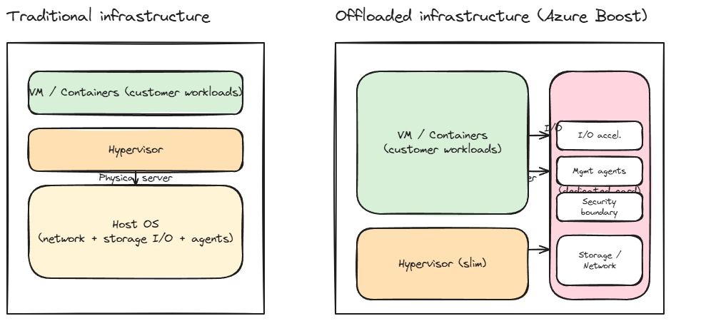
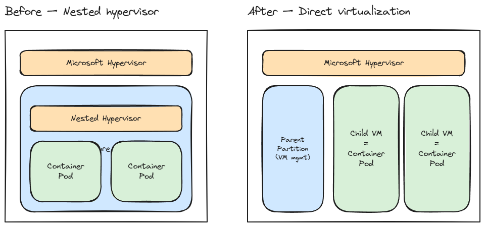
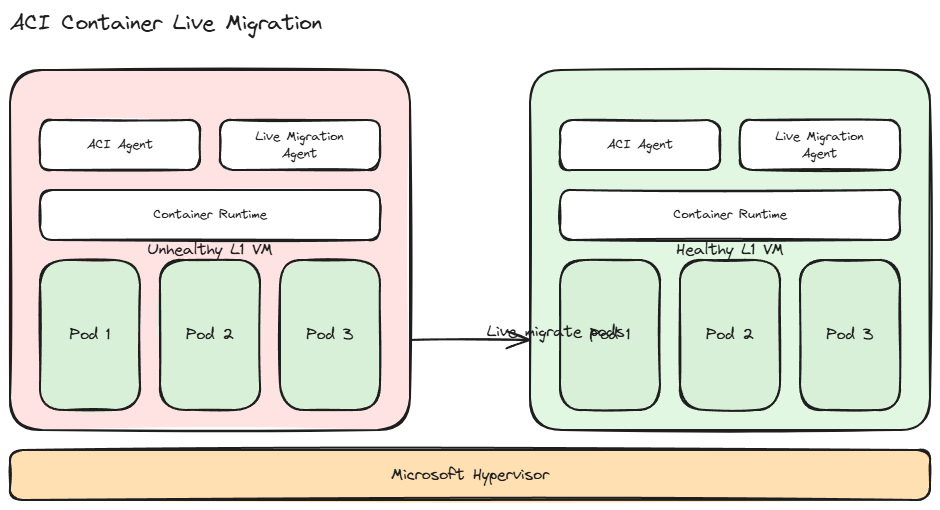
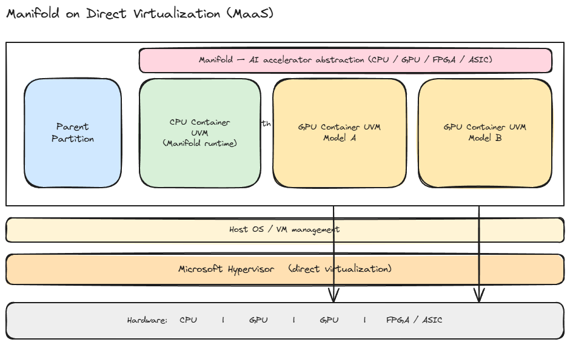
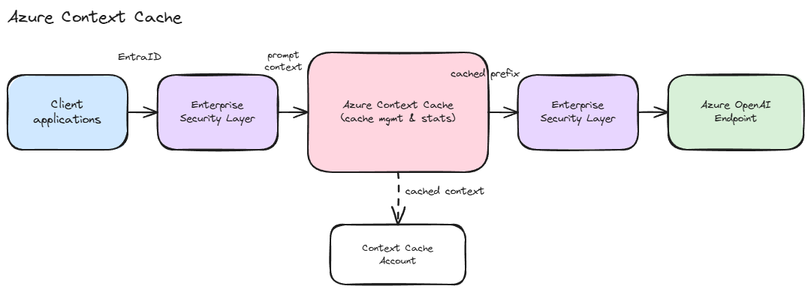
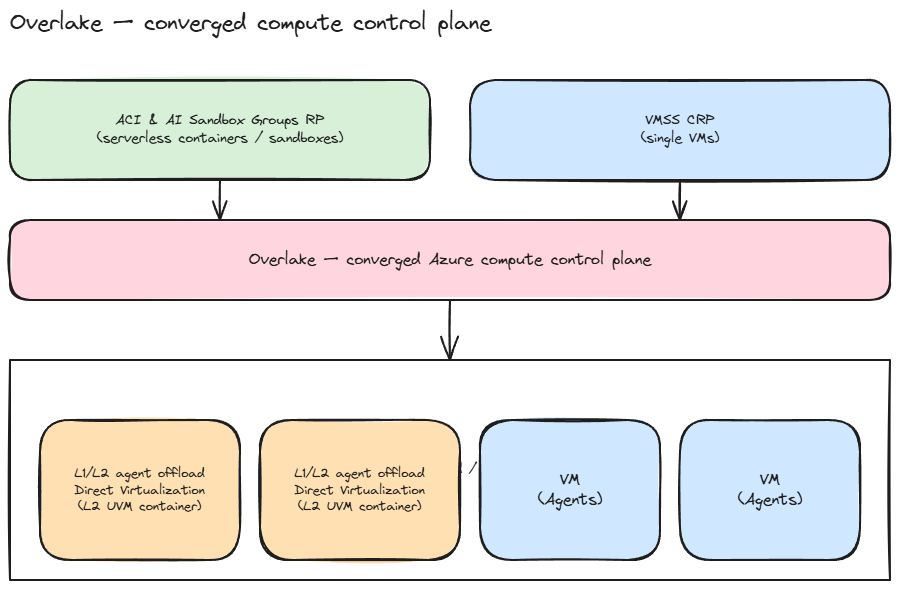
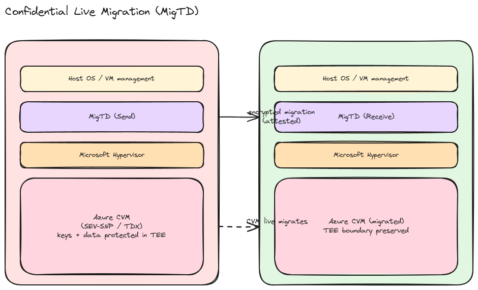
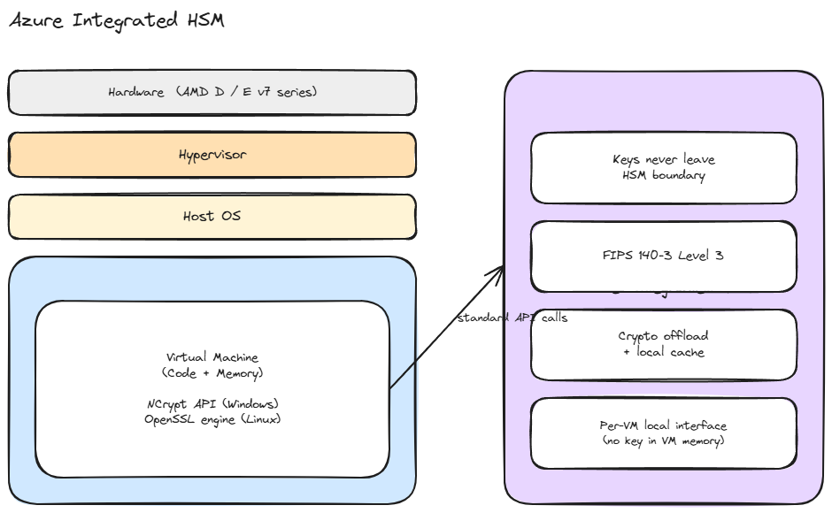
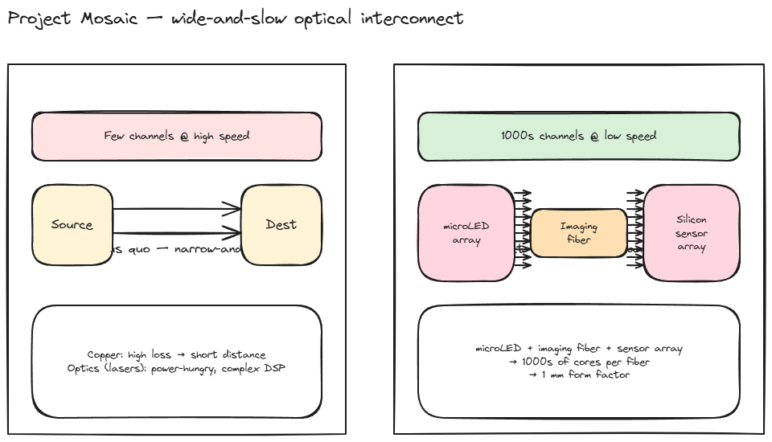

# [BRK226] Inside Azure Innovations with Mark Russinovich

## TL;DR

> Azure 인프라 연례 딥다이브. Fairwater 데이터센터, Azure Boost 확장, Direct Virtualization, Azure Context Cache, Confidential Live Migration, Azure Integrated HSM, Project Mosaic 광 인터커넥트 연구.

## Top highlights

### 1. Azure Boost — 인프라 오프로드가 SKU 기본값으로

[세부 → §1. Fairwater + 오프로드](#sec-boost) · [§4. Guest RDMA / MANA](#sec-mana-rdma)

전통적인 VM은 네트워크·스토리지 I/O와 관리 에이전트를 Host OS에서 처리해 고객 CPU를 잠식해 왔다. Azure Boost는 이 작업을 dedicated card로 들어 옮긴 Microsoft판 IPU/DPU다. AWS가 2017년 Nitro로 먼저 이 방향을 굳혔고, GCP는 Titanium으로 따라붙는 흐름 — Azure도 같은 궤도에 본격 진입했다는 의미다.

올해 핵심은 "Boost가 옵션이 아니라 기본값"이라는 점. 신규 SKU 100%, 기존 fleet 33% 이상이 이미 Boost 기반이고, 한 카드 위에 Guest RDMA, Bare Metal GPU 관리, Confidential Device TDISP, Dual TOR sub-second maintenance까지 묶여 있다. 사실상 Nitro와 동등한 수직 통합 단계에 도달했고, 네트워크 400 Gb/s · 로컬 SSD 36 GB/s / 6.6M IOPS · 원격 디스크 20 GB/s / 1M IOPS로 Build '25 대비 1.4~2× 향상.

Boost와 쌍을 이루는 게 **MANA (Microsoft Azure Network Adapter)** — 게스트가 보는 표준 가상 NIC. 물리 NIC 종류(Mellanox, Intel, 자체 실리콘 등)를 가상화 계층에서 끝까지 감추고, TCP/IP·RDMA·관리 트래픽을 모두 같은 드라이버로 처리한다. AWS가 ENA로 같은 추상화를 먼저 굳힌 것처럼, Azure는 MANA로 fleet 전반의 NIC을 자유롭게 교체·진화시키면서도 게스트 호환성을 깨지 않는 경로를 확보했다.

### 2. Direct Virtualization — nested 가상화의 종료

[세부 → §5. ACI + Direct Virtualization](#sec-direct-virt)

ACI가 process isolation에서 hypervisor isolation(nested)으로 넘어온 게 보안·격리 강화였다면, 이번 Direct Virtualization은 그 위에 쌓인 오버헤드를 정리하는 단계다. nested hypervisor 단계를 제거하고 부모 파티션이 child VM(=컨테이너 포드)을 직접 띄운다. AWS Firecracker가 단일 마이크로VM 모델로 같은 문제를 푼다면, Microsoft는 Windows 하이퍼바이저에 직접 손을 댄 접근이다.

같은 기반을 ACI, Manifold(AI 가속기 추상화), Serverless AI Sandbox가 공유한다. ACI는 이미 Azure OpenAI Code Interpreter, GitHub Actions, Python in Excel, Copilot Tasks, AI Foundry 등 Microsoft 자체 서버리스 워크로드 거의 전부의 백엔드 — 즉 직접 운영하며 검증된 기반 위에 올라간다.

### 3. ACI Container Live Migration — 서버리스의 lifecycle 분리

[세부 → §5. ACI + Direct Virtualization](#sec-direct-virt)

서버리스 컨테이너의 약점은 호스트 lifecycle(패치·하드웨어 장애)이 그대로 워크로드에 노출된다는 점이었다. Kubernetes 진영도 cordon/drain 후 재스케줄 모델로 풀 뿐, 진짜 라이브 마이그레이션은 드물다. Azure는 ACI Agent + Live Migration Agent가 컨테이너 포드 자체를 healthy VM으로 옮기는 방식으로 이 문제를 직접 처리한다. 서버리스 컨테이너에서 호스트 lifecycle을 분리한 첫 production-scale 사례에 가깝다.

### 4. Azure Context Cache + MANA RDMA — AI 워크로드 경제성의 두 레버

[세부 → §7. Azure Context Cache](#sec-context-cache) · [§4. Guest RDMA](#sec-mana-rdma)

LLM 워크로드(특히 코드 리뷰, 에이전트)는 시스템 프롬프트·도구 정의·누적 히스토리가 prefix의 대부분을 차지하고, 매 턴 바뀌는 부분은 일부 tail일 뿐이다. Anthropic의 prompt caching(2024), OpenAI의 prompt caching(2024) 모두 이 패턴을 정조준해 단가를 깎아왔다. **Azure Context Cache**는 이를 Azure OpenAI Endpoint 앞단의 first-class 서비스로 끌어올렸다 — EntraID 인증, Enterprise Security Layer 양방향 적용, Context Cache Account 단위의 캐시 관리/통계 제공.

함께 발표된 **MANA RDMA library**는 #1의 MANA 표준 드라이버에 RDMA 경로를 붙여, 게스트가 표준 RDMA API로 곧장 접근하게 한다. 데모는 prefill VM·decode VM을 RDMA로 직접 묶은 disaggregated 추론 — 지연 2.5× · CPU 2.5× 감소. NVIDIA Dynamo, vLLM 분산 모드가 가야 할 방향과 정확히 일치하고, MANA가 벤더 NIC에 구애받지 않는 추상화이기 때문에 fleet 어디서나 동일 코드로 움직인다.

### 5. Confidential Computing — "쓸 수 있는" 단계로

[세부 → §9. 포트폴리오](#sec-confidential) · [§10. Live Migration](#sec-clm) · [§11. Integrated HSM](#sec-hsm)

지난 몇 년간 기밀 컴퓨팅의 도입 장벽은 (a) 호스트 패치 때 CVM을 종료해야 하는 lifecycle 문제와 (b) HSM 키 관리의 운영 부담이었다. 이번 발표는 두 지점을 동시에 친다.

- **Confidential Live Migration (MigTD)**: 송신/수신 노드에 Migration Trust Domain을 두고 unpatched → patched 노드로 CVM을 라이브 마이그레이션. 기밀성 경계는 유지. CVM lifecycle 운영이 일반 VM 수준에 도달.
- **Azure Integrated HSM**: AMD D/E v7 SKU 내장. FIPS 140-3 Level 3. 키는 VM 메모리에 노출되지 않고 HSM 경계 밖으로도 나가지 않으며, 인터페이스는 Windows NCrypt와 Linux OpenSSL 표준 — 애플리케이션 변경 없이 전환 가능. 클라우드 HSM이 별도 서비스(AWS CloudHSM, Azure Managed HSM)가 아닌 SKU 내장 형태로 가는 흐름.

규제 산업(금융·공공·의료)에서 "기밀 컴퓨팅은 PoC까지는 되는데 운영이 안 된다"는 통념을 깨는 조합.

> 보너스: Project Mosaic은 microLED 어레이 + imaging fiber + 실리콘 카메라 센서 어레이 기반 "wide-and-slow" 광 인터커넥트 연구. 현재 데이터센터 인터커넥트가 "narrow-and-fast"(소수 채널·고속, copper 손실·optics 전력 부담)의 벽에 부딪힌 상황에서 광섬유당 수천 채널 · 1mm 폼팩터로 방향을 바꾸려는 시도. NVIDIA가 NVLink Switch와 silicon photonics에 투자하는 흐름과 같은 문제 의식, 다른 답.

## Why it matters

- VM SKU 성능 기준선 상향 — Boost가 기본
- ACI = Microsoft 자체 AI/Copilot 백엔드 → 안정성 검증
- **Azure Context Cache** — long-context · 에이전트 · RAG 워크로드 단가의 직접 레버. EntraID + Enterprise Security Layer로 엔터프라이즈가 "운영 가능한" 형태로 등장
- Confidential Live Migration + Integrated HSM → 규제 산업 도입 장벽 해소

## Session summary

세그먼트 5개 — Infrastructure → Core → AI → Security → Future.

### 1. Fairwater 데이터센터 + 오프로드 일반화 { #sec-boost }

**Fairwater — AI 학습을 위한 시설 단위 재설계**

범용 워크로드를 가정한 데이터센터로는 AI 학습 클러스터의 전력 밀도·냉각·네트워크 토폴로지를 감당할 수 없다는 게 전제. Fairwater는 이 세 가지를 시설 단위로 다시 잡은 차세대 데이터센터로 소개됐다. 위치·전력·냉각 같은 구체 수치는 본 세션에서 다루지 않고, 별도 인프라 발표 트랙으로 넘김.

**Azure Boost — 오프로드가 SKU 기본값**

기존 VM은 네트워크 I/O, 스토리지 I/O, Azure 관리 에이전트를 모두 Host OS(하이퍼바이저 위 관리 파티션)에서 처리. 이 작업이 고객이 비용을 지불한 CPU·메모리를 잠식했음. Azure Boost는 이 작업 전부를 dedicated card(IPU/DPU)로 옮겨, 호스트 자원을 고객 워크로드 전용으로 돌려준다.

올해 핵심 메시지는 "기본값 전환":

- 신규 SKU의 **100%** 가 Boost 기반
- 기존 fleet의 **33% 이상**이 이미 Boost 위에서 동작
- 결과적으로 같은 SKU 이름이어도 신규 배포는 Boost 성능을 보장

### 2. Bare Metal GPU

AI 학습·HPC 팀이 오랫동안 안고 살아온 딜레마가 있음. 마지막 1–2% 성능까지 쥐어짜려면 베어메탈이 답인데, 그 순간 익숙해진 Azure 운영 도구—VNet, 디스크, 모니터링—가 전부 손에서 빠져나간다. 별도 운영 체계를 새로 떠안는 비용이 성능 이득을 갉아먹는 구조.

이번 Bare Metal GPU 인스턴스는 그 선택을 강요하지 않음. Boost 카드가 관리 평면을 그대로 이어받기 때문에, 고객은 일반 VM과 같은 네트워킹·스토리지·관리 API를 쓰면서 베어메탈 성능을 함께 챙김. 다른 하이퍼스케일러에서는 아직 드문 조합.

### 3. Multipath Reliable Connection (MRC)

데이터센터 네트워크는 지난 10년 동안 2–3 tier Clos 구조로 굳어 있었고, 트래픽이 늘면 tier를 더 쌓아 버티는 방식이었음. 그 결과 전력·케이블·장애 영향 범위가 같이 부풀어 올랐음.

MRC는 이를 2-level multi-path로 단순화 — 평상시 부하 분산과 장애시 회복을 같은 메커니즘으로 처리. tier 수가 줄면 소비전력이 내려가고 장애 회복도 예측 가능해짐.

눈여겨볼 부분은 Microsoft가 이 코드를 **오픈소스로 공개**한다는 점. 자사 fleet 최적화로 끝낼 수 있는 걸 업계 표준으로 밀어보겠다는 시그널. 세션의 한 문장 — *"failure as a normal operating condition"* — 이 설계 철학을 그대로 드러냄. 장애를 예외가 아닌 상수로 두고 설계했다는 뜻.

### 4. Guest RDMA { #sec-mana-rdma }

분산 학습·HPC가 쓰는 RDMA는 지금까지 특수 영역에 가까웠음. 메모리를 네트워크 너머로 직접 꽂게 해주는 대신 특정 NIC 벤더·드라이버에 묶였고, 클라우드에서는 베어메탈이나 일부 SKU에서만 가능. 일반 VM에서 돌리고 싶으면 매번 우회 경로를 설계해야 했음.

이번에 발표된 **MANA RDMA library**는 표준 가상 NIC(MANA) 위에 RDMA 경로를 한 겹 더해, 일반 VM 게스트가 표준 RDMA API로 NIC에 그대로 닿게 함. 하단 NIC이 Mellanox이든 Intel이든 Microsoft 자체 실리콘이든 게스트 코드 관점에서는 동일.

데모는 이 조합이 실제로 무엇을 의미하는지를 보여줬음. prefill VM과 decode VM을 RDMA로 직접 묶은 disaggregated 추론에서 **지연 2.5×, CPU 사용량 2.5×** 감소. NVIDIA Dynamo·vLLM 분산 모드가 가고 있는 방향과 정확히 같은 그림이고, Boost 기반 fleet 어디서나 동일 코드로 굴러감.

### 5. ACI + Direct Virtualization { #sec-direct-virt }

ACI는 원래 프로세스 단위 격리로 시작. 보안 요구가 높아지면서 VM 안에 또 하나의 하이퍼바이저를 끼워 띄우는 nested 모델로 옮겨갔고, 격리는 강해졌으나 그 대가로 cold start 지연과 CPU 오버헤드가 같이 쌓임.

**Direct Virtualization**은 그 중간층을 통째로 들어냄. Windows 하이퍼바이저에 직접 손을 대, 부모 파티션이 컨테이너 포드를 child VM으로 곧장 띄우는 방식. 격리 수준은 그대로 두고 오버헤드만 잘라낼 — AWS Firecracker가 마이크로VM으로 푼 문제를 Microsoft는 OS 내부에서 풀었음.

이 기반 위에 ACI, Manifold(§6), Serverless AI Sandbox(§8)가 모두 올라감.

외부 GA 이전의 기술이지만 신뢰도는 높음. ACI는 이미 Microsoft 자체 AI/Copilot 서비스들—Code Interpreter, GitHub Actions, Python in Excel, Copilot Tasks, AI Foundry—거의 전부를 받치고 있고, 그 위에 이제 컨테이너 라이브 마이그레이션까지 더해짐.

??? example "ACI 내부 사용처 전체 펼쳐보기"

    - Azure Automation, ADX, Azure Deployments, Health Bot
    - Python in Excel, Azure AI Foundry, Browser Automation Tool
    - Copilot Tasks / Cowork, Confidential Ledger
    - Azure OpenAI Code Interpreter, GitHub Actions
    - Graph in Fabric, SQL MI onboarding, Horizon DB Serverless onboarding

**ACI Container Live Migration**

서버리스 컨테이너의 오래된 약점은 호스트의 lifecycle이 그대로 워크로드에 녹아들어온다는 점. 호스트를 패치해야 하면 그 위의 컨테이너도 재시작되고, 하드웨어 장애도 마찬가지. Kubernetes 진영도 보통 cordon/drain 후 재스케줄 모델로 풀 뿐, 진짜로 라이브 마이그레이션을 하는 경우는 드분.

이번에 들어간 ACI Agent + Live Migration Agent는 컨테이너 포드 자체를 healthy VM으로 옮겨서, 고객 입장에서 호스트 패치·장애를 보이지 않게 만들어 줌. 서버리스 컨테이너에서 호스트 lifecycle을 완전히 분리한 production-scale 사례는 아직까지 드분.

### 6. Manifold

모델 운영 팀의 일상은 점점 "이 모델은 이 칩 위에, 저 모델은 저 칩 위에 올리는" 골치 아픈 일이 되고 있음. 공급 제약·가격·세대 교체 때문에 GPU·CPU·FPGA·ASIC이 한 클러스터 안에 섞이고, 그 조합을 운영자가 직접 관리하기에는 변수가 너무 많음.

Manifold는 Azure AI Foundry(MaaS) 아래에 깔리는 **가속기 추상화 레이어**. 이 계층이 칩별 차이를 흡수하고, 위의 운영자는 단일 API로 모델을 올림. 활용률·복원력·장애 시 이전 같은 플랫폼 책임은 Manifold가 가져감.

구조적으로 흥미로운 점은 Direct Virtualization 위에 올라간다는 것. 한 호스트에 parent partition과 CPU UVM, 모델별 GPU UVM이 동시에 떠 있으면서도 각각이 GPU에 직접 접근. nested 오버헤드 없이 멀티 테넌트로 모델을 서빙할 수 있다는 뜻.

### 7. Azure Context Cache { #sec-context-cache }

**워크로드 패턴 — prefix는 안정, tail만 변함**

- 데모: AI Code Reviewer
  - 시스템 프롬프트 ~2.4K 토큰 (고정)
  - 도구 정의·코딩 가이드라인 (고정)
  - 누적 대화 history (느리게 증가)
  - PR diff ~150 토큰 (매 턴 변동)
- 동일 패턴: 에이전트 (tool schema 큼), RAG (system + retrieved chunks), long-context chat
- 매 호출에서 prefix를 다시 토큰화·연산 → 단가의 대부분이 prefix에서 발생

**구조**

- 클라이언트 ↔ **Context Cache** ↔ Azure OpenAI Endpoint
- 인증: EntraID (앱·사용자 단위)
- 입출력 양방향 Enterprise Security Layer 적용 (DLP·콘텐츠 필터 우회 불가)
- 관리/통계: Context Cache Account 단위 (캐시 hit/miss·비용 가시화)

**왜 OpenAI/Anthropic 내장 캐시 대신 Azure Context Cache인가**

| 축 | OpenAI / Anthropic 내장 prompt caching | **Azure Context Cache** |
|----|----------------------------------------|-------------------------|
| 인증 | API key | **EntraID** (앱·사용자 단위 RBAC) |
| 보안 정책 | 모델 호출에만 적용 | **Enterprise Security Layer 양방향** (DLP, 콘텐츠 필터) |
| 거버넌스 | 호출 단위 | **Cache Account 단위** (팀·프로젝트별 격리·통계) |
| 적용 모델 | 해당 벤더 모델 | Azure OpenAI Endpoint 전체 |

→ "엔터프라이즈 사용을 위한 캐시 표준화 레이어". 단순 비용 절감 외에 **누가·어떤 prefix를 캐싱했고 얼마를 썼는지**를 회계·감사 가능한 단위로 묶는 것이 핵심.

**효과**

- 토큰 비용 ↓ — prefix 재과금 회피
- TTFT(Time To First Token) ↓ — prefix 재연산 회피
- 가시성 ↑ — 캐시 hit율·비용을 Account 단위로 추적

**유의 — 슬라이드 미공개**

- 가격 모델 (hit 단가, write 단가 등)
- TTL / eviction 정책
- 지원 모델 범위·리전
- 최소 prefix 토큰 길이

> 사전 평가용으로는 OpenAI/Anthropic 캐시 문서의 단가 절감률(통상 prefix 75~90% 할인)을 시뮬레이션 기준선으로 사용하되, 실측은 Azure 공식 가격 공개 후로 미룰 것.

### 8. ACI Serverless AI Sandbox + Overlake

Azure 안에는 그동안 "VM으로 다루는 세계(VMSS)"와 "서버리스 컨테이너로 다루는 세계(ACI, AKS, Functions)"가 별도의 구조로 나뉘어 있었음. 운영·쿼터·스케줄링·비용 모델도 제각각이어서, AI 에이전트처럼 VM 조각과 샌드박스 컨테이너를 섞어 쓰는 워크로드는 양쪽을 따로 관리해야 했음.

**Overlake**는 그 둘을 하나의 컨트롤 플레인으로 묶는 계층. 그 아래에서 Azure Host가 On-Demand / Spot / Fungible Fleet을 하나의 풀로 운용하고, 공통 기반으로 L1/L2 agent 오프로드와 Direct Virtualization을 쓴다.

사용자 입장에서는 "VM이냐 컨테이너냐"의 경계가 흐릿해지면서, AI 에이전트의 코드·툴 실행 샌드박스가 Azure의 1차 시민 컴퓨트로 올라옴. 같은 관리·비용 모델 위에서 워크로드 형태만 바꿔 끼우면 되는 그림.

### 9. Confidential Computing 포트폴리오 { #sec-confidential }

데이터 보호에서 전송 중(in transit)과 저장(at rest)은 이미 운영 상식. 남은 영역은 메모리에 올라온 **사용 중(in use)** 상태. 이 구간을 하드웨어 root of trust(TEE)로 막는 게 기밀 컴퓨팅이고, 지금까지는 활용 사례가 소수 PoC에 머물러 있었음.

이번 발표의 메시지는 "이제 거의 모든 Azure 데이터 서비스가 기밀 버전을 갖는다"는 것. CVM, AKS 워커 노드, SQL Always Encrypted, ADX, Databricks, PostgreSQL, Whisper 기밀 추론, Clean Rooms까지 — 고객 입장에서는 "별도로 찾아 써야 하는" 옵션에서 "같은 서비스의 기본 선택지 중 하나"로 위치가 바뀌는 단계.

??? example "전체 라인업 펼쳐보기"

    **인프라**

    - DCasv5 / ECasv5
    - DCasv6 / ECasv6 (AMD SEV-SNP)
    - DCesv6 / ECesv6 (Intel TDX)
    - NCCH100v5 (NVIDIA GPU CVM)
    - Azure Integrated HSM

    **컨테이너**

    - Confidential containers on ACI / AKS / ARO
    - Confidential VM AKS worker nodes

    **서비스**

    - SQL Always Encrypted with secure enclaves
    - AVD on CVM, ADX, Confidential Databricks, PostgreSQL
    - Managed HSM, Azure Attestation, Confidential Ledger
    - Batch on CVM, Whisper 기밀 추론, Confidential Clean Rooms

### 10. Confidential Live Migration { #sec-clm }

CVM 도입을 주저하게 만들어온 가장 큰 제약은 "호스트 패치 = VM 종료"라는 점. 메모리에 올라온 암호화 상태를 그대로 다른 호스트로 옮길 방법이 없었기 때문. 이 하나 때문에 월단위 운영 창이 닫히고, 규제 워크로드의 도입 검토가 그 앞에서 멈춰 있는 경우가 적지 않았음.

이번 해법은 송·수신 노드 각각에 MigTD(Migration Trust Domain)를 두고, 그 둘 사이에 암호화된 신뢰 다리를 놓는 방식. unpatched 호스트의 CVM이 patched 호스트로 라이브로 넘어가지만, 고객 입장에서 기밀성 경계는 한 번도 끊기지 않음.

수치보다 의미가 큰 변화. 그동안 "PoC는 되는데 운영이 안 된다"는 평을 들어온 기밀 컴퓨팅이, 일반 VM 수준의 lifecycle 관리 안으로 들어온다는 뜻.

### 11. Azure Integrated HSM { #sec-hsm }

금융·공공·의료에서 HSM은 늘 외부 서비스(Azure Managed HSM, AWS CloudHSM, 온프레미스 어플라이언스)로 분리되어 있었음. 그 결과 키를 한 번 쓸 때마다 네트워크를 타게 되고, 도입 조직은 별도 운영 팀과 고가용성 설계까지 같이 떠안아야 했음.

Azure Integrated HSM은 이 HSM을 아예 **VM SKU(AMD D/E v7)에 내장**. 키는 VM 메모리에 노출되지 않고 HSM 경계 밖으로도 나가지 않으며, FIPS 140-3 Level 3 인증. 도입 관점에서 알고 갈 핵심은 두 가지.

- 인터페이스가 Windows NCrypt API와 Linux OpenSSL 표준 — 기존 키 관리 코드를 거의 손대지 않고 전환 가능
- Crypto offload와 local cache 덕분에 외부 HSM 서비스를 부를 때 생기던 네트워크 왕복 지연이 사라짐

큰 흐름으로 보면 클라우드 HSM이 별도 서비스에서 컴퓨트 SKU의 기본 구성품으로 옮겨가는 중. 키 거버넌스가 워크로드와 한 몸으로 움직이게 되는 그림.

### 12. Project Mosaic

AI 클러스터가 커질수록 노드 간 인터커넥트가 점점 큰 부담. 지금 쓰이는 접근은 "소수의 채널을 더 빠르게(narrow-and-fast)" 밀어붙이는 그림인데, copper는 거리가 조금만 길어져도 신호 손실이 심해지고 optics는 레이저 전력과 DSP 복잡도가 가파르게 올라 한계가 보임.

**Project Mosaic**은 그 방향을 뒤집는 시도. microLED 어레이로 광을 만들고, imaging fiber로 다발째 멀리 보낸 다음, 실리콘 카메라 센서 어레이로 받는 구조. 광섬유 하나에 수천 개의 채널을 천천히(wide-and-slow) 흘려보내는 셈인데, 이 모듈을 1mm 폼팩터에 담은 시제품을 세션에서 직접 시연.

아직 Research 단계라 제품화 일정은 없음. 다만 NVIDIA가 NVLink Switch와 silicon photonics에 계속 투자하며 풀려고 하는 같은 문제—클러스터 인터커넥트의 한계—를 완전히 다른 방향에서 풀어보는 시도라는 점에서 기억해 둘 만함.

## Caveats & open questions

- 공식 GA / Preview 라벨·리전·SKU 슬라이드 미명시 → 제품 페이지 확인 필요
- Azure Boost 400 Gb/s = "speeds up to" 표기 — SKU별 실측 상이 가능
- 다수 신규 제품/코드네임의 외부 노출 범위·가격 정보 미공개

??? note "항목별 세부 미확정 사항"

    - MRC 오픈소스 저장소·라이선스 미공개
    - Direct Virtualization 외부 노출 시점/방식 미정 — 현재는 ACI 백엔드 우선
    - Manifold 외부 API 노출 범위 미확정
    - Azure Context Cache 가격, TTL/eviction 정책, 지원 모델 미공개
    - Confidential Live Migration 지원 CVM 패밀리(SEV-SNP / TDX / GPU CVM) 범위 미명시
    - Azure Integrated HSM GA 일정, 가격 모델 미공개
    - Project Mosaic 제품화 일정·대상 SKU 없음
    - Fairwater 위치·전력·냉각 수치 미공개

## Resources

- 🎥 Session: <https://build.microsoft.com/en-US/sessions/BRK226?source=sessions>
- 🖼️ Slides: (세션 페이지 제공 시 추가)
- 📚 Docs:
  - Azure Boost: <https://learn.microsoft.com/azure/azure-boost/overview>
  - Azure Confidential Computing: <https://learn.microsoft.com/azure/confidential-computing/>
  - Azure Container Instances: <https://learn.microsoft.com/azure/container-instances/>
  - Azure OpenAI Service: <https://learn.microsoft.com/azure/ai-services/openai/>

## About the speaker — Mark Russinovich

- CTO, Deputy CISO, Technical Fellow — Microsoft Azure
- 2014년부터 Azure CTO. Boost / Confidential Computing / ACI / AI 인프라 총괄
- Sysinternals 공동 창업자. 2006년 Microsoft 합류

??? info "상세 프로필 펼쳐보기"

    - 배경: Carnegie Mellon University CS 박사(OS 전공) → IBM Research
    - 1996년 Bryce Cogswell과 Winternals Software / Sysinternals 공동 창업
    - Sysinternals 도구: Process Explorer, Process Monitor, Autoruns, PsTools, ZoomIt — Windows 진단 표준, 현재도 본인 유지보수
    - Microsoft 합류: 2006년 Winternals 인수 → Technical Fellow → Azure CTO(2014–)
    - 저술: 『*Windows Internals*』(공저) 시리즈
    - 소설: 『*Zero Day*』, 『*Trojan Horse*』, 『*Rogue Code*』
    - 매년 Build/Ignite *Inside Azure* 세션 진행
    - 블로그: <https://blogs.technet.microsoft.com/markrussinovich/>
    - X: [@markrussinovich](https://x.com/markrussinovich)
