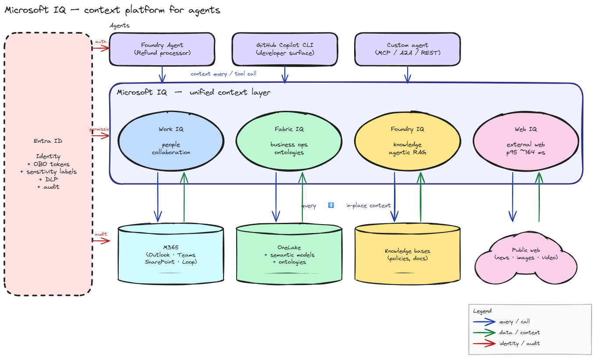
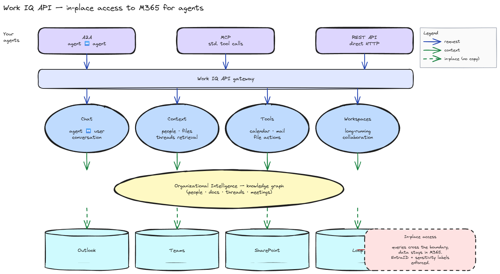
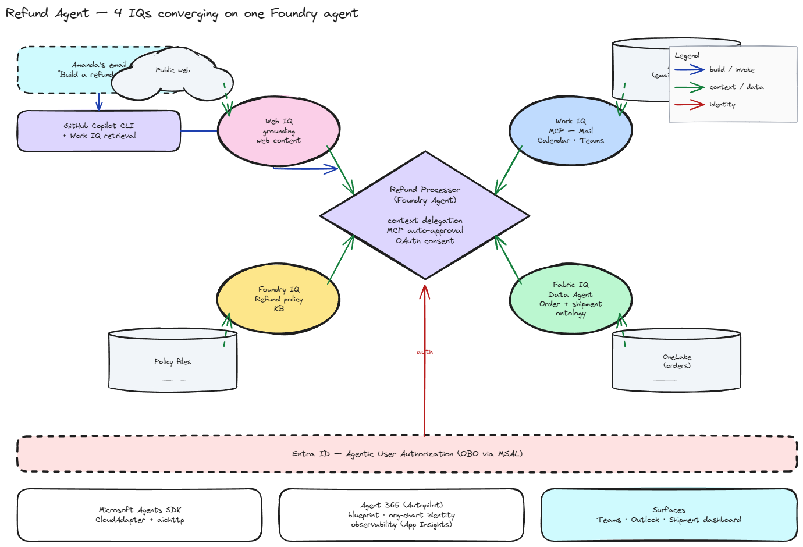

# [BRK240] Build context-aware agents: From data to decisions

## TL;DR

> 에이전트 실패의 본질은 모델이 아니라 **컨텍스트 결핍**. Microsoft IQ는 Work(사람) · Fabric(비즈니스) · Foundry(지식) · Web(외부) 4개 컨텍스트 레이어를 권한·거버넌스가 살아있는 형태로 제공한다.

## Top highlights

### Web IQ — 기존 Bing Grounding을 대체하는 신규 web grounding 계층 { #sec-hl-web-iq }

[세부 → §3. Web IQ](#sec-web-iq)

Work/Fabric/Foundry IQ는 사내 자산을 묶는 레이어인데, 외부 웹은 그동안 **Grounding with Bing Search**(classic Agents의 단일 tool)가 채우고 있었음. Microsoft Foundry Agents Service에서 그 자리를 새 **Web Search tool**(GA, Foundry Agents API)이 대신함 — 세션에서는 이걸 **Web IQ**라는 IQ 평면 위의 외부 컨텍스트 레이어로 부른 것.

오피셜 문서 [Web grounding tools overview](https://learn.microsoft.com/en-us/azure/foundry/agents/how-to/tools/web-overview)와 [Web search tool](https://learn.microsoft.com/en-us/azure/foundry/agents/how-to/tools/web-search) 기준 차이는 다음과 같음.

| 축 | Grounding with Bing Search (classic) | **Web Search tool (= Web IQ surface)** |
|----|--------------------------------------|----------------------------------------|
| 위치 | Foundry Agents (classic) — 2027-03-31 retire 예정 | Foundry Agents Service (GA) |
| Bing 리소스 | 고객이 직접 생성·관리 (Contributor/Owner 역할 필요) | **Microsoft가 관리** — 별도 리소스 불필요 |
| 파라미터 | `count` / `freshness` / `market` / `set_lang` | `user_location` / `search_context_size` (low/medium/high) |
| 지원 모델 | Azure OpenAI + 비-OpenAI Foundry 모델 | Azure OpenAI 모델 |
| Deep Research | 별도 deprecated **Deep Research tool** 필요 | **흡수** — `o3-deep-research` 모델과 함께 web search tool 직접 사용 |
| 도메인 제한 | Bing Custom Search 별도 연결 | 동일 도구 안에서 `custom_search_configuration`로 allow/block 리스트 |
| 컴플라이언스 | "데이터가 Azure 컴플라이언스 바운더리 외부로 흐름" | 동일 (Bing 기반 First Party Consumption Service) |

핵심 차이는 두 가지 — **리소스 관리 부담 제거**(Bing 리소스를 직접 만들 필요 없음)와 **Deep Research 흡수**(별도 tool이 아니라 같은 web search tool + `o3-deep-research` 모델). 세션의 "5개 표면(Web/News/Images/Video/Browse)" 같은 표현은 발표자가 IQ 평면으로 묶어 부른 것이고, 오피셜 docs는 현재 단일 `Web Search` tool로 정리하고 있음 — 향후 docs 갱신 여부 확인 필요.

## Why it matters

- 기존 Bing 기반 web grounding을 쓰던 코드는 **2027-03-31** 이후 동작 안 함 (classic Agents 자체가 retire) — 마이그레이션 일정이 잡힘
- 이전엔 고객이 직접 만들던 **Grounding with Bing Search 리소스**가 사라지고 Microsoft가 관리 → Bing 리소스 운영·키 관리·역할 부여 부담 감소
- Deep Research도 별도 tool에서 web search tool + `o3-deep-research` 모델 조합으로 통합 → 멀티 스텝 외부 조사 패턴이 단일 도구로 정리
- 단, Web Search / Grounding with Bing 모두 **First Party Consumption Service** — 요청이 Azure 컴플라이언스 바운더리 외부로 흘러나가는 성격은 그대로. 규제 워크로드는 별도 평가 필요

## Key announcements

| 항목 | 상태 | 날짜 | 비고 |
|------|------|------|------|
| Work IQ | GA | 2026-06-16 | M365 in-place, Chat/Context/Tools/Workspaces API |
| Foundry IQ | GA (Available today) | — | Agentic RAG engine, 지식베이스, enterprise security |
| Fabric IQ | GA (Available today) | — | OneLake + semantic models + 온톨로지 |
| Web IQ | Limited availability | — | "Available for select Azure customers" |
| Microsoft IQ Platform (umbrella) | Announce | 2026-06 | 4개 IQ 통합 브랜드 |
| Agents League Hackathon | Event | 2026-05-19 ~ 06-14 | Creative / Reasoning / Enterprise 트랙 |

## Session summary

### 1. 문제 정의 — 컨텍스트가 빠진 에이전트는 틀린 결정을 한다 { #sec-problem }

세션은 Amanda가 Microsoft에서의 지난 20년을 돌아보며 시작한다. 메시지는 짧다 — 소프트웨어가 "사람이 쓰는 앱" 에서 "의도로 정의되고 결과로 측정되는 에이전트" 로 바뀌고 있다. 추론·검색·결정·실행을 사용자 대신 한다.

그런데 Gartner는 2027년까지 agentic AI 프로젝트의 40% 이상이 취소될 것으로 본다. 이유는 모델이 약해서가 아니다. **컨텍스트가 흩어져 있어서**다. 개발자가 데이터 소스·권한·메타데이터를 직접 봉합하다 보니 신뢰할 수 없는 에이전트가 양산된다.

같은 보고서가 가리키는 반대편 — 통합된 컨텍스트 레이어를 갖춘 조직은 에이전트 정확도 최대 +80%, 운영 비용 최대 -60%. 즉 컨텍스트가 단순한 인프라 비용이 아니라 ROI의 직접 변수다.

### 2. Microsoft IQ Platform — 4개 컨텍스트 레이어 { #sec-iq-platform }

Microsoft의 답은 컨텍스트를 4개 레이어로 분리해서 묶는 것. 이름은 **Microsoft IQ**.

- **Work IQ** — "직원이 어떻게 일하는가" — 사람, 협업, 워크플로우 (M365)
- **Fabric IQ** — "비즈니스가 어떻게 운영되는가" — 비즈니스 엔티티, 시스템 오브 레코드, 액션 (OneLake)
- **Foundry IQ** — "에이전트가 어떻게 지식을 풀어내는가" — 정책, 권위 있는 문서, 지식베이스
- **Web IQ** — "웹 인텔리전스에 어떻게 연결되는가" — 웹, 뉴스, 이미지, 비디오

핵심은 **분리 + 공통 기반**. 각 레이어는 자기 데이터 소스의 의미·권한·갱신 주기를 가장 잘 안다. 그러나 그 위에서는 동일한 EntraID 인증, 동일한 민감도 라벨, 동일한 거버넌스가 통과한다. 에이전트는 4개 IQ를 "기존 직원이 사내 도구를 가져다 쓰듯" 가져다 쓴다.

### 3. Web IQ — 외부 데이터를 에이전트 속도로 { #sec-web-iq }

Web IQ는 grounding API 묶음이다 — Web, News, Images, Video, Browse. 세션이 강조한 세 축:

- **Quality** — passage-level ranking과 citation-ready 컨텍스트. 측정 지표(GSDAT, grounding satisfaction)에서 일반적으로 수년에 걸쳐 얻는 +3 포인트 격차를 제공한다고 주장.
- **Speed** — p95 지연 ~164 ms (대안 대비 ~2.5×). 멀티 스텝 에이전트 체인에서 sub-200ms는 critical path.
- **Token efficiency** — passage 단위로 정보 밀도를 올려 컨텍스트 토큰을 줄임 → TCO 직접 감소.

도입 사례 — Nasdaq Boardvantage®는 외부 정보를 가져오되 데이터 격리는 엄격해야 했다. Web IQ로 "별도 시스템을 붙이거나 보안을 양보하지 않고" 빠르고 정확한 결과를 얻었다고 인용.

> 주의 — "Available for select Azure customers" 표기. 일반 가용성 시점·리전·가격 정보는 슬라이드에 없음.

### 4. Foundry IQ — 에이전트를 위한 지식 엔진 { #sec-foundry-iq }

Foundry IQ는 세 층으로 구성된다.

- **Knowledge sources** — 앱, 구조화·비구조화 데이터
- **Enterprise context** — 에이전트 메모리, 풍부한 메타데이터, 임베딩
- **Context engineering** — agentic RAG 엔진과 지식베이스 (검색 자체를 에이전트가 한다)

기존 RAG 패턴과의 차이는 "검색이 일회성" 이 아니라는 점이다. agentic retrieval engine이 여러 knowledge base를 가로질러 반복 질의·재구성하고, 그 결과를 정책·권한 컨텍스트로 한 번 더 거른다.

가치 명제는 단순 — **engineering overhead 감소 + 보안 유지**. 자체 RAG 파이프라인(인덱서, retriever, reranker, permission filter)을 짜는 대신 managed로 받는다.

도입 사례 — Sitecore는 마케팅·브랜드 지식을 에이전트마다 따로 다시 구축하던 작업을 Foundry IQ로 합쳤다. permission-aware한 비즈니스 컨텍스트 레이어를 한 번 만들면 모든 에이전트가 공유한다는 그림.

### 5. Fabric IQ — 비즈니스 운영을 에이전트가 이해하게 { #sec-fabric-iq }

Fabric IQ는 OneLake를 데이터 기반으로 두고 그 위에 세 레이어를 쌓는다.

- **Unified data** — OneLake가 on-prem · 모든 클라우드 · 모든 DB/앱/파일을 zero ETL로 통합
- **Business intelligence** — Power BI semantic models. 현재 35M+ 사용자가 정기적으로 사용. 산업 전반이 통합 semantic layer로 가는 흐름의 출발점.
- **Operational intelligence** — Real-time 데이터 + **ontologies** + IQ

핵심은 **온톨로지**. 단순한 스키마가 아니라 비즈니스가 어떻게 동작하는지 — 엔티티(package, customer, order), 관계(belongs to, ships to), 동사(refund, deliver, cancel) — 를 모델링한다. 에이전트는 이 위에서 의미적으로 추론한다.

세션은 두 가지 운영적 장점을 강조한다.

- **Jumpstart** — 20M+ 기존 semantic models를 온톨로지 출발점으로 자동 변환
- **Context delegation** — Fabric Data Agent가 다른 에이전트의 질의를 받아 비즈니스 컨텍스트로 응답. 즉 에이전트가 또 다른 에이전트를 도메인 전문가로 부른다.

도입 사례 — Hanwha Qcells. AI 데이터센터 에너지 관리는 규모·복잡도가 사람만으로 운영할 수 없는 단계. Fabric IQ로 EMS에 agentic AI를 더했다. **데이터센터 온톨로지**가 사람 운영자·데이터 팀·AI 에이전트가 같은 언어로 합의하게 만든다. 에이전트는 권고하고, 최종 결정은 운영자 — human oversight 유지.

### 6. Work IQ — M365 위에서 에이전트가 동료가 된다 { #sec-work-iq }

2026-06-16 GA. 메시지 한 줄 — **에이전트 사용을 위해 새로 설계된 workplace intelligence**.

세 가지 설계 원칙:

- **Optimized for agentic use** — 대용량 에이전트 추론·tool call을 속도·효율·스케일로 처리
- **Comprehensive** — 데이터 전반에 걸쳐 고품질 컨텍스트를 지속적으로 구조화
- **Secure** — 엔터프라이즈 데이터 위에서 **in place**로 동작. 기존 보안·거버넌스 정책을 그대로 사용. 데이터를 복사하지 않는다.

세 번째가 가장 중요하다. "복사 없는" 모델 덕분에 에이전트는 본래 사용자 권한 너머로 갈 수 없다. 별도 권한 인덱스를 다시 만들 필요가 없고, 민감도 라벨·DLP가 그대로 통과한다.

**API 컴포넌트 4개** — Chat / Context / Tools / Workspaces.

- **Chat** — 에이전트와 사용자의 대화
- **Context** — 사람·문서·스레드 retrieval
- **Tools** — 메일, 캘린더, 파일에 대한 action
- **Workspaces** — 장기 실행되는 에이전트 ↔ 사용자 협업 세션

A2A · MCP · REST API 세 가지 표준 인터페이스 모두 제공.

도입 사례 — Miro. Work IQ API로 M365 Copilot 컨텍스트를 Miro 캔버스에 직접 가져온다. 데이터 복사 없이 같은 그림을 양쪽 도구에서 본다. 협업 사일로 제거.

### 7. Refund Agent — 4 IQ가 한 에이전트로 합쳐지는 그림 { #sec-refund }

세션 마지막 데모. 네트워크 장애로 한 번 막혔다가 후반에 성공하면서 보여준 구조.

흐름은 단순하다 — Amanda의 이메일에 "환불 에이전트 만들어줘" 아이디어가 와 있고, Marco가 Copilot CLI를 통해 Work IQ로 그 메일을 끌어와 에이전트 계획을 세운다. 만든 에이전트는 **Foundry Agent**로 등록되고, 4개 IQ를 모두 가져다 쓴다.

| IQ | Refund Processor에서의 역할 |
|----|----------------------------|
| Web IQ | 외부 정책·운송사 정보 grounding |
| Foundry IQ | 환불 정책 문서 KB |
| Fabric IQ | Data Agent로 주문·배송 온톨로지 조회 |
| Work IQ | MCP로 메일·캘린더·Teams 접근 |

권한은 **EntraID 위 Agentic User Authorization** — OBO(On-Behalf-Of) 토큰을 MSAL로 발급. 에이전트가 임의로 권한을 확장할 수 없다.

런타임은 두 갈래.

- **Microsoft Agents SDK** (CloudAdapter + aiohttp) — 에이전트 실행 기반
- **Agent 365 (Autopilot)** — blueprint 템플릿 + 거버넌스 + org chart identity + App Insights 관찰성

표면은 Teams, Outlook 등 M365 + 별도 Shipment 대시보드. 데모 결말 — refund processor가 **자체 Teams identity** 를 가진 채로 메일을 읽고 자율 응답.

### 8. 엔터프라이즈 기반 — 신뢰가 기본값 { #sec-foundation }

세션이 닫히기 전 정리한 세 가지 — 이게 4개 IQ 모두에 공통으로 깔린다.

- **Permission-aware & policy-aligned** — identity·접근 관리, 민감도 라벨·컴플라이언스 정책 강제
- **Agent decisions are fully traceable** — 모든 권고·액션이 공유된 비즈니스 컨텍스트로 역추적
- **Centrally managed governance** — 정책 업데이트가 모든 에이전트·경험에 자동 반영

메시지는 — **더 많은 데이터가 아니라 올바른 컨텍스트를 효율적으로 주는 것**이 미래. identity·보안·거버넌스가 처음부터 박혀 있어야 에이전트 결정이 스케일에서도 설명 가능·준수 가능.

## Demo highlights

- ⏱️ 03:35 — Copilot CLI + Work IQ: Amanda 메일에서 "refund agent" 아이디어 retrieve → 빌드 계획. 네트워크 장애로 초반 막힘.
- ⏱️ 10:01 — Foundry IQ grounding 데모: enterprise 지식으로 응답 보강.
- ⏱️ 16:21 — Fabric IQ + 온톨로지: packages/customers/shipment 의미 정의 → 에이전트가 동사로 추론.
- ⏱️ 26:00 — Fabric Data Agent로 다른 에이전트에 컨텍스트 위임 (context delegation).
- ⏱️ 35:35 — Refund Processor 성공: 자체 Teams identity + EntraID OBO로 메일 자율 응답.

## Architecture / Diagram

본문에 3개 다이어그램 인라인 — `microsoft-iq-platform.png`, `work-iq-api.png`, `refund-agent-architecture.png`.

## Caveats / Open questions

- **Web IQ** — "select Azure customers" 한정. 일반 가용성·리전·가격 미공개.
- Foundry IQ / Fabric IQ "Available today" 표기 — 정확한 GA 라벨·SLA·가격 슬라이드 없음.
- 데모가 라이브 네트워크 장애로 두 차례 중단 — 무대 위 안정성·재시도 패턴 검증 필요.
- 4개 IQ 사이의 호출 단가 모델 (토큰 vs 호출 수 vs 데이터 볼륨) 미공개.
- 온톨로지 모델링 도구·언어·버전 관리 방식 슬라이드 미명시.
- Agent 365 (Autopilot) 거버넌스 정책 표면·관리 API 미공개.

??? note "추가 미확정 사항"

    - Web IQ가 어떤 검색 인덱스·뉴스 소스를 사용하는지 (자체인지 파트너인지) 미공개
    - Fabric IQ 온톨로지가 OWL/RDF 같은 표준에 매핑되는지 미명시
    - Work IQ Workspaces의 동시성·세션 수명 제한 미공개
    - Refund 데모의 OBO 토큰 만료·refresh 정책 미공개

## Resources

- 🎥 Session: <https://build.microsoft.com/en-US/sessions/BRK240?source=sessions>
- 🔗 Microsoft IQ overview: <https://aka.ms/microsoft-iq>
- 💻 GitHub (session code): <https://aka.ms/build26-BRK240>
- 🧪 Hands-on lab: <https://aka.ms/MicrosoftIQLab>
- 💬 Discussions: <https://aka.ms/iq/discussions>
- 🏆 Agents League Hackathon: <https://aka.ms/agentsleague/aisf>
- 📚 Docs:
  - Microsoft Foundry: <https://learn.microsoft.com/azure/ai-foundry/>
  - Microsoft Fabric: <https://learn.microsoft.com/fabric/>
  - Microsoft 365 Copilot: <https://learn.microsoft.com/microsoft-365-copilot/>
  - Web grounding tools overview (Web Search vs Grounding with Bing Search): <https://learn.microsoft.com/en-us/azure/foundry/agents/how-to/tools/web-overview>
  - Web search tool (new, GA): <https://learn.microsoft.com/en-us/azure/foundry/agents/how-to/tools/web-search>
  - Grounding with Bing Search (classic, retiring 2027-03-31): <https://learn.microsoft.com/en-us/azure/foundry-classic/agents/how-to/tools-classic/bing-grounding>

## About the speakers

- **Amanda Silver** — Corporate Vice President, M365 Core & Work IQ, Microsoft. M365 핵심 + Work IQ 책임. Microsoft 20년차.
- **Marco Casalaina** — Vice President, Products and AI Futurist, Core AI, Microsoft. Foundry / Core AI 제품 + AI 미래 전략.

## Notes

> 세션 후반에 라이브 데모가 두 번 막혔다가 최종적으로 refund agent 구동까지 성공. 발표 톤은 "데모 장애 통과하면서도 신시대 알리는" 마무리. 고객 배포 시 데모 시간·실수 자체는 메모에서 제외 가능.
