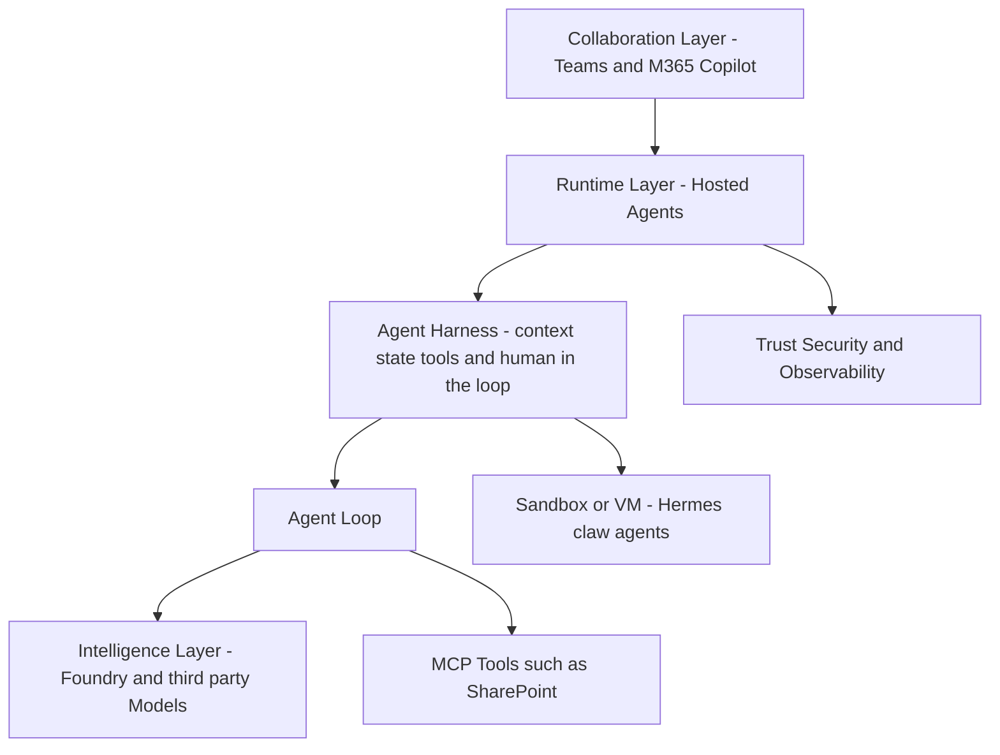

# [BRK243] Claw and agent harness in Microsoft Foundry

## TL;DR

> Microsoft Foundry에서 long-running multi-agent를 운영하기 위한 harness 패턴을 중심으로, hosted agent 아키텍처와 운영(관측/평가)까지 연결해 보여주는 고급 세션이다.

## Top highlights

- Harness를 "agent loop를 감싸는 운영 shell"로 분리해 long-running agent 설계를 체계화한다.
- Hermes claw-style 운영 패턴으로 sandbox/VM 기반 자율 실행·상태 유지·복구 전략을 시연한다.
- Teams/M365 Copilot publish와 observability/continuous eval 연계로 production 운영 흐름을 연결한다.

## Why it matters

- 단일 프롬프트 agent를 넘어, 트리거·상태·파일 접근이 필요한 enterprise workflow를 어떻게 구조화할지 구체적인 설계 기준을 제공한다.
- GitHub Copilot SDK/Claude Agent SDK와 Microsoft Agent Framework를 함께 사용하는 현실적인 통합 경로를 제시해, 기존 팀의 도입 난이도를 낮춘다.

## Key announcements

| 항목 | 상태 | 날짜 | 비고 |
|------|------|------|------|
| BRK243 온디맨드 Breakout 공개 | 공개 | 2026-06-04 | Build 세션 페이지 기준, 45분 |
| Foundry native 지원 범위 소개(트리거/상태관리/파일 접근) | 세션 발표 | 2026-06-04 | About the session에 명시 |
| Agent 운영 항목(Observability + Continuous eval) 연계 강조 | 세션 발표 | 2026-06-04 | About the session에 명시 |

## Session summary

### 1.

세션은 Foundry 기반 multi-agent 시스템을 "agent loop + harness + collaboration surface" 관점으로 설명한다. 핵심 메시지는 지능 자체보다도, long-running 실행과 상태 관리, 도구 접근, 인간 승인 절차를 감싸는 harness 설계가 운영 품질을 좌우한다는 점이다.

### 2.

데모 흐름은 크게 세 가지로 구성된다.

- Claw 계열 패턴(Hermes) 배포: 자율 실행 agent를 sandbox/VM 환경에서 운영하는 방식
- Microsoft Agent Framework로 custom harness 제작: Python/C# 기반 loop/workflow/harness 조합
- Teams/M365 Copilot publish: 협업 환경에서 agent 배포 및 운영 시나리오

또한 세션 설명에서 coding agent(GitHub Copilot SDK, Claude Agent SDK)가 multi-agent workflow에 통합되는 패턴을 명시한다.

## Demo highlights

- ⏱️ 00:08 (세션 페이지 AI Summary 기준) — Hermes 기반 claw-style agent 배포 데모
- ⏱️ 00:21 / 00:26 (세션 페이지 AI Summary 기준) — Agent Framework로 custom harness 구성 및 코드 데모

## Architecture / Diagram

<!-- 필요 시 mermaid 또는 이미지 -->

Mermaid가 렌더되지 않는 환경을 위한 텍스트 다이어그램 (Foundry 3계층 구조):

```text
[Collaboration Layer: Teams / M365 Copilot]
        |
        v
[Runtime Layer: Hosted Agents + Harness]
  - Harness = agent loop를 감싸는 shell
  - context 증가/compaction/enrichment, state, file/tool access
  - human-in-the-loop, lifecycle hooks, multi-agent orchestration
        |
        v
[Agent Loop] --> [Intelligence Layer: Foundry / OpenAI / Anthropic / Gemini Models]
        |       --> [MCP Tools (e.g., SharePoint)]
        v
[Sandbox / VM Execution: Hermes claw-style agents]

(전 계층 공통 기반) [Trust / Security / Observability / Continuous Evals]
```



## Code & samples

<!-- 핵심 스니펫이 있다면 -->

세션은 코드 샘플과 리소스 링크를 제공하며, 실무에서는 아래 순서로 PoC를 권장한다.

1. 단일 업무 시나리오를 대상으로 harness 책임(트리거/상태/승인)을 먼저 분리
2. Agent Framework로 최소 loop를 구현한 뒤 MCP 도구를 점진적으로 연결
3. Foundry 운영 단계에서 관측 지표와 continuous eval을 배포 파이프라인에 포함

## Caveats / Open questions

- AI Summary 기반 타임스탬프/용어(예: Autopilot agents)는 공식 제품 문서에서 기능 가용성/제한사항을 별도 확인해야 한다.
- 세션은 개념/데모 중심이므로, 권한 경계·비용 가드레일·장기 상태 복구 정책은 조직 표준으로 보강이 필요하다.

## Customer takeaways

- [ ] 우리 시나리오에서 "agent logic"와 "harness responsibilities"를 분리해 아키텍처를 정의했다.
- [ ] 배포 전 체크리스트에 observability, continuous eval, human-in-the-loop 승인 경로를 포함했다.

## Resources

- 🎥 Session: https://build.microsoft.com/en-US/sessions/BRK243?source=sessions
- 🖼️ Slides: https://medius.microsoft.com/video/asset/PPT/ce857844-2448-482c-a66b-efa81e214b35?referrer=Microsoft+Build-%2Fen-US%2Fsessions%2FBRK243&mhid=build&loc=en-us
- 💻 GitHub: https://aka.ms/build26/BRK243
- 📚 Docs: https://build.microsoft.com/en-US/sessions/BRK243

## About the speakers

- Glenn Condron - Builder, Microsoft
- Amanda Foster - Product Manager, Microsoft
- Shawn Henry - Product Manager, Microsoft

## Notes

<!-- 내부 메모. 고객 배포 시 제거 가능 -->

- 근거 출처: Build 세션 페이지 About the session, speaker metadata, session tags, resources.
- 타임스탬프/세부 흐름은 세션 페이지 AI Summary를 보조 근거로 사용했다.