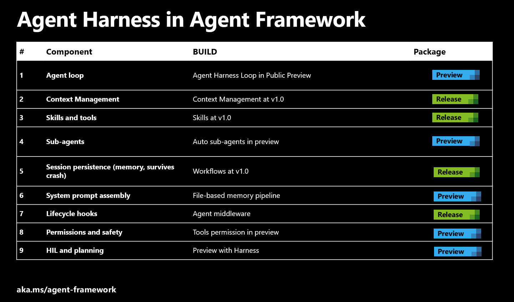
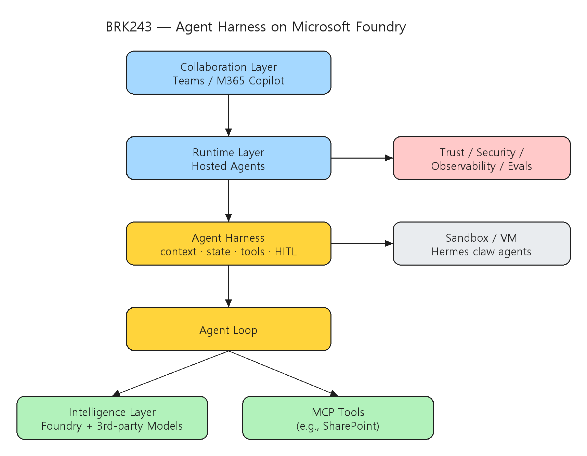
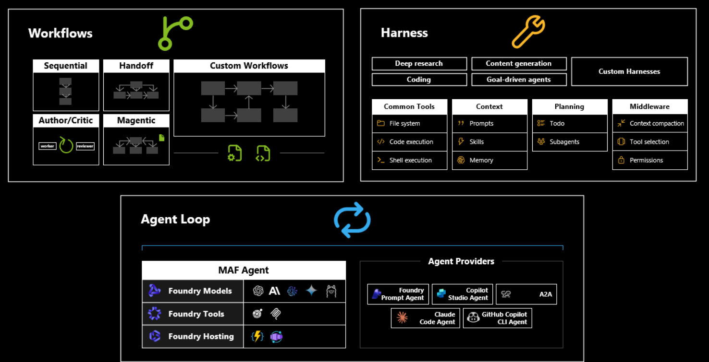

# [BRK243] Claw and agent harness in Microsoft Foundry

## TL;DR

> Foundry Agent Service의 **Hosted agents**(public preview) 위에서 long-running·multi-agent를 운영하는 **harness** 패턴을 다룬 Day 2 expert(L400) 세션. 핵심을 세 갈래로 묶으면:
>
> - **개념** — agent loop(=엔진)를 감싸는 **harness**(=차체)가 context 압축·도구 접근·메모리·human-in-the-loop·lifecycle를 책임진다
> - **off-the-shelf harness** — claw 계열 **Hermes**를 sandbox/VM에 자율 실행, Slack/Telegram로 상시 소통, SharePoint를 MCP로 연결, "routines"로 자가 유지보수
> - **custom harness** — Microsoft Agent Framework(Python/C#)로 loop+workflow+harness를 직접 조립, OpenAI·Anthropic·Gemini 모델 혼용, AG-UI/Copilot Kit로 표면화, Foundry로 배포 후 관측·평가
>
> 마무리는 **Autopilot agents** — 자체 user identity로 메일·문서·그룹챗에 자율 참여하는 협업 에이전트.

## Top highlights

### 1. Harness = agent loop를 감싸는 운영 셸 { #sec-hl-harness }

[세부 → §2. Harness의 정의](#sec-harness)

세션의 중심 비유는 "harness는 차체, agent loop는 모터"다. agent loop는 context 처리 → 도구 실행 → 응답 정제를 목표 달성까지 반복하는 핵심 지능이고, harness는 그 바깥에서 **context 성장·compaction·enrichment**, 파일시스템·코드 실행 같은 컴퓨터 도구 접근, **세션 간 메모리**, lifecycle hook, 위험 작업의 **human-in-the-loop 승인**을 담당한다. 단일 프롬프트 에이전트와 long-running 에이전트를 가르는 지점이 바로 이 harness 계층이라는 게 메시지.

이는 추상 개념이 아니라 [Foundry Agent Service의 Hosted agents](https://learn.microsoft.com/en-us/azure/ai-foundry/agents/concepts/hosted-agents)로 제품화돼 있다 — per-session **VM-isolated sandbox**, `$HOME`·`/files` 영속 상태, 15분 idle 후 scale-to-zero + 상태 자동 복원, 에이전트별 전용 Entra identity. harness가 떠안던 "containerization·웹서버·보안·메모리·스케일·계측·롤백"을 managed로 흡수한 형태.

### 2. Hermes — claw-style 자율 에이전트의 off-the-shelf harness { #sec-hl-hermes }

[세부 → §3. Hermes 데모](#sec-hermes)

Glenn의 데모(00:08:01)는 **Hermes**를 Foundry-hosted agent 위에서 돌린다. 메모리·도구·자율성을 묶어 sandbox/VM에서 상시 동작하고, Slack/Telegram으로 사람과 계속 소통하며, Azure credential + Foundry model로 인증, SharePoint를 MCP로 연결한다. 특징은 **"routines"**(00:13:55) — skill 관리·백업 같은 자동 유지보수 작업으로, 에이전트가 계속 켜져 있지 않아도 스스로를 유지한다. 단, 각 인스턴스가 고유 sandbox를 만들어 "쓸수록 좋아지지만 상태 복구 전략이 필요"하다는 점을 분명히 짚는다 — autonomy ↔ cost ↔ resilience의 trade-off.

### 3. Custom harness(Agent Framework) → 배포 → 관측·평가 → 협업 { #sec-hl-custom }

[세부 → §4. Agent Framework](#sec-maf) · [§5. Autopilot](#sec-autopilot)

직접 만들고 싶다면 **Microsoft Agent Framework**(Python/C#)가 loop·workflow·harness 3요소를 제공한다. loop는 Foundry·OpenAI·Anthropic·Gemini 모델을 끼우고, workflow는 멀티 에이전트 시퀀싱/감독 계획을, harness는 파일 접근·코드 실행·context 관리·planning 공통 도구를 더한다. 만든 에이전트는 AG-UI/Copilot Kit로 표면화하거나 Foundry에 배포해 모니터링·평가를 받는다. 마지막으로 **Autopilot agents**는 자체 user identity로 메일 전송·문서 관리·그룹챗 참여까지 하는 — 사람 계정에 한정됐던 행위를 수행하는 — 새 세대 협업 에이전트.

## Why it matters

- 단일 프롬프트 에이전트를 넘어 **트리거·상태·파일 접근**이 필요한 enterprise workflow를 어디서 끊어 설계할지(=harness 책임 분리)에 대한 구체 기준을 준다.
- Hosted agents가 **GitHub Copilot SDK·Anthropic Agent SDK·LangGraph·OpenAI Agents SDK** 등 어떤 프레임워크로 짠 코드든 컨테이너로 받아 돌린다 → 기존 coding agent 자산을 그대로 multi-agent workflow에 편입 가능.
- **세션당 격리 + 상태 영속 + scale-to-zero** 모델은 long-running 에이전트의 비용 곡선을 "활성 세션 시간"으로 정렬한다(=idle 시 과금 중단). 단 동시 세션 수가 비용·쿼터의 직접 변수.
- 에이전트별 **전용 Entra identity** + OBO 흐름으로 "에이전트가 누구 권한으로 무엇을 했는가"가 감사 가능 — 거버넌스가 런타임에 내장.

## Customer scenarios

- 트리거·상태·파일 접근이 필요한 장기 실행 업무(야간 배치 리서치, 티켓 자동 분류, 반복 운영 작업)를 agent loop와 harness로 분리하고, Hosted agents의 `$HOME`/`/files` 영속 세션에 상태를 둔다.
- 이미 GitHub Copilot SDK / Anthropic Agent SDK / LangGraph로 만든 coding agent를 컨테이너화해 Foundry에 올리고, Agent Framework workflow로 묶어 multi-agent 시스템으로 확장한다.
- 사람 손이 필요한 협업(온보딩 진행, 그룹챗 관리)을 **Autopilot agent**에 위임하되, 자체 Teams identity + Entra 권한 경계 안에서만 동작하도록 둔다.

## Key announcements

| 항목 | 상태 | 비고 |
|------|------|------|
| **Hosted agents** (Foundry Agent Service) | Public Preview | 컨테이너 에이전트를 managed로 호스팅 — per-session VM sandbox, `$HOME`/`/files` 영속, 전용 Entra identity, 자동 스케일·관측. Agent Framework·LangGraph·OpenAI Agents SDK·Anthropic Agent SDK·**GitHub Copilot SDK**·custom code 지원 ([docs](https://learn.microsoft.com/en-us/azure/ai-foundry/agents/concepts/hosted-agents)) |
| **Microsoft Agent Framework** harness/loop/workflow | 발표 (Python·C#) | loop+workflow+harness 3요소, Foundry/OpenAI/Anthropic/Gemini 모델 혼용, AG-UI·Copilot Kit 표면화 ([repo](https://github.com/microsoft/agent-framework)) |
| **Autopilot agents** | 세션 데모 | 자체 user identity로 메일·문서·그룹챗에 자율 참여하는 협업 에이전트 (가용 범위 미공개) |
| **Hermes** (claw-style harness) | 데모 | off-the-shelf 자율 에이전트 harness — sandbox/VM 실행, Slack/Telegram 소통, MCP 연결, "routines" 자가 유지보수 |

!!! preview "Public Preview · Hosted agents"
    Hosted agents는 Foundry Agent Service의 **public preview** 기능. preview 기간 동안 활성 동시 세션 기본 쿼터 50(구독·리전별, Support로 조정), 세션 idle timeout 15분 / 비활성 30일 후 영구 삭제, 컨테이너 레지스트리(ACR)는 현재 **public endpoint 필수** 등 제약이 있으므로 production 적용 전 [공식 limitations](https://learn.microsoft.com/en-us/azure/ai-foundry/agents/concepts/hosted-agents) 확인 필요.

## Session summary

발표는 Foundry 계층 구조 소개 → harness 정의 → Hermes(off-the-shelf) → Agent Framework(custom) → 협업/Autopilot → 마무리 순으로 진행. 진행자는 Shawn Henry(세션 AI summary는 "Sean"으로 표기), Glenn Condron, Amanda Foster.

### 1. Foundry 계층 구조 { #sec-layers }

도입부(00:00)에서 Foundry를 3계층으로 정리한다 — **Intelligence layer**(사용할 모델), **Runtime layer**(에이전트 호스팅·관리), **Human–agent collaboration layer**(Teams·M365 Copilot 통합). 그 아래 전 계층 공통으로 trust·security·observability 기반이 깔린다. 이 세션은 runtime과 collaboration에 집중하고, 단순 프롬프트 에이전트 너머의 고급 배포를 다룬다고 예고.

### 2. Harness의 정의 — agent loop를 감싸는 셸 { #sec-harness }

00:03:39, Shawn이 **agent harness**를 "에이전트를 둘러싼 바깥 셸 / 플랫폼 계층"으로 정의한다. 비유는 모터(=agent loop)를 품은 차체. agent loop는 목표 달성까지 context 처리 → 도구 실행 → 응답 정제를 반복하고, harness는 그 위에서 다음을 책임진다.

- **context 관리** — 성장·compaction·enrichment를 prompt·skill·message로 처리
- **컴퓨터 도구 접근** — 파일시스템, 코드 실행 환경 → 사람 같은 작업 수행
- **오케스트레이션** — 특화 에이전트 조율, 세션 간 메모리 관리
- **lifecycle hook** — 통합 지점
- **human-in-the-loop** — 위험 작업에 대한 사람 감독

이 계층이 robust·extensible 에이전트 설계의 토대이고, 이후 데모가 모두 이 골격 위에 올라간다.

### 3. Hermes 데모 — claw-style 자율 에이전트 { #sec-hermes }

00:08:01, Glenn이 **Hermes**를 배포한다. claw 계열 아키텍처로, 메모리·도구·autonomy를 통합해 sandbox/VM에서 상시 동작하며 Slack·Telegram으로 사람과 계속 소통한다. 백엔드는 Foundry-hosted agent(Azure credential + Foundry model). MCP 도구로 SharePoint에 연결하는 모습을 시연.

핵심 개념은 **"routines"**(00:13:55) — skill 관리·백업 같은 자동 유지보수 작업으로, 에이전트가 계속 켜져 있지 않아도 스스로를 유지한다. Glenn은 에이전트 state와 sandbox 영속성의 중요성을 강조하며, 각 Hermes 인스턴스가 고유 환경을 만들어 "쓸수록 개선되지만 신중한 상태 복구 전략이 필요"함을 짚는다. claw-style 에이전트를 스케일에서 운영할 때의 **autonomy ↔ cost optimization ↔ resilience** 균형이 주제.

> Hosted agents의 세션 모델이 이를 그대로 뒷받침한다 — `$HOME`/`/files`가 15분 idle 후 compute 해제 시 persist되고, 동일 세션 재참조 시 새 compute에 자동 복원. 세션당 디스크 예산은 1 vCPU 이상에서 최대 20 GiB(약 20%는 시스템 예약).

### 4. Microsoft Agent Framework — custom harness 만들기 { #sec-maf }

00:21:21, **Microsoft Agent Framework**(Python·C#)로 직접 harness를 만드는 흐름. 3요소로 구성된다.

- **agent loop** — Foundry 모델 + 도구는 물론 OpenAI·Anthropic·Gemini 같은 서드파티 provider도 연결
- **workflow** — 멀티 에이전트 시스템. 업무 시퀀싱 또는 supervisory planning
- **harness** — 파일 접근·코드 실행·context 관리·planning 공통 도구

00:26:05 코딩 데모에서 에이전트에 harness를 감싸고 capability를 커스터마이즈한 뒤 console UI로 동작을 시각화하는 과정을 보여준다. 배포 옵션도 다양 — **AG-UI** 통합으로 GUI에서 실행, **Copilot Kit** 인터페이스로 인터랙티브 데이터 시각화 연결, 또는 Foundry에 직접 배포해 모니터링·평가 도구로 성능을 추적. Foundry의 유연성과 개발자 제어가 이 구간의 메시지.

세션 슬라이드는 Agent Framework의 harness 구성요소별 성숙도(Build 기준)를 정리한다 — 9개 중 Context Management·Skills·Workflows·Lifecycle hooks가 v1.0(Release), 나머지(Agent loop·Sub-agents·System prompt assembly·Permissions·HIL/planning)는 Preview:

| # | Component | BUILD | Package |
|---|---|---|---|
| 1 | Agent loop | Agent Harness Loop in Public Preview | Preview |
| 2 | Context Management | Context Management at v1.0 | Release |
| 3 | Skills and tools | Skills at v1.0 | Release |
| 4 | Sub-agents | Auto sub-agents in preview | Preview |
| 5 | Session persistence (memory, survives crash) | Workflows at v1.0 | Release |
| 6 | System prompt assembly | File-based memory pipeline | Preview |
| 7 | Lifecycle hooks | Agent middleware | Release |
| 8 | Permissions and safety | Tools permission in preview | Preview |
| 9 | HIL and planning | Preview with Harness | Preview |

> 참조: [aka.ms/agent-framework](https://aka.ms/agent-framework) (슬라이드 footer)

### 5. 인간 협업과 Autopilot agents { #sec-autopilot }

00:35:01, Amanda가 협업 환경에서의 에이전트로 전환. Foundry는 에이전트를 Teams·M365 Copilot에 **원클릭으로 publish**해 조직 전체에 공유한다. 이어 00:39:46, **Autopilot agents** — 자체 user identity를 가진 새 세대 — 를 소개한다. 메일 전송·문서 관리·독립 행위 등 전통적으로 사람 계정에만 허용되던 작업을 수행한다. 데모 샘플 "work stream manager"는 온보딩·접근 제어·그룹챗 행동을 처리하며, 허용된 사용자에게 지능적으로 응답하고 진행 중 논의를 관리한다.

### 6. 마무리 { #sec-wrap }

00:44:03, Shawn이 세 데모(Hermes off-the-shelf harness, Agent Framework custom harness, Foundry publish)를 요약하고, GitHub 코드 샘플과 진행 중인 **Agents League Hackathon**(00:45:00)을 안내. Foundry 부스 방문과 후속 프로젝트 아이디어 공유를 독려하며 닫는다.

## Architecture

Foundry 3계층 — Collaboration(Teams·M365 Copilot) → Runtime + Harness → Agent Loop, 그리고 Intelligence/MCP Tools와 Sandbox(Hermes claw), 전 계층 공통의 Trust·Observability:

세션 슬라이드 기준 Microsoft Agent Framework의 구성 — 위쪽 **Workflows**(멀티 에이전트 오케스트레이션)와 **Harness**(공통 도구·context·planning·middleware)가 아래쪽 **Agent Loop**(MAF Agent + Agent Providers) 위에 얹히는 구조:

| 밴드 | 구성요소 (슬라이드 verbatim) |
|---|---|
| **Workflows** | Sequential · Handoff · Custom Workflows · Author/Critic · Magentic |
| **Harness** | Deep research · Content generation · Coding · Goal-driven agents · Custom Harnesses / Common Tools(File system·Code execution·Shell execution) · Context(Prompts·Skills·Memory) · Planning(Todo·Subagents) · Middleware(Context compaction·Tool selection·Permissions) |
| **Agent Loop** | MAF Agent(Foundry Models·Foundry Tools·Foundry Hosting) · Agent Providers(Foundry Prompt Agent·Copilot Studio Agent·A2A·Claude Code Agent·GitHub Copilot CLI Agent) |

Hosted agents의 런타임 표면(공식 docs verbatim) — 에이전트 컨테이너가 노출하는 프로토콜:

| 프로토콜 | 적합 시나리오 | 상태 관리 |
|---|---|---|
| **Responses** | 대화형 챗봇/어시스턴트, RAG, 백그라운드 async | 플랫폼이 conversation history 관리 |
| **Invocations** | 웹훅 수신(GitHub/Stripe/Jira), 분류·추출 배치, AG-UI 같은 custom streaming | 직접 세션 관리 (in-memory, Cosmos DB 등) |
| **Invocations (WebSocket)** | 실시간 voice 에이전트 (preview, North Central US 한정) | 단일 영속 연결 양방향 스트리밍 |
| **Activity** | Teams·M365 채널 전달 | Responses에서 자동 브리지 |
| **A2A** (preview) | 에이전트 간 위임 | — |

## Demo highlights

- ⏱️ 00:03:39 — Shawn: agent harness 정의(차체=harness, 모터=agent loop) 및 핵심 책임 정리
- ⏱️ 00:08:01 — Glenn: **Hermes** claw-style 에이전트 배포, Foundry-hosted + MCP로 SharePoint 연결
- ⏱️ 00:13:55 — "routines" 자가 유지보수(skill 관리·백업) 시연, 상태/sandbox 영속성 논의
- ⏱️ 00:21:21 — Microsoft Agent Framework로 custom harness 구성(loop/workflow/harness)
- ⏱️ 00:26:05 — 코딩 데모: harness 래핑 + console UI 시각화, AG-UI/Copilot Kit/Foundry 배포
- ⏱️ 00:35:01 — Amanda: Teams·M365 Copilot 원클릭 publish
- ⏱️ 00:39:46 — **Autopilot agents**(자체 identity) "work stream manager" 샘플

## Code & samples

세션 라이브 코드의 verbatim 스크립트는 미공개이므로, 아래는 [Hosted agents 공식 docs](https://learn.microsoft.com/en-us/azure/ai-foundry/agents/concepts/hosted-agents)와 [Agent Service overview](https://learn.microsoft.com/en-us/azure/ai-foundry/agents/overview)에서 인용한 사실 기반 구성이다.

### Hosted agents 운영 사양 (docs verbatim)

- **배포 흐름** — 에이전트를 컨테이너 이미지로 패키징 → ACR push → Agent Service가 pull·compute provision·전용 Entra identity 할당·전용 endpoint 노출. zip 소스를 올리면 Foundry가 이미지를 대신 빌드.
- **격리/상태** — per-session VM-isolated sandbox, `$HOME`·`/files` 영속, scale-to-zero + 상태 자동 resume.
- **세션 lifecycle** — idle timeout 15분(이후 compute 해제, 상태 persist), 30일 비활성 시 영구 삭제.
- **샌드박스 크기** — 0.5 vCPU/1 GiB · 1 vCPU/2 GiB · 2 vCPU/4 GiB. 세션 디스크 ≤20 GiB(1 vCPU+ 기준, ~20% 시스템 예약).
- **언어** — Python·C# (프레임워크 무관).
- **도구** — 에이전트 정의에 직접 도구 추가 불가. Foundry **Toolbox MCP endpoint**로 Code Interpreter·Web Search·Azure AI Search·OpenAPI·custom MCP·A2A 연결.
- **관측** — App Insights connection string 자동 주입, 프로토콜 라이브러리가 OpenTelemetry trace 기본 emit.

### 권장 PoC 순서

1. 단일 업무 시나리오에서 harness 책임(트리거/상태/승인)을 먼저 분리하고, Agent Framework로 최소 loop를 구현.
2. MCP 도구(예: SharePoint, Azure AI Search)를 Toolbox로 점진 연결, `$HOME`에 세션 상태를 둔다.
3. 컨테이너화해 Hosted agent로 배포, App Insights 트레이스로 CPU/메모리 피크를 보고 sandbox 크기를 right-size.
4. Foundry 배포 파이프라인에 continuous eval을 포함하고, Teams/M365 publish 전 권한·OBO 흐름을 검증.

- 📦 샘플: [microsoft-foundry/foundry-samples — hosted-agents (Python)](https://github.com/microsoft-foundry/foundry-samples/tree/main/samples/python/hosted-agents) (Agent Framework·LangGraph·custom code 예시)

## Caveats & open questions

- **Hosted agents는 public preview** — 동시 세션 쿼터 기본 50(조정 가능), idle 15분/30일 삭제, ACR public endpoint 필수 등 제약. production 전 limitations 재확인.
- **Autopilot agents 가용 범위 미공개** — GA/preview 라벨, 라이선스, 어느 표면(Teams/Outlook)에서 어떤 자율 행위가 허용되는지 슬라이드 미명시.
- **Hermes 정체** — 세션에서 시연한 claw-style harness. 오픈소스/제품 여부·배포 경로가 명확히 정리되지 않음(데모 기준 서술). 외부 제공 형태 확인 필요.
- **비용 모델** — Hosted agents는 inference + 도구 + **컨테이너 compute(활성 세션 CPU·메모리)** 합산. 동시 세션 수가 비용을 곱하므로 right-sizing·동시성 가드 필요.
- **서드파티 시스템 리스크** — non-Microsoft 모델/도구/MCP 연결 시 데이터가 외부로 흐를 수 있음(docs 명시). 규제 워크로드는 별도 평가.
- **명칭 표기** — 세션 AI summary는 진행자를 "Sean Henry"로 적지만 스피커 등록명은 **Shawn Henry**.

## Resources

- 🎥 Session: <https://build.microsoft.com/en-US/sessions/BRK243?source=sessions>
- 📥 Video / Slides / Transcript: 세션 페이지 우측 다운로드 ([Slides](https://medius.microsoft.com/video/asset/PPT/ce857844-2448-482c-a66b-efa81e214b35?referrer=Microsoft+Build-%2Fen-US%2Fsessions%2FBRK243&mhid=build&loc=en-us))
- 💻 Recommended next steps / 코드 샘플: <https://aka.ms/build26/BRK243>
- 💬 Microsoft Foundry Discord: <https://aka.ms/build/foundrydiscord>
- 📚 Docs:
  - [Hosted agents in Foundry Agent Service (preview)](https://learn.microsoft.com/en-us/azure/ai-foundry/agents/concepts/hosted-agents) — sandbox·세션·프로토콜·identity·스케일
  - [What is Foundry Agent Service?](https://learn.microsoft.com/en-us/azure/ai-foundry/agents/overview) — prompt vs hosted agents 비교, 개발 lifecycle
  - [Microsoft Agent Framework (GitHub)](https://github.com/microsoft/agent-framework)
  - [Foundry samples — hosted-agents](https://github.com/microsoft-foundry/foundry-samples/tree/main/samples/python/hosted-agents)

## Related sessions

- [BRK240 — Build context-aware agents: From data to decisions](BRK240-build-context-aware-agents.md) — 에이전트가 사용하는 4개 IQ 컨텍스트 레이어
- [BRK246 — Foundry IQ: Fuel agents with enterprise knowledge and agentic retrieval](BRK246-foundry-iq-enterprise-knowledge-agentic-retrieval.md) — harness가 grounding에 쓰는 retrieval 계층
- [BRK250 — Observe and control agents across any framework with open source tools](BRK250-observe-control-agents-open-source-tools.md) — 배포 후 평가·통제 루프
- [BRK226 — Inside Azure innovations](BRK226-inside-azure-innovations.md) — Hosted agents sandbox가 올라가는 Azure 컴퓨트 기반 (세션 페이지 관련 세션)

## About the speakers

- **Glenn Condron** — Builder, Microsoft. [LinkedIn](https://www.linkedin.com/in/glenncon/) · [GitHub @glennc](https://www.github.com/glennc)
- **Amanda Foster** — Product Manager, Microsoft. [LinkedIn](https://www.linkedin.com/in/foster-amanda) · [GitHub @fosteramanda](https://www.github.com/fosteramanda)
- **Shawn Henry** — Product Manager, Microsoft. [LinkedIn](https://www.linkedin.com/in/shawn-patrick-henry/) · [GitHub @sphenry](https://www.github.com/sphenry)