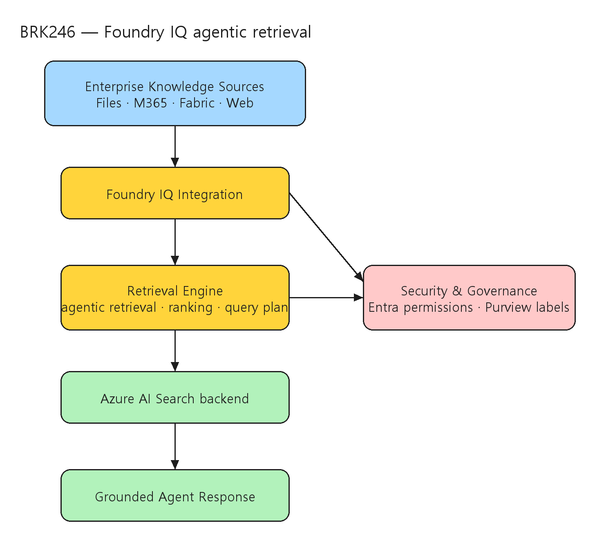

# [BRK246] Foundry IQ: Fuel agents with enterprise knowledge and agentic retrieval

## TL;DR

> Foundry IQ는 에이전트가 enterprise 지식에 안전하게 접근하도록 돕는 Microsoft의 "context engineering platform"이며, 그 retrieval 핵심은 Azure AI Search의 **agentic retrieval**(복잡 질의를 subquery로 분해 → 병렬 실행 → semantic rerank → 통합 응답)이다.

- **세 가지 설계 원칙** — 빠른 온보딩(ease of use), 복잡 시나리오 대응력(versatility), retrieval·ranking 품질(top-tier AI quality)을 균형 있게 충족하도록 설계됐다 (00:00:34).
- **Serverless Foundry IQ Public Preview** — 10~20초 만에 서비스 생성, auto-scaling, pay-per-use를 지원하면서도 enterprise-grade ranking·vector search·security를 유지한다 (00:09:03).
- **다중 지식 소스 + 거버넌스** — 파일·object store·Fabric·Microsoft 365·Web을 단일 retrieval 계층으로 묶고, Entra 권한 전파와 Purview 민감도 라벨을 검색 워크플로에 propagate한다 (00:13:00, 00:28:00).
- **2세대 agentic retrieval** — recall·accuracy·completeness가 hybrid search 단독 대비 개선됐고, semantic ranker·model-specific prompting·caching으로 토큰을 줄이면서 품질을 높였다 (00:32:32, 00:35:00).

## Top highlights

### 1. Serverless Foundry IQ로 마찰 없는 프로비저닝 { #sec-hl-serverless }

- 기존에는 검색 서비스 용량을 미리 프로비저닝해야 했지만, serverless 버전은 10~20초 내 생성·auto-scale·pay-per-use로 동작한다. dynamic agent workflow와 확장형 production 환경에 적합하다.
- [세부 → §3 아키텍처와 serverless 출시](#sec-architecture)

### 2. "knowledge source"로 데이터를 코드 없이 연결 { #sec-hl-sources }

- 파일을 업로드해 knowledge base("Movies Wiki")를 만들고, Foundry IQ의 MCP 서버에 연결해 GitHub Copilot이 별도 에이전트 코드 없이 질의하도록 구성한다. 파일/object store/Fabric/M365/Web 소스를 같은 모델로 확장한다.
- [세부 → §2 지식 베이스 빠른 구성](#sec-kb) · [§4 지식 소스 확장](#sec-sources)

### 3. agentic retrieval의 품질·효율 동시 개선 { #sec-hl-quality }

- 복잡 질의를 subquery로 분해하고 병렬 실행 후 semantic rerank → synthesis로 grounded 응답을 만든다. 2세대에서 recall/accuracy/completeness를 끌어올리면서도 caching·model-specific prompting으로 토큰 사용을 낮췄다.
- [세부 → §5 retrieval 품질과 효율](#sec-quality)

## Why it matters

- 에이전트 품질은 모델 자체보다 **retrieval 품질과 권한 전파**에 크게 좌우된다. 이 세션은 grounding 데이터의 정확도·근거성과 enterprise 보안(Entra/Purview)을 동시에 충족하는 운영 핵심을 구체적으로 보여준다.
- agentic retrieval은 단일 질의 파이프라인 대비 latency를 더하지만, "여러 요구가 섞인 질문", "대화 맥락에 의존하는 질문", "재작성이 필요한 질문" 등 단일 질의가 다루지 못하는 복잡도를 처리한다.
- serverless 프로비저닝과 다중 지식 소스 통합 패턴은 PoC를 실제 운영으로 옮길 때의 시간·복잡도를 줄여 준다.

## Customer scenarios

- 사내 파일·M365·Fabric·Web 지식을 단일 retrieval 계층으로 묶어, **문서 단위 권한이 살아있는** enterprise RAG 에이전트를 구성한다.
- 단일 소스 baseline에서 다중 소스로 점진 확장하며 retrieval 품질(정확도/근거성)과 비용·지연 균형을 측정한다.
- 22M chunk(영문 Wikipedia 전체) 규모에서도 sub-second 검색이 필요한 대규모 지식 에이전트.

## Key announcements

| 항목 | 상태 | 비고 |
|------|------|------|
| Serverless Foundry IQ | Public Preview | 10~20초 생성, auto-scale, pay-per-use, enterprise-grade ranking/security 유지 (00:09:03) |
| Azure AI Search agentic retrieval | GA (2026-04-01 REST API) / Portal·Foundry는 Preview | 일부 기능은 `2026-04-01` REST API에서 GA, Portal/Foundry는 preview-only |
| Content Understanding 연계 | 세션 시연 | 문서 parsing·OCR·복잡 레이아웃 처리로 index 품질 향상 (00:17:00) |
| Work IQ / Fabric IQ / Web IQ 연결 | 세션 시연 | M365 콘텐츠·구조적 분석(SQL)·웹 grounding 소스 연결 (00:13:00~00:21:00) |

!!! preview "Public Preview · Serverless Foundry IQ"
    serverless 버전은 사전 용량 프로비저닝 없이 10~20초 내 서비스 생성, auto-scaling, pay-per-use로 동작하며 enterprise-grade ranking·vector search·security를 유지한다. (세션 AI Summary 00:09:03 기준 — 일반 공급 일정·세부 한도는 공식 제품 문서에서 최종 확인 권장)

!!! ga "GA · Azure AI Search agentic retrieval (2026-04-01 REST API)"
    일부 agentic retrieval 기능이 `2026-04-01` REST API에서 GA로 제공된다. Azure Portal과 Microsoft Foundry 포털은 모든 기능을 preview-only로 노출하며, `2026-05-01-preview`에서 최신 기능(타 서비스/서드파티 연결 등)에 접근할 수 있다.

## Session summary

### 1. Foundry IQ란 무엇인가 { #sec-intro }

`00:00:08` Pablo Castro(Foundry IQ 팀)가 세션을 열며, AI 에이전트·모델을 회사 데이터·애플리케이션에 **knowledge source**로 연결하는 방법에 초점을 맞춘다고 설명한다. `00:00:34` Foundry IQ를 그 연결을 단순화하는 플랫폼으로 정의하고, 세 가지 기반 목표 — (1) ease of use, (2) 복잡 시나리오 대응 versatility, (3) retrieval·ranking 전반의 top-tier AI quality — 를 제시한다. 빠른 시작, 점진적 확장, 정밀한 관련성을 동시에 보장한다는 메시지다.

### 2. 지식 베이스 빠른 구성 데모 { #sec-kb }

`00:01:14~00:03:00` Wikipedia 영화 파일을 업로드해 "Movies Wiki" knowledge base를 만들고, Foundry IQ 내 **MCP 서버**에 연결한다. `00:03:10` 별도 에이전트를 새로 작성하는 대신, Foundry IQ 서비스를 API 엔드포인트로 묶는 proxy를 두고 **GitHub Copilot**이 이 데이터와 상호작용하도록 구성한다. `00:06:06` "Neo가 *The Matrix*에서 어떤 알약을 먹었는가" 같은 질의에 답하며, 데이터 연결→인덱싱→질의가 실제 시나리오에서 얼마나 빠른지 보여준다.

### 3. 아키텍처와 serverless 출시 { #sec-architecture }

`00:07:00` Foundry IQ의 계층 구조를 설명한다 — **Foundry 통합 계층 + 완결형 retrieval engine + Azure AI Search 기반 백엔드**. `00:09:03` 핵심 마일스톤으로 **serverless Foundry IQ의 public preview**를 발표한다: 10~20초 내 서비스 생성, auto-scaling, pay-per-use이면서 enterprise-grade ranking·vector search·security를 유지한다. `00:12:03` Foundry에서 serverless 인스턴스를 수 초 만에 프로비저닝하는 zero-friction 셋업을 시연한다.

### 4. 지식 소스 확장과 AI 통합 { #sec-sources }

`00:13:00~00:21:00` Foundry IQ가 파일·object store·Fabric·Microsoft 365 환경의 데이터를 통합하는 방법을 다룬다. `00:17:00` 문서 parsing·OCR·복잡 레이아웃 처리를 위한 **Azure Content Understanding**을 소개해 index 품질과 검색 정밀도를 높인다. Work IQ(M365 콘텐츠), Fabric IQ(구조적 분석·SQL 기반 접근), Web IQ(웹 grounding) 연결을 함께 보여준다. `00:28:00` **Entra·Purview** 통합으로 문서 단위 권한과 민감도 라벨을 검색 워크플로에 전파해 access control을 보장한다.

### 5. retrieval 품질과 효율 { #sec-quality }

`00:31:00` agentic orchestration, iterative query planning, synthesis 단계로 정확하고 grounded한 답을 만드는 과정을 설명한다. `00:32:32` **2세대 agentic retrieval**로 진화하며 recall·accuracy·completeness가 이전 시스템이나 hybrid search 단독 대비 측정 가능하게 개선됐다고 밝힌다. 정교함이 latency를 약간 늘리지만 이해도를 크게 높인다고 인정한다. `00:35:00` 새 semantic ranker, model-specific prompting, caching 최적화로 토큰 사용을 줄이면서 성능·비용 효율을 함께 끌어올렸다 — "더 적은 토큰으로 더 나은 답"이라는 지표를 제시한다.

### 6. 백엔드 제어와 마무리 { #sec-wrap }

`00:41:00` Azure Portal에서 index, transformation pipeline, quantization 설정을 점검·조정하는 백엔드를 보여준다. `00:43:22` 작은 index와 대규모 데이터셋(영문 Wikipedia 전체)의 실시간 속도를 비교하며, **22M content chunk에서 sub-second 검색**을 시연한다. `00:44:51` serverless 배포, 고도화된 retrieval, 통합 데이터 인텔리전스가 Foundry·Azure Portal·SDK로 모두 즉시 사용 가능하다고 정리하며 관련 IQ 세션을 안내한다.

## Architecture

Foundry IQ의 retrieval 핵심인 Azure AI Search **agentic retrieval**은 knowledge base(파이프라인 오케스트레이션)와 1개 이상의 knowledge source(indexed 또는 remote)를 기본 구성으로 한다. 흐름은 다음과 같다.

1. **Workflow initiation** — 애플리케이션이 query와 대화 이력으로 knowledge base의 retrieve action 호출.
2. **Query planning** — `low`/`medium` reasoning effort에서 LLM(Azure OpenAI)이 focused subquery 생성. `minimal`에서는 이 단계를 건너뛰고 직접 질의(기본값 `low`).
3. **Query execution** — subquery를 knowledge source에 **병렬** 실행(keyword/vector/hybrid). 각 subquery는 semantic rerank(L2)로 가장 관련된 결과를 선별하고 인용용 reference 추출.
4. **Result synthesis** — 결과를 통합 응답으로 결합. merged content는 항상 반환, source reference·activity log는 선택.

| Component | Service | 역할 |
|-----------|---------|------|
| Knowledge base | Azure AI Search | 파이프라인 오케스트레이션, knowledge source·query 파라미터 관리 |
| Knowledge source | Azure AI Search | 파이프라인에서 쓰는 콘텐츠 정의(indexed=서비스 내 search index / remote=질의 시 외부 플랫폼에서 회수) |
| Search index | Azure AI Search | 텍스트·벡터 + semantic 구성 저장 (indexed source에만 필요) |
| Semantic ranker | Azure AI Search | 파이프라인 내부에서 결과 relevance 재정렬(L2 reranking) |
| LLM | Azure OpenAI | query planning·source 선택. `low`/`medium`에서만 사용, `minimal`에서는 우회 |

Knowledge Sources → Foundry IQ Integration → Retrieval Engine → Azure AI Search → Grounded Response, 그리고 Integration/Retrieval 전반에 Entra·Purview 기반 Security & Governance가 적용된다:

## Demo highlights

- ⏱️ 00:01:14~00:03:00 — Wikipedia 영화 파일 업로드 → "Movies Wiki" knowledge base 생성 → MCP 서버 연결
- ⏱️ 00:03:10~00:06:06 — proxy로 Foundry IQ를 GitHub Copilot에 연결, *The Matrix* 알약 질의 응답
- ⏱️ 00:09:03~00:12:03 — serverless Foundry IQ public preview 발표 및 수 초 내 프로비저닝 데모
- ⏱️ 00:17:00 — Azure Content Understanding으로 문서 parsing·OCR·복잡 레이아웃 처리
- ⏱️ 00:32:32~00:35:00 — 2세대 agentic retrieval 품질/토큰 효율 지표 비교
- ⏱️ 00:43:22 — 22M chunk(영문 Wikipedia 전체)에서 sub-second 검색 시연

## Code & samples

agentic retrieval은 Azure Portal, Microsoft Foundry 포털, REST API, 또는 Azure SDK로 구성할 수 있다. 공식 quickstart/샘플은 다음과 같다 (Azure AI Search 문서 기준).

- Quickstart-Agentic-Retrieval: [Python](https://github.com/Azure-Samples/azure-search-python-samples/tree/main/Quickstart-Agentic-Retrieval) · [.NET](https://github.com/Azure-Samples/azure-search-dotnet-samples/blob/main/quickstart-agentic-retrieval) · [REST](https://github.com/Azure-Samples/azure-search-rest-samples/tree/main/Quickstart-agentic-retrieval)
- End-to-end with Azure AI Search and Foundry Agent Service: [azure-search-python-samples](https://github.com/Azure-Samples/azure-search-python-samples/tree/main/agentic-retrieval-pipeline-example)
- REST API: [Knowledge Sources](https://learn.microsoft.com/en-us/rest/api/searchservice/knowledge-sources) · [Knowledge Bases](https://learn.microsoft.com/en-us/rest/api/searchservice/knowledge-bases) · [Knowledge Retrieval (retrieve)](https://learn.microsoft.com/en-us/rest/api/searchservice/knowledge-retrieval/retrieve)

실무 PoC 권장 순서:

1. 단일 knowledge source(예: 파일)로 baseline retrieval 품질 측정.
2. M365/Fabric/Web 소스를 단계적으로 추가해 품질–지연시간–비용 균형 검증. 소스 수를 줄이면 fan-out과 토큰 사용량이 낮아진다.
3. 배포 전 Entra/Purview 기반 권한·민감도 전파를 테스트해 보안 회귀를 점검.
4. 응답의 **activity log**를 확인해 어떤 subquery가 어떤 소스에 어떤 파라미터로 갔는지 추적하고 토큰 사용을 추정.

## Caveats & open questions

- **비용 모델은 token 기반** — 기존 classic 파이프라인은 query 기반 과금이지만, agentic retrieval은 Azure AI Search(subquery 실행·semantic ranking 토큰) + Azure OpenAI(query planning·synthesis 토큰)의 token 기반 과금이다. reasoning effort에 따라 비용이 가변적이다.
- **품질 ↔ 지연 trade-off** — 2세대 retrieval은 정확도를 높이는 대신 latency를 더한다. 도메인별 SLO(정확도/응답시간/비용) 기준 정의가 필요하다.
- **GA/Preview 경계** — 일부 기능은 `2026-04-01` REST API에서 GA지만 Portal/Foundry는 preview-only다. 운영 도입 시 어떤 기능이 GA인지 마이그레이션 가이드로 확인해야 한다.
- **serverless 세부 한도/일정 미확정** — serverless Foundry IQ의 일반 공급 일정·정확한 용량 한도는 AI Summary만으로 단정할 수 없어 공식 제품 문서에서 재확인이 필요하다.
- **데이터 경계** — `2026-05-01-preview`는 타 Microsoft/서드파티 서비스 연결을 지원하며, 이때 데이터가 Azure 컴플라이언스 경계 밖에서 처리/저장될 수 있다. 권한·경계·승인 관리는 사용자 책임이다.

## Resources

- 🎥 Session: https://build.microsoft.com/en-US/sessions/BRK246?source=sessions
- 🖼️ Slides: https://medius.microsoft.com/video/asset/PPT/ae80fe5d-7c1e-4fc5-ab1c-a37839c0a9bd?referrer=Microsoft+Build-%2Fen-US%2Fsessions%2FBRK246&mhid=build&loc=en-us
- 📝 Transcript: https://medius.microsoft.com/video/asset/Transcript/ae80fe5d-7c1e-4fc5-ab1c-a37839c0a9bd?referrer=Microsoft+Build-%2Fen-US%2Fsessions%2FBRK246&mhid=build&loc=en-us
- 📚 Agentic Retrieval Overview (Azure AI Search): https://learn.microsoft.com/en-us/azure/search/search-agentic-retrieval-concept
- 📚 Tutorial — End-to-end agentic retrieval: https://learn.microsoft.com/en-us/azure/search/agentic-retrieval-how-to-create-pipeline

## Related sessions

- [BRK240 — Build context-aware agents: From data to decisions](BRK240-context-aware-agents-data-to-decisions.md)
- [BRK243 — Claw and agent harness in Microsoft Foundry](BRK243-claw-agent-harness-microsoft-foundry.md)
- [BRK250 — Observe and control agents across any framework with open source tools](BRK250-observe-control-agents-open-source-tools.md)

## About the speakers

- **Pablo Castro** — CVP & Distinguished Engineer, AI Knowledge, Microsoft · [LinkedIn](https://www.linkedin.com/in/pabloc/)
