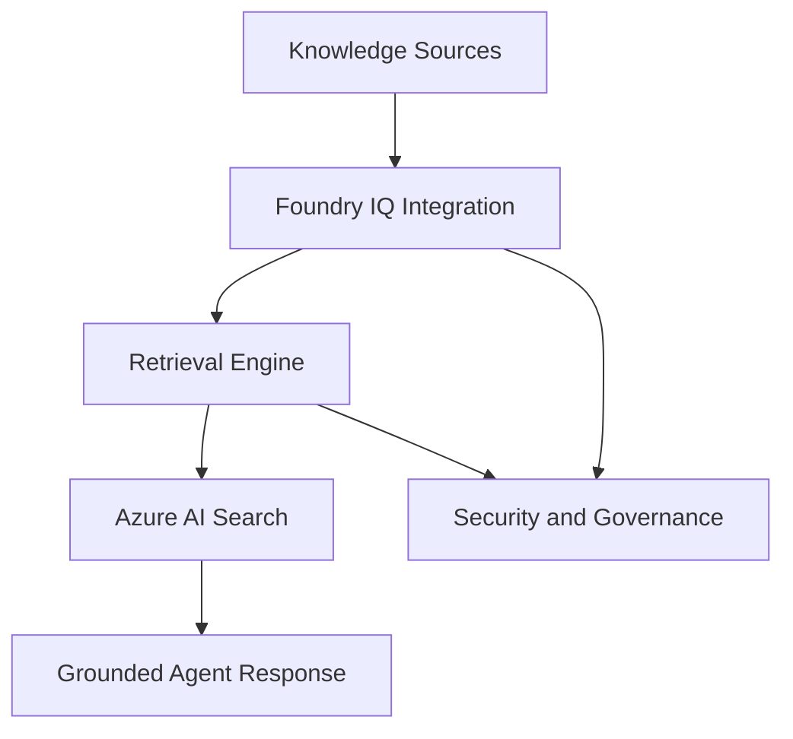

# [BRK246] Foundry IQ: Fuel agents with enterprise knowledge and agentic retrieval

## TL;DR

> Foundry IQ와 Azure AI Search를 중심으로, enterprise 데이터 연결부터 agentic retrieval 품질/성능 최적화까지 한 번에 다루는 기술 심화 세션이다.

## Top highlights

- Foundry IQ 통합 계층, retrieval engine, Azure AI Search 백엔드의 3계층 아키텍처를 명확히 제시한다.
- 파일, object store, Microsoft 365, Fabric, Web 등 다중 지식 소스를 일관된 보안 맥락으로 연결한다.
- Entra 권한 전파와 Purview 민감도 라벨 연계를 통해 retrieval 품질과 거버넌스를 함께 확보한다.

## Why it matters

- 에이전트 품질은 모델 자체보다 retrieval 품질과 권한 전파에 크게 좌우되는데, 이 세션은 그 운영 핵심을 구체적으로 보여준다.
- serverless Foundry IQ(세션 발표 기준)와 다중 지식 소스 통합 패턴을 통해, PoC를 실제 운영으로 옮길 때의 시간·복잡도를 줄일 수 있다.

## Key announcements

| 항목 | 상태 | 날짜 | 비고 |
|------|------|------|------|
| BRK246 온디맨드 Breakout 공개 | 공개 | 2026-06-04 | Build 세션 페이지 기준, 45분 |
| Foundry IQ 최신 agentic retrieval/지식 소스 확장 발표 | 세션 발표 | 2026-06-04 | About the session에 명시 |
| Serverless Foundry IQ Public Preview 언급 | Public Preview (확인 필요) | 2026-06-04 | AI Summary 기반, 제품 문서 재확인 권장 |

## Session summary

### 1.

세션은 Foundry IQ를 "context engineering platform"으로 정의하고, 에이전트가 enterprise 데이터/애플리케이션에 안전하게 접근하도록 만드는 흐름을 설명한다. 핵심은 쉬운 온보딩, 복잡 시나리오 대응력, retrieval 품질(정확도/관련성) 균형이다.

### 2.

데모와 기술 설명은 다음 축으로 전개된다.

- 지식 베이스 빠른 구성: 파일 업로드, 인덱싱, 질의 연계
- 아키텍처 심화: Foundry 통합 계층 + retrieval engine + Azure AI Search 기반 백엔드
- 데이터 소스 확장: 파일/object store/Fabric/Microsoft 365/Web 연결 시나리오
- 품질·효율 개선: agentic retrieval 2세대, 랭킹/프롬프팅/캐시 최적화, 운영 관측 지표

## Demo highlights

- ⏱️ 00:09~00:12 (세션 페이지 AI Summary 기준) — serverless Foundry IQ 프로비저닝 데모
- ⏱️ 00:31~00:35 (세션 페이지 AI Summary 기준) — agentic retrieval 품질/효율 개선 포인트 설명

## Architecture / Diagram

<!-- 필요 시 mermaid 또는 이미지 -->

렌더 환경과 무관하게 보이는 아키텍처 흐름:

```text
[Enterprise Knowledge Sources]
  - Files / Object Store
  - Microsoft 365
  - Fabric
  - Web
          |
          v
[Foundry IQ Integration Layer]
          |
          v
[Retrieval Engine]
  - Agentic retrieval
  - Ranking
  - Query planning
          |
          v
[Azure AI Search Backend]
          |
          v
[Grounded Agent Response]
          |
          v
[Security & Governance]
  - Entra permissions
  - Purview labels
```

핵심 연결 관계 요약:

1. Knowledge Sources -> Foundry IQ Integration Layer
2. Integration Layer -> Retrieval Engine -> Azure AI Search
3. Azure AI Search -> Grounded Agent Response
4. Integration/Retrieval 단계 전반에 Security & Governance 적용



## Code & samples

<!-- 핵심 스니펫이 있다면 -->

실무 PoC에서는 다음 순서를 권장한다.

1. 우선 단일 지식 소스(예: 파일)로 baseline retrieval 품질 측정
2. 이후 M365/Fabric/Web 소스를 단계적으로 추가해 품질-지연시간-비용 균형을 검증
3. 배포 전 Entra/Purview 기반 권한·민감도 전파 테스트를 포함해 보안 회귀를 점검

## Caveats / Open questions

- AI Summary 기반의 수치/타임스탬프/preview 상태는 공식 제품 문서에서 최종 확인이 필요하다.
- agentic retrieval 품질 향상은 지연시간 증가와 맞교환될 수 있어, 도메인별 SLO 기준(정확도/응답시간/비용) 정의가 필요하다.

## Customer takeaways

- [ ] 우리 에이전트의 retrieval 품질 지표(정확도, 근거성, 완전성)와 비용 지표를 함께 정의했다.
- [ ] 데이터 소스 확장 전에 권한 전파(Entra)와 민감도 정책(Purview) 검증 항목을 배포 체크리스트에 넣었다.

## Resources

- 🎥 Session: https://build.microsoft.com/en-US/sessions/BRK246?source=sessions
- 🖼️ Slides: https://medius.microsoft.com/video/asset/PPT/ae80fe5d-7c1e-4fc5-ab1c-a37839c0a9bd?referrer=Microsoft+Build-%2Fen-US%2Fsessions%2FBRK246&mhid=build&loc=en-us
- 💻 GitHub: https://aka.ms/build26-next-steps
- 📚 Docs: https://build.microsoft.com/en-US/sessions/BRK246

## About the speakers

- Pablo Castro - CVP and Distinguished Engineer, AI Knowledge, Microsoft

## Notes

<!-- 내부 메모. 고객 배포 시 제거 가능 -->

- 근거 출처: Build 세션 페이지 About the session, speaker metadata, session tags, resources.
- 타임스탬프/세부 흐름은 세션 페이지 AI Summary를 보조 근거로 사용했다.
