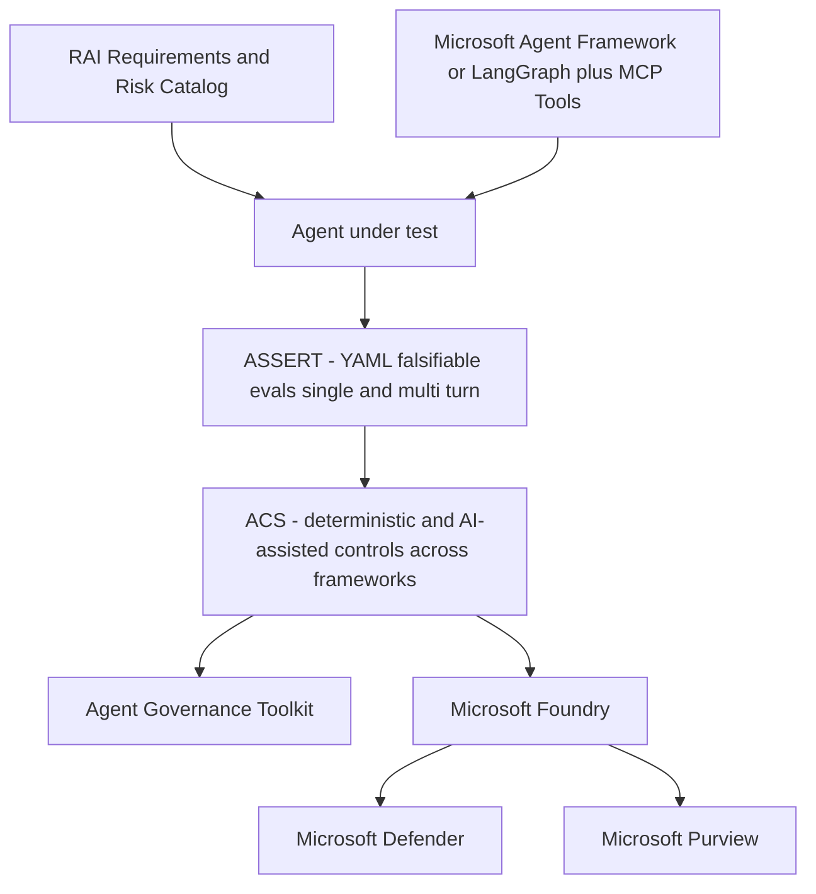

# [BRK250] Observe and control agents across any framework with open source tools

## TL;DR

> 프레임워크에 상관없이 agent를 평가·통제·관측하기 위한 오픈소스 도구(ASSERT, ACS)와 Foundry 거버넌스 연계를 통해, enterprise 규모로 agent를 안전하게 배포하는 방법을 다룬다.

## Top highlights

- agent 실패 유형(오해, 환각, 데이터 유출, multi-agent 예측불가)을 평가 가능한 위험 항목으로 구조화한다.
- ASSERT로 YAML 기반 falsifiable eval을 만들고, ACS로 프레임워크 횡단 control을 적용하는 흐름을 제시한다.
- AGT/Microsoft Foundry와 Defender/Purview 연계로 운영 환경의 통제·감사를 통합한다.

## Why it matters

- production agent의 핵심 리스크(지시 오해, 환각, 민감정보 유출, multi-agent 예측불가)를 평가-통제-개선 루프로 다루는 실전 blueprint를 제공한다.
- Microsoft Agent Framework뿐 아니라 LangGraph 등 오픈소스 스택에도 적용되는 control 방식이라, 이미 다양한 프레임워크를 쓰는 조직에 바로 적용 가능하다.

## Key announcements

| 항목 | 상태 | 날짜 | 비고 |
|------|------|------|------|
| BRK250 온디맨드 Breakout 공개 | 공개 | 2026-06-03 | Build 세션 페이지 기준, 45분 |
| ASSERT (Agent Systematic Evaluation and Risk Testing) 오픈소스 발표 | 오픈소스 (확인 필요) | 2026-06-03 | AI Summary 기반, 저장소/문서 재확인 권장 |
| ACS (Agent Control Specification) 오픈소스 발표 | 오픈소스 (확인 필요) | 2026-06-03 | AGT/Foundry 통합 언급, 제품 문서 재확인 권장 |

## Session summary

### 1.

세션은 Responsible AI 관점에서 agent 실패 유형과 "lethal trifecta"(context rot, confusion, privilege misuse)를 설명하고, 위험 식별 → 평가 → 통제 → 지속 개선의 프로세스 루프를 제시한다.

### 2.

핵심 도구와 데모는 다음과 같이 전개된다.

- ASSERT: 안전 요구사항을 YAML로 정의해 falsifiable evaluation을 자동 생성(단일/멀티턴 포함)
- 데모: LangGraph + MCP Server 기반 "Bank Manager Agent"로 prompt injection/무단 이체 등 도메인 리스크 평가
- ACS: 프레임워크 횡단으로 deterministic + AI 보조 안전 검사를 통합하는 control specification
- Foundry 연계: Defender/Purview, identity, tracing과 결합한 production 거버넌스 및 지속 모니터링

## Demo highlights

- ⏱️ 00:06~00:09 (세션 페이지 AI Summary 기준) — LangGraph 기반 Bank Manager Agent 리스크 데모
- ⏱️ 00:27~00:30 (세션 페이지 AI Summary 기준) — ACS 가드레일 적용 후 정책 위반률 감소 시연

## Architecture / Diagram

<!-- 필요 시 mermaid 또는 이미지 -->

세션에서 제시한 평가-통제 파이프라인을 실제 구성요소 기준으로 정리하면 다음과 같다. agent는 임의 프레임워크(Microsoft Agent Framework 또는 LangGraph) 위에서 MCP Server/Tools와 함께 동작하고, ASSERT가 위험 평가를, ACS가 프레임워크 횡단 control을 담당하며, AGT/Microsoft Foundry를 통해 Defender·Purview와 연계된다.

```text
[RAI 요구사항 / Risk Catalog]
        |
        v
[Agent under test]
   ^
   |  (Microsoft Agent Framework 또는 LangGraph + MCP Tools 위에서 동작)
   |
[ASSERT: YAML falsifiable evals (single/multi-turn)]
        |
        v
[ACS: deterministic + AI-assisted controls across frameworks]
        |
        +--> [Agent Governance Toolkit (AGT)]
        |
        v
[Microsoft Foundry]
        |
        +--> [Microsoft Defender]
        +--> [Microsoft Purview]
```



## Code & samples

<!-- 핵심 스니펫이 있다면 -->

실무 적용 순서 권장:

1. 핵심 리스크를 ASSERT YAML 규칙으로 정의해 baseline 위반율 측정
2. 프롬프트 개선만으로 한계가 있는 영역은 ACS deterministic 가드레일로 보강
3. Foundry에서 Defender/Purview/Tracing과 연계해 production 모니터링을 상시화

## Caveats / Open questions

- ASSERT/ACS의 라이선스·저장소·정식 지원 범위는 공식 오픈소스/제품 문서로 재확인이 필요하다.
- 가드레일 강화는 over-refusal(과도한 거부)로 이어질 수 있어, 정책 위반율과 사용자 경험 간 균형 지표 설정이 필요하다.

## Customer takeaways

- [ ] 우리 agent의 핵심 리스크를 평가 규칙(ASSERT 스타일)으로 명문화하고 baseline 위반율을 측정했다.
- [ ] production 배포 체크리스트에 deterministic 가드레일(ACS), 데이터 보호(Defender/Purview), 지속 모니터링을 포함했다.

## Resources

- 🎥 Session: https://build.microsoft.com/en-US/sessions/BRK250?source=sessions
- 🖼️ Slides: https://medius.microsoft.com/video/asset/PPT/b919f3dd-95e5-41c4-9ea5-7604e8d87df8?referrer=Microsoft+Build-%2Fen-US%2Fsessions%2FBRK250&mhid=build&loc=en-us
- 💻 GitHub: https://aka.ms/build26-next-steps
- 📚 Docs: https://build.microsoft.com/en-US/sessions/BRK250

## About the speakers

- Sarah Bird - Chief Product Officer, Responsible AI, Microsoft
- Sandeep Atluri - Partner Applied Research, Microsoft
- Mehrnoosh Sameki - Principal Product Lead, Microsoft

## Notes

<!-- 내부 메모. 고객 배포 시 제거 가능 -->

- 근거 출처: Build 세션 페이지 About the session, speaker metadata, session tags, resources.
- 타임스탬프/도구명(ASSERT, ACS, AGT)은 세션 페이지 AI Summary를 보조 근거로 사용했고, 정식 표기/가용성은 별도 확인 필요.
