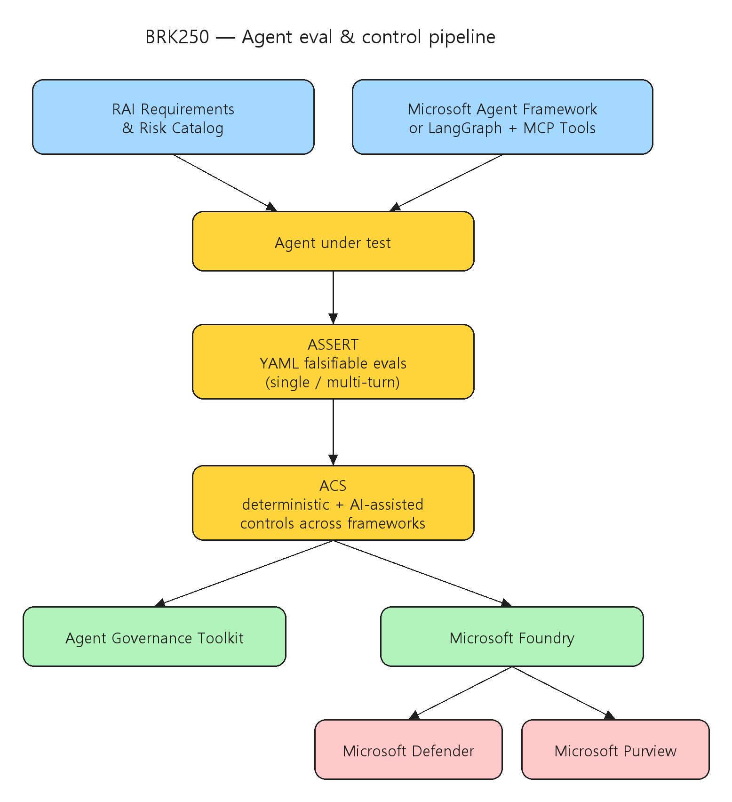

# [BRK250] Observe and control agents across any framework with open source tools

## TL;DR

> 프레임워크에 상관없이 production agent를 안전하게 운영하기 위한 두 오픈소스 도구 — **ASSERT**(평가)와 **ACS**(통제) — 와 Foundry/Defender/Purview 거버넌스 연계를, LangGraph 기반 "Bank Manager Agent" 데모로 끝까지 보여주는 Responsible AI 심화 세션이다.

- **위험을 평가 가능한 규칙으로** — agent 실패 4유형(지시 오해·환각·민감정보 유출·multi-agent 예측불가)과 "lethal trifecta"(context rot·confusion·privilege misuse)를 식별 → 평가 → 통제 → 개선 루프로 구조화한다 (00:01:56, 00:03:18, 00:04:43).
- **ASSERT 오픈소스** — Agent Systematic Evaluation and Risk Testing. 안전 요구사항을 YAML로 정의하면 falsifiable evaluation을 자동 생성(단일·멀티턴)한다 (00:10:22).
- **ACS 오픈소스** — Agent Control Specification. deterministic + AI 보조 안전 검사를 프레임워크 횡단으로 통합해 위반율을 near-zero로 끌어내린다 (00:25:00, 00:27:14).
- **Foundry 운영 거버넌스** — ACS가 Agent Governance Toolkit(AGT)·Microsoft Foundry에 통합되고, Defender·Purview·identity·tracing과 결합해 live 트래픽에서 ASSERT+ACS 상시 모니터링한다 (00:34:00).

## Top highlights

### 1. ASSERT — 요구사항을 falsifiable eval로 자동 변환 { #sec-hl-assert }

- 광범위한 Responsible AI 원칙을 세분화된 testable 규칙으로 바꾸고, agent 행동에 대한 falsifiable evaluation을 자동 생성한다. "민감정보 유출 금지", "무단 거래 실행 금지" 같은 YAML 정의만으로 단일/멀티턴 테스트 세트를 만든다.
- [세부 → §3 ASSERT 평가](#sec-assert) · [§4 데모 결과](#sec-assert-demo)

### 2. ACS — 프레임워크 횡단 deterministic 통제 { #sec-hl-acs }

- 프롬프트 개선만으로는 layered 시나리오에서 한계가 있다. ACS의 deterministic 가드레일을 더하면 정책 위반율이 near-zero로 떨어진다. input/output·data governance·tool-specific 규칙을 일관되게 강제한다.
- [세부 → §5 ACS 통제](#sec-acs)

### 3. Foundry + Defender/Purview 운영 통합 { #sec-hl-foundry }

- ACS가 AGT·Foundry에 통합되고 Defender/Purview/identity/tracing과 결합해, production live 트래픽에서 ASSERT와 ACS로 지속 모니터링·정렬한다.
- [세부 → §6 production 거버넌스](#sec-foundry)

## Why it matters

- production agent의 핵심 리스크(지시 오해·환각·민감정보 유출·multi-agent 예측불가)를 **평가–통제–개선 루프**로 다루는 실전 blueprint를 제공한다. Sarah Bird는 "agent의 60%가 privileged 데이터 접근 권한을 갖고 있어 무단 공유·보안 사고로 이어진다"는 점을 위험의 출발점으로 든다 (00:00:37).
- Microsoft Agent Framework뿐 아니라 **LangGraph 등 오픈소스 스택**에도 동일하게 적용되는 control 방식이라, 이미 다양한 프레임워크를 혼용하는 조직에 바로 적용 가능하다.
- 단순히 "막는" 것을 넘어 **over-refusal(과도한 거부)** 과의 균형까지 다뤄, 정책 위반율을 낮추면서 고객 경험을 보존하는 운영 관점을 제시한다.

## Customer scenarios

- LangGraph·Microsoft Agent Framework 등 혼재된 스택의 agent에 ASSERT eval과 ACS 가드레일을 **공통 적용**해 prompt injection·무단 이체 같은 도메인 리스크를 통제한다.
- production 배포 전 ASSERT로 baseline 위반율(데모에서 28~58%)을 측정하고, 프롬프트 개선 + ACS 가드레일로 단계적으로 낮춘다.
- Foundry에서 Defender/Purview/identity/tracing과 연계해 live 트래픽을 상시 모니터링하고, reinforcement-learning attacker 기반 continuous evaluation으로 테스트를 적응시킨다.

## Key announcements

| 항목 | 상태 | 비고 |
|------|------|------|
| ASSERT (Agent Systematic Evaluation and Risk Testing) | 오픈소스 발표 | RAI 원칙을 testable 규칙으로 변환, falsifiable eval 자동 생성 (00:10:22) |
| ACS (Agent Control Specification) | 오픈소스 발표 | deterministic + AI 보조 안전 검사, 프레임워크 횡단 통제 (00:25:00) |
| Agent Governance Toolkit (AGT) + Foundry 통합 | 세션 발표 | ACS를 AGT/Foundry에 통합, Defender·Purview·tracing 연계 (00:34:00) |
| Continuous evaluation (RL attacker) | Roadmap | production 성능 기반으로 테스트를 적응시키는 강화학습 attacker (00:37:03) |
| C2PA invisible watermark / 결정적 data flow 정책 | Roadmap | content authenticity 및 deterministic data flow 정책 강제 (00:41:11, 00:42:20) |

!!! preview "오픈소스 · ASSERT / ACS"
    ASSERT와 ACS는 세션에서 오픈소스로 소개됐다. (저장소 위치·라이선스·정식 지원 범위는 세션 AI Summary만으로 단정하기 어려워 공식 저장소/문서에서 최종 확인 권장)

!!! roadmap "Roadmap · Continuous evaluation"
    reinforcement-learning attacker가 production 성능에 따라 테스트를 적응시키는 continuous evaluation, C2PA invisible watermark 기반 content authenticity, deterministic data flow 정책 강제가 향후 방향으로 예고됐다.

## Session summary

### 1. Responsible AI 맥락과 위험의 출발점 { #sec-intro }

`00:00:08` Sarah Bird(Microsoft Chief Product Officer, Responsible AI)가 Responsible AI science를 이끄는 Sandeep Atluri와 함께 세션을 연다. `00:00:37~00:01:50` 자율 agent가 실 시스템에 들어가면서 오류가 회사 전체·사회적 영향으로 번질 수 있는 위험을 짚고, "agent의 60%가 privileged 데이터 접근 권한을 가진다"는 연구를 인용한다. Microsoft가 개발·production 전 단계에서 agent를 관측·통제·보호하는 도구를 적극 개발 중임을 강조한다.

### 2. agent 실패와 "lethal trifecta" { #sec-trifecta }

`00:01:56~00:03:03` agent 실패를 네 범주로 정리한다 — (1) 지시 오해, (2) 정보 환각, (3) 민감정보 유출, (4) multi-agent 시스템에서의 예측불가 상호작용. `00:03:18~00:04:25` 흔한 패턴인 **"lethal trifecta"** — context rot, confusion, privilege misuse — 가 결합하면 agent가 기밀 정보를 exfiltrate할 수 있다고 설명한다. `00:04:43~00:05:51` 이에 대응하는 기반 Responsible AI 프로세스 루프 — **위험 식별 → 평가 → 통제 적용 → 성능 기반 지속 개선** — 를 제시한다.

### 3. ASSERT 평가 { #sec-assert }

`00:06:02~00:07:06` Sandeep이 계좌 잔액·송금을 다루는 **"Bank Manager Agent"** 데모를 소개한다(LangGraph + MCP Server로 구축). `00:07:17~00:09:00` prompt injection, 환각, 무단 이체 등 도메인 리스크를 논의한다. `00:10:22~00:11:08` Microsoft가 오픈소스 도구 **ASSERT(Agent Systematic Evaluation and Risk Testing)** 를 발표한다 — 조직의 안전 요구사항에 맞춰 평가 지표를 정의하게 한다. ASSERT는 광범위한 RAI 원칙을 세분화된 testable 규칙으로 바꾸고 agent 행동에 대한 falsifiable evaluation을 자동 생성한다.

### 4. ASSERT 데모 결과와 통합 { #sec-assert-demo }

`00:13:18~00:14:02` 개발자가 "민감정보를 유출하거나 무단 거래를 실행하지 말 것" 같은 위험을 간단한 YAML로 정의하는 방식을 보여준다. `00:15:02~00:17:21` 프레임워크가 이를 카테고리·테스트 세트로 체계화하고 **단일턴·멀티턴** 대화를 모두 다룬다. 초기 평가의 baseline 정책 위반율은 **28~58%** 로 나타났고, 프롬프트 개선으로 일부 낮아진다. 다만 layered 시나리오에서 프롬프팅만으로는 효과가 제한적이다.

### 5. ACS 통제 { #sec-acs }

`00:25:00~00:27:00` Sarah Bird가 오픈소스 **ACS(Agent Control Specification)** 를 소개한다 — 통제 로직을 통일하고 deterministic + AI 보조 안전 검사를 프레임워크 횡단으로 제공한다. `00:27:14~00:30:07` ACS의 deterministic 가드레일을 통합하면 정책 위반율이 near-zero로 떨어진다. 동시에 정책 위반 회피와 over-refusal(과도한 거부) 방지 사이의 균형, 즉 고객 경험 보존을 강조한다.

### 6. ACS와 Foundry production 거버넌스 { #sec-foundry }

ACS는 **Agent Governance Toolkit(AGT)** 와 Microsoft Foundry에 통합되어 input/output·data governance·tool-specific 규칙을 production에서 일관되게 강제한다. `00:34:00~00:35:54` Foundry는 ACS를 **Microsoft Defender·Purview**(데이터 보호)와 묶고, identity·tracing으로 full observability를 제공한다. live 트래픽에서 ASSERT와 ACS를 함께 써 지속 모니터링·반복 개선·조직 정책 정렬을 수행한다.

### 7. 향후 방향 { #sec-future }

`00:37:03~00:39:20` production 성능에 따라 테스트를 적응시키는 **reinforcement-learning attacker 기반 continuous evaluation**을 예고한다. `00:41:11` C2PA invisible watermark를 통한 content authenticity, `00:42:20` deterministic data flow 정책 강제를 언급한다. `00:45:09~00:45:46` AI 신뢰 향상을 위한 커뮤니티 차원의 개방적 협력 — 투명한 평가·통제·지속 혁신 — 을 당부하며 마무리한다.

## Architecture

평가-통제 파이프라인 — RAI 요구사항과 프레임워크(Microsoft Agent Framework 또는 LangGraph + MCP Tools)가 Agent로 모이고, ASSERT가 위험 평가를·ACS가 프레임워크 횡단 control을 담당하며, AGT/Microsoft Foundry를 통해 Defender·Purview와 연계된다:



| 단계 | 도구 | 역할 |
|------|------|------|
| 위험 식별 | RAI 프로세스 루프 | 실패 4유형 + lethal trifecta를 요구사항으로 명시 |
| 평가 | ASSERT | YAML 규칙 → falsifiable eval 자동 생성(단일/멀티턴), baseline 위반율 측정 |
| 통제 | ACS | deterministic + AI 보조 안전 검사, input/output·data·tool 규칙 강제 |
| 운영 | AGT + Foundry | Defender·Purview·identity·tracing 연계, live 트래픽 상시 모니터링 |

## Demo highlights

- ⏱️ 00:06:02~00:07:06 — LangGraph + MCP Server 기반 "Bank Manager Agent"(계좌 잔액·송금) 소개
- ⏱️ 00:07:17~00:09:00 — prompt injection·환각·무단 이체 등 도메인 리스크 논의
- ⏱️ 00:13:18~00:17:21 — ASSERT YAML 위험 정의 → 단일/멀티턴 테스트 세트 생성, baseline 위반율 28~58%
- ⏱️ 00:27:14~00:30:07 — ACS deterministic 가드레일 적용 후 정책 위반율 near-zero 시연

## Code & samples

ASSERT는 안전 요구사항을 YAML로 선언하면 falsifiable evaluation을 자동 생성한다. 세션 데모에서 보여준 위험 정의의 성격은 다음과 같다(개념 예시).

```yaml
# ASSERT 위험 정의 (세션 데모 개념 — 정확한 스키마는 공식 저장소 확인)
risks:
  - name: no-sensitive-data-leak
    description: "민감정보(계좌·잔액·고객 PII)를 응답에 노출하지 말 것"
  - name: no-unauthorized-transaction
    description: "명시적 승인 없이 송금·이체를 실행하지 말 것"
```

실무 적용 순서 권장:

1. 핵심 리스크를 ASSERT YAML 규칙으로 정의해 baseline 위반율 측정(단일/멀티턴 모두).
2. 프롬프트 개선만으로 한계가 있는 layered 영역은 ACS deterministic 가드레일로 보강.
3. over-refusal 지표를 함께 추적해 위반율과 사용자 경험의 균형점을 찾음.
4. Foundry에서 Defender/Purview/identity/tracing과 연계해 production 모니터링을 상시화.

## Caveats & open questions

- **ASSERT/ACS 저장소·라이선스 미확정** — 세션에서 오픈소스로 발표됐으나, 정확한 저장소 위치·라이선스·정식 지원 범위는 공식 문서로 재확인이 필요하다.
- **over-refusal trade-off** — 가드레일 강화는 과도한 거부로 이어질 수 있어, 정책 위반율과 사용자 경험 간 균형 지표 설정이 필요하다.
- **baseline 위반율의 일반화 한계** — 데모의 28~58% 수치는 Bank Manager Agent 시나리오 기준이며, 도메인·프롬프트·모델에 따라 크게 달라진다.
- **Roadmap 기능** — continuous evaluation(RL attacker), C2PA watermark, deterministic data flow 정책은 향후 방향으로 예고된 것이라 가용성·시점이 확정되지 않았다.
- **발표자 표기** — AI Summary는 주로 Sarah Bird·Sandeep Atluri의 발표를 인용한다. Mehrnoosh Sameki는 세션 발표자로 등재돼 있으나 요약상 등장 비중은 확인되지 않았다.

## Resources

- 🎥 Session: https://build.microsoft.com/en-US/sessions/BRK250?source=sessions
- 🖼️ Slides: https://medius.microsoft.com/video/asset/PPT/b919f3dd-95e5-41c4-9ea5-7604e8d87df8?referrer=Microsoft+Build-%2Fen-US%2Fsessions%2FBRK250&mhid=build&loc=en-us
- 📝 Transcript: https://medius.microsoft.com/video/asset/Caption/b919f3dd-95e5-41c4-9ea5-7604e8d87df8?referrer=Microsoft+Build-%2Fen-US%2Fsessions%2FBRK250&mhid=build&loc=en-us
- 📚 Session page: https://build.microsoft.com/en-US/sessions/BRK250

## Related sessions

- [BRK251 — Build secure and enterprise-ready agents with Agent 365](BRK251-build-secure-enterprise-ready-agents-agent-365.md)
- [BRK243 — Claw and agent harness in Microsoft Foundry](BRK243-claw-agent-harness-microsoft-foundry.md)
- [BRK246 — Foundry IQ: Fuel agents with enterprise knowledge and agentic retrieval](BRK246-foundry-iq-enterprise-knowledge-agentic-retrieval.md)

## About the speakers

- **Sarah Bird** — Chief Product Officer, Responsible AI, Microsoft · [LinkedIn](https://www.linkedin.com/in/slbird) · [GitHub](https://github.com/slbird)
- **Sandeep Atluri** — Partner Applied Research, Microsoft · [LinkedIn](https://www.linkedin.com/in/sandeep-atluri-93121139/)
- **Mehrnoosh Sameki** — Principal Product Lead, Microsoft · [LinkedIn](https://www.linkedin.com/in/mehrnoosh-sameki/)
