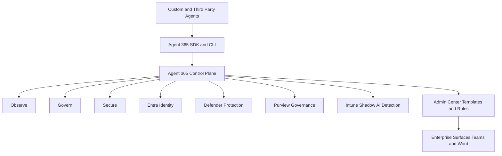

# [BRK251] Build secure and enterprise-ready agents with Agent 365

## TL;DR

> Agent 365 SDK와 Purview SDK를 중심으로, agent 수명주기 전반에 관측성·거버넌스·보안을 내장해 enterprise 운영 요건을 맞추는 실전 패턴을 다룬다.

## Top highlights

- Agent 365의 3대 축 Observe, Govern, Secure를 기준으로 에이전트 운영 요건을 구조화한다.
- Agent 365 SDK와 CLI로 기존 Microsoft/서드파티 에이전트를 온보딩해 식별성·가시성·정책 적용을 표준화한다.
- Entra, Defender, Purview, Intune, Admin Center Templates/Rules까지 연결해 운영 자동화와 컴플라이언스를 강화한다.

## Why it matters

- 에이전트를 운영 단계로 올릴 때 필요한 핵심 요건(가시성, 정책 적용, identity 기반 접근제어, 데이터 보호)을 개발 속도를 크게 늦추지 않고 적용하는 기준을 제공한다.
- Microsoft/서드파티 에이전트를 함께 관리하는 혼합 환경에서 Entra, Defender, Purview, Intune과 연계된 통합 거버넌스 모델을 보여준다.

## Key announcements

| 항목 | 상태 | 날짜 | 비고 |
|------|------|------|------|
| BRK251 온디맨드 Breakout 공개 | 공개 | 2026-06-04 | Build 세션 페이지 기준, 45분 |
| Agent 365 SDK + Purview SDK 기반 엔터프라이즈 패턴 소개 | 세션 발표 | 2026-06-04 | About the session에 명시 |
| Agent 365 3대 축(Observe, Govern, Secure) 및 Admin 자동화(Rules, Templates) 시연 | 세션 발표 | 2026-06-04 | AI Summary 기반 |

## Session summary

### 1.

세션은 "에이전트를 안전하게 production에 올릴 수 있는가"를 중심 질문으로 두고, Agent 365의 3대 가치 축(Observe, Govern, Secure)을 제시한다. 핵심은 개발팀이 기존 에이전트를 Agent 365 SDK로 래핑해 식별성과 런타임 가시성을 확보하고, identity 및 정책 기반 통제를 일관되게 적용하는 것이다.

### 2.

데모는 개발자-관리자-사용자 관점을 순차적으로 연결한다.

- 개발자 관점: LangChain + Node.js 에이전트를 Agent 365 CLI/skills로 온보딩하고 observability 및 identity 구성을 적용
- 사용자 관점: Teams/Word 등 업무 surface에서 동일 에이전트를 사용하며 권한·감사 추적이 유지됨을 확인
- 관리자 관점: Microsoft 365 Admin Center에서 usage/exception/orphaned agent를 모니터링하고, Templates/Rules로 배포 승인과 정책 적용 자동화
- 파트너 통합: Genspark 사례로 서드파티 에이전트도 Entra 인증 및 Purview 로깅 체계에 편입 가능함을 제시

## Demo highlights

- ⏱️ 00:14~00:22 (세션 페이지 AI Summary 기준) — LangChain Node.js travel agent를 Agent 365 SDK로 온보딩해 Teams 상호작용까지 시연
- ⏱️ 00:25~00:36 (세션 페이지 AI Summary 기준) — Admin Center 대시보드, Templates/Rules, Registry Sync로 운영 자동화 시연

## Architecture / Diagram

<!-- 필요 시 mermaid 또는 이미지 -->

세션 기준 핵심 구조는 "다양한 에이전트 소스 -> Agent 365 표준화 계층 -> 기업 보안/거버넌스 도구 연계"로 정리된다.

```text
[Custom or Third Party Agents]
  - Microsoft agents
  - LangChain Node.js agents
  - External platforms
          |
          v
[Agent 365 SDK and CLI]
  - Agent ID registration
  - Runtime observability
  - Blueprint and Identity mapping
          |
          v
[Agent 365 Control Plane]
  - Observe
  - Govern
  - Secure
          |
          +--> [Entra Identity]
          +--> [Defender Protection]
          +--> [Purview Governance]
          +--> [Intune Shadow AI Detection]
          |
          v
[Admin Center Templates and Rules]
          |
          v
[Enterprise Surfaces: Teams and Word]
```



## Code & samples

<!-- 핵심 스니펫이 있다면 -->

실무 PoC 권장 순서:

1. 기존 에이전트 하나를 Agent 365 SDK로 래핑해 Agent ID와 런타임 텔레메트리 연결
2. Entra 권한 모델(사용자 위임 vs 전용 identity)을 시나리오별로 분리 정의
3. Purview 라벨/감사 정책과 Defender 경보를 배포 파이프라인 승인 단계(Templates/Rules)에 연결

## Caveats / Open questions

- Agent 365 구성요소(Agent Blueprints, Agent Identities, Registry Sync)의 정식 가용 범위와 라이선스 조건은 공식 제품 문서로 재확인이 필요하다.
- AI Summary 기반 데모 세부(예: 특정 시점의 자동화 규칙 동작)는 세션 영상/문서 기준으로 후속 검증이 필요하다.

## Customer takeaways

- [ ] 내 에이전트 포트폴리오를 Observe/Govern/Secure 3축으로 분류하고, 누락된 통제 항목을 체크리스트화했다.
- [ ] Agent SDK 온보딩부터 Entra/Purview/Defender 연계, Admin Rules 적용까지 배포 전 검증 플로우를 정의했다.

## Resources

- 🎥 Session: https://build.microsoft.com/en-US/sessions/BRK251?source=sessions
- 🖼️ Slides: https://medius.microsoft.com/video/asset/PPT/1cdd1849-8b45-4ee1-9671-e766fb044081?referrer=Microsoft+Build-%2Fen-US%2Fsessions%2FBRK251&mhid=build&loc=en-us
- 💻 GitHub: https://aka.ms/build26-next-steps
- 📚 Docs: https://build.microsoft.com/en-US/sessions/BRK251

## About the speakers

- Neta Haiby - Partner Product Manager, Microsoft
- Kendra Springer - Principal Product Manager, Microsoft
- Ray Zhong - Co-founder, Genspark

## Notes

<!-- 내부 메모. 고객 배포 시 제거 가능 -->

- 근거 출처: Build 세션 페이지 About the session, speaker metadata, session tags, resources.
- 세부 타임스탬프 및 일부 운영 기능 설명은 세션 페이지 AI Summary를 보조 근거로 사용했다.
