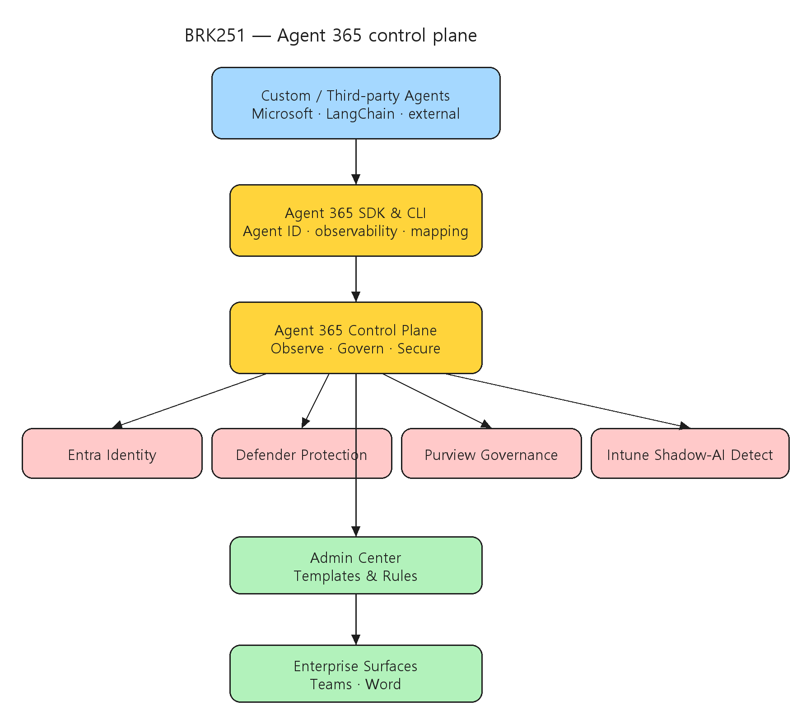

# [BRK251] Build secure and enterprise-ready agents with Agent 365

## TL;DR

> **Agent 365**는 Microsoft·서드파티 에이전트를 구분 없이 enterprise 규모로 관측·거버넌·보호하는 control plane이며, **Agent 365 SDK/CLI**로 기존 에이전트를 래핑해 Agent ID·가시성·정책을 입히고 Entra·Defender·Purview·Intune과 연계한다.

- **3대 가치 축 — Observe·Govern·Secure** — 배포된 모든 에이전트를 보고 분석(Observe), 개발 속도를 늦추지 않고 가드레일 적용(Govern), Defender·Purview·Entra로 identity·위협 탐지·컴플라이언스(Secure) (00:03:24~00:05:01).
- **Agent 365 SDK** — Microsoft·서드파티 에이전트를 래핑해 식별성·가시성·정책 강제를 부여하고, 에이전트에 ID와 observability를 준다 (00:06:10).
- **Agent Blueprints + Agent Identities** — 재사용 명령 세트(Blueprints)와 service principal 확장으로 사용자와 일관된 권한을 갖는 identity(Identities) (00:12:28).
- **Admin 자동화** — M365 Admin Center의 Templates(Entra+Defender+Purview 정책 번들), Rules(자동 재할당/차단), Registry Sync(Google Vertex·Amazon Bedrock 에이전트 통합 가시성) (00:33:33~00:36:31).

## Top highlights

### 1. Observe·Govern·Secure 3대 축 { #sec-hl-pillars }

- Observe는 다양한 플랫폼의 배포 에이전트를 보고 사용·채택 추세를 분석한다. Govern은 혁신을 막지 않고 가드레일로 안전을 유지한다. Secure는 Defender·Purview·Entra와 통합해 identity 관리·위협 탐지·컴플라이언스 모니터링을 제공한다.
- [세부 → §2 Agent 365 개요](#sec-overview)

### 2. SDK/CLI로 기존·서드파티 에이전트 온보딩 { #sec-hl-sdk }

- Agent 365 SDK는 Microsoft·서드파티 에이전트를 래핑해 Agent 365 내 discoverability·visibility·policy enforcement를 부여한다. 데모는 LangChain + Node.js travel agent를 CLI·skills로 온보딩해 observability·Work IQ·identity 등록을 자동 구성한다.
- [세부 → §4 End-to-End 데모](#sec-demo)

### 3. Admin 자동화 — Templates·Rules·Registry Sync { #sec-hl-admin }

- M365 Admin Center에서 orphaned agent 탐지·소유권 관리, Entra+Defender+Purview 정책을 번들로 묶은 Templates, 자동 재할당/차단 Rules, Google Vertex·Amazon Bedrock 에이전트를 통합하는 Registry Sync를 제공한다.
- [세부 → §5 Admin 경험과 자동화](#sec-admin)

## Why it matters

- IDC는 2028년에 조직 내 에이전트가 **13억 개 이상**이 될 것으로 예측한다. 많은 조직이 에이전트를 만들고 쓰지만 그것이 안전·컴플라이언트하다고 확신하는 경우는 드물다 — Agent 365는 그 간극을 메우는 것을 목표로 한다 (00:01:00).
- 에이전트를 운영 단계로 올릴 때 필요한 핵심 요건(가시성·정책 적용·identity 기반 접근제어·데이터 보호)을 개발 속도를 크게 늦추지 않고 적용하는 기준을 제공한다.
- SaaS·endpoint·cloud 에이전트가 혼재하고 **여러 클라우드·프레임워크·공급자**가 섞인 환경에서, Entra·Defender·Purview·Intune과 연계된 통합 거버넌스 모델을 보여준다.

## Customer scenarios

- Microsoft·서드파티 에이전트가 혼재된 환경에서 Agent 365 SDK로 온보딩해 Agent ID·런타임 가시성·정책을 일관 적용한다.
- Teams/Word 등 업무 surface에 배포하면서 Entra 권한·Purview 감사·Defender 경보를 Admin Center Templates/Rules로 자동화한다.
- Google Vertex·Amazon Bedrock 등 타 플랫폼 에이전트를 Registry Sync로 편입해 단일 콘솔에서 관측·통제한다.

## Key announcements

| 항목 | 상태 | 비고 |
|------|------|------|
| Agent 365 (Observe·Govern·Secure control plane) | 세션 발표 | Microsoft·서드파티 에이전트 통합 관측·거버넌·보호 (00:02:40) |
| Agent 365 SDK | 세션 발표 | 기존·서드파티 에이전트 래핑 → Agent ID·observability·policy (00:06:10) |
| Agent Blueprints / Agent Identities | 세션 발표 | 재사용 명령 세트 / service principal 확장 identity (00:12:28) |
| Admin Center Templates / Rules | 세션 시연 | Entra+Defender+Purview 정책 번들, 자동 재할당/차단 (00:33:33, 00:33:49) |
| Registry Sync | 세션 시연 | Google Vertex·Amazon Bedrock 에이전트 통합 가시성 (00:36:31) |

!!! preview "Agent 365 · control plane"
    Agent 365는 Observe·Govern·Secure 3대 축과 Agent 365 SDK·Admin Center 자동화(Templates·Rules·Registry Sync)를 세션에서 시연했다. 각 구성요소의 정식 가용 단계·라이선스 조건은 공식 제품 문서에서 확인이 필요하다.

## Session summary

### 1. 문제 제기와 시장 맥락 { #sec-intro }

`00:00:00` Neta Haiby가 세션을 열고, 안전·enterprise-ready·governed 에이전트를 Agent 365로 만드는 방법을 보일 것임을 설명한다. `00:00:33` 청중 설문 후, "많은 조직이 에이전트를 개발·사용하지만 안전·컴플라이언트하다고 확신하는 경우는 적다"는 문제를 제시한다. `00:01:00` IDC의 "2028년 13억+ 에이전트" 예측을 인용해 관측·거버넌·보안의 긴급성을 강조한다. `00:01:20` SaaS·endpoint·cloud 에이전트 평광과 거버넌스 질문을 던지며 Agent 365 소개로 연결한다.

### 2. Agent 365 개요 { #sec-overview }

`00:02:40` Kendra Springer가 Agent 365의 필요성과 Microsoft·서드파티 커스텀 에이전트에 주는 가치를 설명한다. **3대 가치 축** — `00:03:24` Observe(배포된 에이전트를 보고 사용·채택 추세 분석), `00:04:06` Govern(개발 속도를 늦추지 않고 가드레일로 위험 방지), `00:05:01` Secure(Defender·Purview·Entra로 identity·위협 탐지·컴플라이언스). `00:06:10` **Agent 365 SDK**로 기존 에이전트(MS 또는 서드파티)를 래핑해 discoverability·visibility·policy enforcement를 부여하고, 에이전트에 ID와 observability를 주되 기존 거버넌스·보안 프레임워크를 존중한다.

### 3. 아키텍처와 핵심 구성 { #sec-architecture }

`00:07:28` Agent 365는 Microsoft enterprise 도구와 통합된다 — **Entra**(identity), **Defender**(위협 보호), **Purview**(데이터 거버넌스), **Intune**(shadow AI 탐지). `00:08:07` 서로 다른 클라우드·프레임워크·공급자의 이종 에이전트 혼합을 관리한다. `00:12:28` 두 핵심 구조를 정의한다 — **Agent Blueprints**(재사용 명령 세트)와 **Agent Identities**(사용자와 유사한 권한으로 일관되게 행동하는 service principal 확장). `00:13:30` 인증 모델이 사용자 대행(on behalf of)이나 전용 identity로 나뉘는 점을 명확히 한다.

### 4. End-to-End 데모 { #sec-demo }

`00:13:40` Aarthy가 여러 역할로 에이전트 개발 수명주기를 시연한다. `00:14:09` 개발자로서 **LangChain + Node.js** travel-planning 에이전트를 만들고, SDK skills로 Agent 365용으로 준비한다. `00:15:07` Agent 365 CLI·skills로 observability, Work IQ 서버, identity 등록이 자동 구성된다. `00:19:07` 배포 후 테넌트 가시성 부여·Admin Center 활성화, 사용자 관점으로 전환해 Teams에서 여행 추천을 요청하고 Teams·Word를 오가며 협업한다. `00:22:01` 에이전트가 안전한 identity·관리된 권한·투명한 텔레메트리를 가진 enterprise "employee"처럼 동작함을 보인다.

### 5. Admin 경험과 자동화 { #sec-admin }

`00:25:03` Kendra가 M365 Admin Center의 관리자 뷰를 보인다. `00:26:26` total agents·usage·exception 등 analytics 대시보드와 orphaned agent 탐지·소유권 할당을 시연한다. `00:33:33` 사람 개입 없이 에이전트를 선제적으로 재할당하거나 위험한 것을 차단하는 자동화 **Rules**를, `00:33:49` Entra·Defender·Purview 통제를 결합한 재사용 정책 번들 **Templates**를 소개하고, 승인 중 자동 적용되는 배포 플로를 시연한다. `00:36:31` **Registry Sync**로 Google Vertex·Amazon Bedrock 같은 타 플랫폼 에이전트를 통합 가시성으로 수용한다.

### 6. 파트너 통합과 마무리 { #sec-partner }

`00:39:44` Genspark의 Ray Zhong이 파트너 스포트라이트로 등장한다. `00:41:11` Genspark가 AI workspace를 Agent 365와 통합해 identity 관리·보안·observability를 통일했다고 설명한다. `00:43:59` 모든 에이전트 행동이 Microsoft Entra로 인증하고 Purview에 안전하게 로깅되며, MCP 커넥터로 Teams·Outlook·OneDrive를 활용한다. `00:47:02` Neta가 Agent 365가 내부·외부 구분 없이 에이전트를 enterprise 규모로 자신있게 배포·관측·보호하게 한다고 정리한다.

## Architecture

다양한 에이전트 소스(Microsoft·LangChain·서드파티) → Agent 365 SDK/CLI 표준화 계층 → Control Plane(Observe/Govern/Secure) → Entra·Defender·Purview·Intune 연계 → Admin Center Templates/Rules/Registry Sync → Teams·Word:



| 구성요소 | 역할 |
|------|------|
| Agent 365 SDK / CLI | 기존·서드파티 에이전트를 래핑 → Agent ID·observability·policy 주입 |
| Agent Blueprints | 재사용 명령 세트 (에이전트 일관된 행동 정의) |
| Agent Identities | service principal 확장, 사용자 대행 또는 전용 identity |
| Entra / Defender / Purview / Intune | identity / 위협 탐지 / 데이터 거버넌스 / shadow AI 탐지 |
| Admin Center Templates / Rules | 정책 번들 자동 적용 / 자동 재할당·차단 |
| Registry Sync | Google Vertex·Amazon Bedrock 등 타 플랫폼 에이전트 통합 가시성 |

## Demo highlights

- ⏱️ 00:13:40~00:15:07 — LangChain + Node.js travel agent를 Agent 365 CLI·skills로 온보딩(observability·Work IQ·identity 자동 구성)
- ⏱️ 00:19:07~00:22:01 — Admin Center 활성화 후 Teams·Word에서 사용자 사용, enterprise "employee"처럼 동작
- ⏱️ 00:25:03~00:26:26 — M365 Admin Center 대시보드(total agents·usage·exception·orphaned agent)
- ⏱️ 00:33:33~00:36:31 — Rules·Templates 자동화 및 Registry Sync(Vertex·Bedrock) 시연
- ⏱️ 00:39:44~00:43:59 — Genspark 파트너 통합(Entra 인증 + Purview 로깅 + MCP 커넥터)

## Code & samples

Agent 365 SDK는 기존 에이전트(Microsoft 또는 서드파티)를 래핑해 Agent 365 내에서 discoverability·visibility·policy enforcement를 부여한다. 데모의 온보딩 흐름은 다음 개념을 따른다.

```bash
# Agent 365 CLI 온보딩 (세션 데모 개념 — 정확한 명령어는 공식 문서 확인)
# 1) 기존 LangChain + Node.js 에이전트에 Agent 365 skills 적용
# 2) observability · Work IQ server · identity 등록이 자동 구성됨
# 3) Admin Center에서 테넌트 가시성 할당 후 활성화
```

실무 PoC 권장 순서:

1. 기존 에이전트 하나를 Agent 365 SDK로 래핑해 Agent ID와 런타임 텔레메트리 연결.
2. Entra 권한 모델(사용자 위임 vs 전용 identity)을 시나리오별로 분리 정의.
3. Purview 라벨/감사 정책과 Defender 경보를 배포 파이프라인 승인 단계(Templates/Rules)에 연결.
4. 타 플랫폼(Vertex/Bedrock) 에이전트는 Registry Sync로 편입해 단일 콘솔에서 관측.

## Caveats & open questions

- **구성요소 가용 범위 미확정** — Agent Blueprints·Agent Identities·Registry Sync·Templates/Rules의 정식 가용 범위와 라이선스 조건은 공식 제품 문서로 재확인이 필요하다.
- **데모 세부의 일반화 한계** — LangChain Node.js travel agent는 예시이며, 실제 온보딩 명령어·구성은 프레임워크·언어별로 달라질 수 있다.
- **서드파티 공급자 의존성** — Genspark 등 파트너 통합은 해당 제품의 Agent 365 연계 수준에 따라 달라진다.
- **발표자 표기** — transcript의 "Neda"는 Neta Haiby로, 공식 세션 페이지 기준 표기를 따랐다. 데모 발표자 Aarthy는 공식 speaker 리스트에는 없다.

## Resources

- 🎥 Session: https://build.microsoft.com/en-US/sessions/BRK251?source=sessions
- 🖼️ Slides: https://medius.microsoft.com/video/asset/PPT/1cdd1849-8b45-4ee1-9671-e766fb044081?referrer=Microsoft+Build-%2Fen-US%2Fsessions%2FBRK251&mhid=build&loc=en-us
- 📝 Transcript: https://medius.microsoft.com/video/asset/Transcript/1cdd1849-8b45-4ee1-9671-e766fb044081?referrer=Microsoft+Build-%2Fen-US%2Fsessions%2FBRK251&mhid=build&loc=en-us
- 📚 Session page: https://build.microsoft.com/en-US/sessions/BRK251

## Related sessions

- [BRK250 — Observe and control agents across any framework with open source tools](BRK250-observe-control-agents-open-source-tools.md)
- [BRK243 — Claw and agent harness in Microsoft Foundry](BRK243-claw-agent-harness-microsoft-foundry.md)
- [BRK246 — Foundry IQ: Fuel agents with enterprise knowledge and agentic retrieval](BRK246-foundry-iq-enterprise-knowledge-agentic-retrieval.md)

## About the speakers

- **Neta Haiby** — Partner Product Manager, Microsoft · [LinkedIn](https://www.linkedin.com/in/netahaiby/) · [GitHub](https://github.com/netahw_microsoft)
- **Kendra Springer** — Principal Product Manager, Microsoft · [LinkedIn](https://www.linkedin.com/in/kendraspringer/) · [GitHub](https://github.com/kespring_microsoft)
- **Ray Zhong** — Co-founder, Genspark · [LinkedIn](https://www.linkedin.com/in/ray-zhong-a3735627/)
