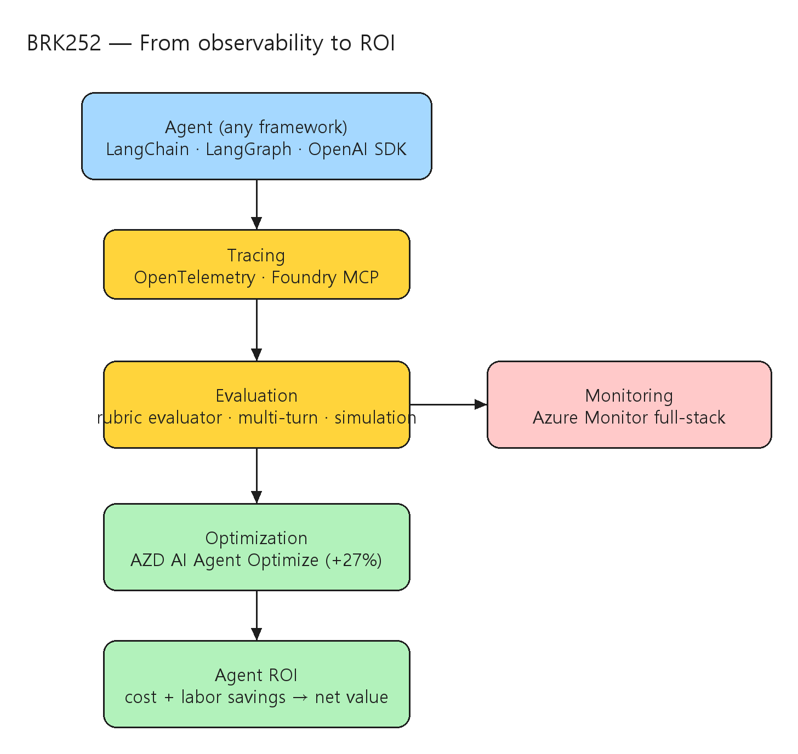

# [BRK252] From observability to ROI for AI agents on any framework

## TL;DR

> 비결정적 멀티 에이전트 시스템은 전통 모니터링을 무너뜨린다. Microsoft Foundry Observability는 **tracing · evaluation · monitoring · optimization** 4기둥을 어떤 프레임워크(LangChain/LangGraph/OpenAI SDK)에서도 제공하고, 행동 신호를 **value · cost · ROI**라는 비즈니스 성과로 연결한다. rubric evaluator(public preview)·AZD AI Agent Optimize·Agent ROI(private preview)가 핵심이다.

- **4기둥 = agent DevOps lifecycle** — tracing·evaluation·monitoring·optimization을 어떤 프레임워크에서도 (00:00:39).
- **rubric evaluator** — system prompt/model/hosted agent로부터 가중 카테고리의 다차원 메트릭을 자동 생성, 프로덕션 trace에 적용 → public preview (00:05:53~00:10:05).
- **AZD AI Agent Optimize** — 라이브 trace 기반 hill-climbing으로 prompt·tool·model 자율 개선, +27% 정확도 (00:20:23).
- **Agent ROI** — 토큰·도구 비용 + 인건비 절감을 net value/ROI로 추적 → private preview (00:27:19).

## Top highlights

### 1. Any-framework observability 4기둥 { #sec-hl-pillars }

- tracing·evaluation·monitoring·optimization을 LangChain/LangGraph/OpenAI SDK 등 어떤 프레임워크에서도 일관되게 제공하고, Azure Monitor로 full-stack 가시성을 잇는다.
- [세부 → §1 Foundry Observability 4기둥](#sec-pillars)

### 2. rubric evaluator로 자동 평가 { #sec-hl-rubric }

- system prompt·model·hosted agent를 입력하면 가중 카테고리의 다차원 메트릭을 자동 생성하고, 이를 프로덕션 trace에 적용해 멀티턴·시뮬레이션 평가까지 확장한다(public preview).
- [세부 → §2 시작하기·rubric evaluator](#sec-rubric)

### 3. observability → ROI { #sec-hl-roi }

- AZD AI Agent Optimize가 라이브 trace에서 prompt·tool·model을 자율 개선(+27%)하고, Agent ROI 모듈이 비용 대비 가치를 trace 수준으로 추적해 관찰을 비즈니스 성과로 닫는다(private preview).
- [세부 → §3 최적화와 ROI](#sec-optimize)

## Why it matters

- 멀티 에이전트는 **비결정적**이라 동일 입력에도 경로가 달라진다. 전통적 임계치·로그 기반 모니터링으로는 품질·안전·비용을 통제할 수 없고, **cross-framework tracing + context-specific evals + always-on signals**가 필요하다.
- 핵심 차별점은 관찰을 **ROI로 닫는 루프**다 — 토큰·도구 비용과 인건비 절감을 trace 수준으로 묶어 "성공 1건당 $5 절감"처럼 비즈니스 성과로 환산한다. 에이전트 투자의 정당화·최적화가 데이터 기반이 된다.
- **any framework** 전략은 Foundry에 종속되지 않은 팀도 관측·평가·최적화를 채택할 수 있게 해, OpenTelemetry 표준·Azure Monitor full-stack과 결합된 개방형 생태계를 지향한다.

## Customer scenarios

- LangGraph/OpenAI SDK로 만든 기존 에이전트에 코드 변경 없이 tracing·평가를 붙여 프로덕션 품질을 상시 관측.
- rubric evaluator로 도메인 특화 다차원 메트릭을 정의해 회귀를 CI/CD에서 자동 차단.
- Agent ROI로 에이전트별 net value/ROI 추세를 경영진에 보고하고 비용 초과 에이전트를 식별·최적화.

## Key announcements

| 항목 | 상태 | 비고 |
|------|------|------|
| Microsoft Foundry Observability (tracing/eval/monitoring/optimization) | 세션 발표 | any framework, agent DevOps lifecycle (00:00:39) |
| rubric evaluator | Public Preview | 다차원 메트릭 자동 생성, 프로덕션 trace 적용 (00:10:05) |
| 코드 우선 observability (VS Code + Foundry MCP server/toolkit) | 세션 시연 | inner-loop 관측 (00:12:01) |
| 멀티턴 평가 + user simulation | 세션 시연 | 대화 흐름 평가 (00:17:59) |
| AZD AI Agent Optimize | 세션 발표 | prompt·tool·model 자율 개선, +27% 정확도 (00:20:23) |
| Agent ROI 모듈 | Private Preview | 비용+인건비 절감 → net value/ROI (00:27:19) |

!!! preview "Public Preview · rubric evaluator"
    rubric evaluator는 세션에서 public preview로 소개되었다.

!!! preview-private "Private Preview · Agent ROI"
    Agent ROI 모듈은 세션에서 private preview로 소개되었다. 가용 단계·접근 경로는 공식 문서로 재확인이 필요하다.

## Session summary

### 1. Foundry Observability 4기둥 { #sec-pillars }

`00:00:00` Sebastian Kohlmeier가 Microsoft Foundry Observability를 소개한다. `00:00:39` tracing·evaluation·monitoring·optimization 4기둥을 제시하며, 이를 **agent DevOps lifecycle**로 묶고 어떤 프레임워크에서도 동작함을 강조한다. 비결정적 멀티 에이전트는 전통 모니터링을 무너뜨리므로, 행동을 비즈니스 성과(value·cost·ROI)에 연결하는 always-on 신호가 필요하다.

### 2. 시작하기·rubric evaluator { #sec-rubric }

`00:03:55` Filisha Shah가 getting-started 데모를 진행한다 — MS 데이터센터의 벤더 성능을 평가하는 hosted agent를 만들고, tracing 뷰에서 라이브 로그를 본다. `00:05:53` **rubric evaluator**를 소개한다 — system prompt·model·hosted agent target에서 가중 카테고리의 다차원 메트릭을 자동 생성하고 프로덕션 trace에 적용한다. `00:10:05` 개방형 생태계(LangChain/LangGraph/OpenAI SDK)와 Azure Monitor full-stack 가시성을 강조하며 rubric evaluator의 **public preview**를 알린다. `00:12:01` VS Code 안에서 Foundry MCP server·toolkit 확장으로 코드 우선 observability를 시연하고, `00:17:59` 멀티턴 평가와 user simulation으로 대화 흐름을 평가한다.

### 3. 최적화와 ROI { #sec-optimize }

`00:20:23` Vivek Bhadauria가 **AZD AI Agent Optimize**를 소개한다 — 라이브 trace에서 prompt·tool·model을 자율적으로 hill-climbing 개선하며 정확도 **+27%**를 보인다. `00:27:19` **Agent ROI** 모듈(**private preview**)을 발표한다 — 토큰·도구 비용과 인건비 절감을 묶어 "성공 1건당 $5 절감"처럼 net value/ROI 추세를 추적하고 trace 수준으로 파고든다. `00:33:00` open telemetry 표준, memory tracing semantics, red-teaming, CI/CD, Azure Monitor 통합으로 마무리하며 고객 사례로 NTT DATA를 든다.

## Architecture

Agent(any framework) → Tracing(OpenTelemetry) → Evaluation(rubric evaluator·멀티턴·simulation) → Monitoring(Azure Monitor full-stack) → Optimization(AZD AI Agent Optimize) → ROI(Agent ROI 모듈):



| 기둥 | 구성요소 | 산출 |
|------|------|------|
| Tracing | OpenTelemetry, Foundry MCP server (VS Code) | 라이브 로그·trace |
| Evaluation | rubric evaluator, 멀티턴, user simulation | 가중 다차원 메트릭 |
| Monitoring | Azure Monitor full-stack | always-on 신호 |
| Optimization | AZD AI Agent Optimize | prompt·tool·model 자율 개선 |
| ROI | Agent ROI 모듈 | net value · cost · ROI 추세 |

## Demo highlights

- ⏱️ 00:03:55 — Filisha Shah, 벤더 성능 평가 hosted agent + tracing 라이브 로그
- ⏱️ 00:05:53 — rubric evaluator 자동 다차원 메트릭 생성·프로덕션 trace 적용
- ⏱️ 00:12:01 — VS Code + Foundry MCP server/toolkit 코드 우선 observability
- ⏱️ 00:17:59 — 멀티턴 평가 + user simulation
- ⏱️ 00:20:23 — AZD AI Agent Optimize, 라이브 trace hill-climbing +27%
- ⏱️ 00:27:19 — Agent ROI, 성공 1건당 $5 절감·net value/ROI trace 분석

## Code & samples

코드 우선 관측은 VS Code에서 Foundry MCP server와 toolkit 확장으로 inner-loop를 구성한다(정확한 명령·패키지는 Foundry/AZD 문서 확인).

```text
# observability → ROI 루프 (세션 흐름 기준)
# 1) any framework(LangChain/LangGraph/OpenAI SDK) 에이전트에 OpenTelemetry tracing
# 2) rubric evaluator: system prompt/model/target → 가중 다차원 메트릭 자동 생성
# 3) 프로덕션 trace에 평가 적용 + 멀티턴 + user simulation
# 4) Azure Monitor full-stack로 always-on 모니터링
# 5) AZD AI Agent Optimize: 라이브 trace hill-climbing(prompt/tool/model)
# 6) Agent ROI: 토큰/도구 비용 + 인건비 절감 → net value/ROI
```

## Caveats & open questions

- **가용 단계** — rubric evaluator는 public preview, Agent ROI는 private preview로 소개되었다. AZD AI Agent Optimize·user simulation의 정식 단계·일자는 공식 문서로 재확인이 필요하다.
- **+27% 정확도** — AZD AI Agent Optimize의 +27%는 세션 데모 수치이며, 도메인·데이터에 따라 달라질 수 있다.
- **ROI 산정 가정** — "성공 1건당 $5 절감" 같은 값은 인건비·성공 정의 등 가정에 의존하므로 조직별 보정이 필요하다.

## Resources

- 🎥 Session: https://build.microsoft.com/en-US/sessions/BRK252?source=sessions
- 🎬 Video: https://medius.microsoft.com/video/asset/HIGHMP4/bc75ad49-f354-49ee-a449-69cb12bcf5fb?referrer=Microsoft+Build-%2Fen-US%2Fsessions%2FBRK252&mhid=build&loc=en-us
- 📝 Transcript: https://medius.microsoft.com/video/asset/Transcript/bc75ad49-f354-49ee-a449-69cb12bcf5fb?referrer=Microsoft+Build-%2Fen-US%2Fsessions%2FBRK252&mhid=build&loc=en-us
- 🔗 Next steps: https://aka.ms/build26/BRK252

## Related sessions

- [BRK250 — Observe and control agents with open-source tools](BRK250-observe-control-agents-open-source-tools.md)
- [BRK251 — Build secure, enterprise-ready agents with Agent 365](BRK251-build-secure-enterprise-ready-agents-agent-365.md)
- [BRK243 — Claw and agent harness in Microsoft Foundry](BRK243-claw-agent-harness-microsoft-foundry.md)

## About the speakers

- **Sebastian Kohlmeier** — Microsoft (Microsoft Foundry Observability)
- **Filisha Shah** — Microsoft
- **Vivek Bhadauria** — Microsoft
