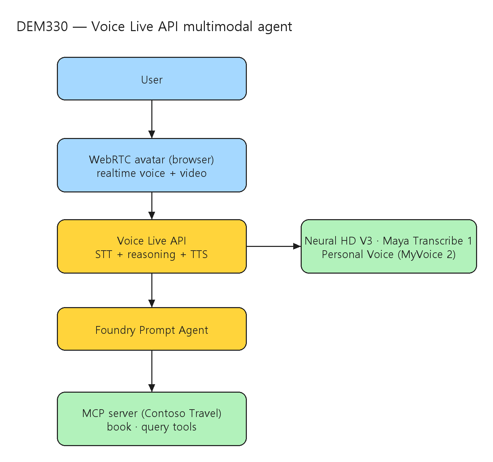

# [DEM330] Build multimodal agents that reason, interact, and take action

## TL;DR

> Microsoft Foundry의 **Voice Live API**로 speech-to-text·모델 추론·text-to-speech를 하나로 묶어, MCP로 도구를 호출해 실제 행동(항공·호텔 예약)을 하는 **voice-first 멀티모달 에이전트**를 슬라이드 없이 라이브 코딩으로 만든다. Personal Voice·avatar까지 붙여 사용자 고유의 음성·외형을 가진 에이전트로 확장한다.

- **Voice Live API** — STT·reasoning·TTS를 통합하고 듣기·turn-taking·끼어들기를 자동 처리. Neural HD V3 voice "Serena", Maya Transcribe 1 다국어 입력, WebRTC avatar (00:03:44).
- **Foundry Prompt Agent + MCP** — 모델·지시문을 정의하고 Contoso Travel MCP server에 연결해 예약·조회 도구를 자동 부여 (00:04:43~00:06:02).
- **Personal Voice + avatar** — 동의 녹음으로 음성 클로닝(MyVoice 2), 사진 1장+동의 영상으로 talking-head avatar 생성 (00:07:06~00:11:15).

## Why it matters

- 복잡한 실시간 대화 처리(듣기·turn-taking·끼어들기·STT/TTS 동기화)가 Voice Live API로 자동화되어, 개발자는 **intent와 UX에만 집중**하면 voice-first 에이전트를 만들 수 있다.
- MCP로 도구를 연결하면 에이전트가 단순 응답을 넘어 **실제 행동(예약·조회)**을 수행한다 — 대화형 avatar가 곧 작업을 실행하는 인터페이스가 된다.
- Personal Voice·avatar로 브랜드/개인 고유의 음성·외형을 입힐 수 있어, 콜센터·키오스크·가상 안내 등 고객 접점에 차별화된 멀티모달 경험을 배치할 수 있다.

## Customer scenarios

- 여행·예약 도메인에서 음성으로 항공·호텔을 대화형으로 검색·확정하는 voice-first 어시스턴트.
- 브랜드 고유의 Personal Voice와 avatar를 가진 가상 상담원을 웹(WebRTC)에 임베드.
- MCP 도구 연결로 사내 시스템(CRM·예약·티켓팅)에 실제 행동을 수행하는 멀티모달 에이전트.

## Key announcements

| 항목 | 상태 | 비고 |
|------|------|------|
| Voice Live API (Microsoft Foundry) | 세션 시연 | STT+추론+TTS 통합, turn-taking·끼어들기 자동 처리 (00:03:44) |
| Neural HD V3 voice "Serena" / Maya Transcribe 1 | 세션 시연 | 자연스러운 TTS · 다국어 STT (00:03:44) |
| Personal Voice (MyVoice 2) | 세션 시연 | 동의 기반 음성 클로닝 (00:08:12~00:09:59) |
| WebRTC avatar (talking-head) | 세션 시연 | 사진 1장+동의 영상으로 생성 (00:10:00~00:11:15) |

!!! preview "Microsoft Foundry · Voice Live API"
    Voice Live API·Neural HD·Personal Voice·avatar는 세션에서 라이브로 시연되었다. 각 기능의 정식 가용 단계·리전·동의/책임 AI 요건은 공식 Microsoft Foundry 문서에서 확인이 필요하다.

## Session summary

### 1. 도입과 라이브 데모 { #sec-intro }

`00:00:01` Microsoft의 Principal Developer Advocate Heng Bullmann이 reason·interact·act 하는 멀티모달 에이전트 세션을 연다. 예시로 자연스럽게 대화하고 항공·호텔을 검색·응답하는 voice agent "Hank's Travel Agency"를 제시한다. `00:00:29` 실시간 데모에서 음성 에이전트가 Heng의 Microsoft Build(San Francisco) 출장을 관리하며 2026년 5월 28일 Amsterdam 출발 항공을 예약하고 가격·시간을 확인한다(`00:01:20`~`00:01:39`), 예산 내 호텔을 제안한다(`00:02:05`~`00:02:34`). `00:03:26` Heng이 사람에게 말하듯 대화했고 에이전트가 실시간으로 듣고 적응하며 작업을 수행했다고 정리한다.

### 2. Voice Live API 기술 { #sec-voicelive }

`00:03:44` Heng이 데모가 Microsoft **Voice Live API** 위에서 동작함을 설명한다 — STT와 TTS를 매끄러운 실시간 통신으로 통합하는 단일 인터페이스로, 듣기·turn-taking·끼어들기를 자동 처리한다. 데모는 새 **Neural HD V3 voice "Serena"**와 **Maya Transcribe 1** 다국어 음성 입력을 사용하고, lifelike avatar "Selena"는 WebRTC 위에서 브라우저 기반 실시간 음성·영상 상호작용을 가능케 한다.

### 3. Foundry에서 에이전트 빌드 { #sec-build }

`00:04:43` Heng이 Microsoft Foundry에서 에이전트를 만드는 과정을 보인다. `00:05:01`~`00:06:02` **Prompt Agent**를 설정해 모델과 대화 지시문을 정의하고 Contoso Travel MCP server에 연결한다. 에이전트는 외부 서비스 접근을 자동 부여받아 예약·조회를 처리하며, 음성 통합 전에 텍스트 전용 버전을 Foundry에서 직접 테스트해 이미 지능적 행동이 가능함을 확인한다.

### 4. Voice·avatar 개인화 { #sec-personalize }

`00:07:06` 개인화 옵션을 소개한다 — 톤·컨텍스트에 동적으로 적응하는 Neural HD voice, 표현력 있는 음성을 위한 최신 **MyVoice 2** 모델, Personal Voice 클로닝. `00:08:12`~`00:09:59` Foundry에서 동의 문구와 짧은 샘플을 녹음해 고유 재현 음성을 만든다. `00:10:00`~`00:11:15` 사진 1장과 동의 영상으로 talking-head 모델을 학습시켜 사실적·표현력 있는 avatar를 만든다.

### 5. 최종 통합과 마무리 { #sec-wrap }

`00:11:54`~`00:15:59` Heng이 모든 것을 결합한다 — 개인화된 음성·avatar가 같은 에이전트 시스템을 통해 상호작용하며 New York행 새 출장을 예약한다. 멀티모달 에이전트가 항공부터 호텔 선택까지 자율적으로 수행하면서 Heng 자신의 정체성을 시각·청각으로 반영한다. 복잡한 대화 처리가 자동화되므로 개발자는 intent와 UX에 집중하면 된다고 요약하며, 데모 URL 탐색과 고유 멀티모달 에이전트 제작을 권한다.

## Architecture

User ↔ WebRTC avatar(브라우저) → Voice Live API(STT·reasoning·TTS 통합) → Foundry Prompt Agent → MCP server(Contoso Travel) 도구 호출 → 실제 행동(예약·조회):



| 구성요소 | 역할 |
|------|------|
| Voice Live API | STT+추론+TTS 통합, turn-taking·끼어들기 자동 처리 |
| Neural HD V3 / Maya Transcribe 1 | 자연스러운 TTS(Serena) · 다국어 STT |
| WebRTC avatar | 브라우저 기반 실시간 음성·영상 talking-head |
| Foundry Prompt Agent | 모델·지시문 정의, 텍스트 테스트 |
| MCP server (Contoso Travel) | 예약·조회 도구 자동 부여 |
| Personal Voice (MyVoice 2) | 동의 기반 음성 클로닝 |

## Demo highlights

- ⏱️ 00:00:29~00:03:26 — Hank's Travel Agency 음성 에이전트가 Amsterdam 출발 항공·호텔을 대화형 예약
- ⏱️ 00:03:44 — Voice Live API(Neural HD "Serena", Maya Transcribe 1, WebRTC avatar) 설명
- ⏱️ 00:05:01~00:06:02 — Foundry Prompt Agent + Contoso Travel MCP server 연결, 텍스트 테스트
- ⏱️ 00:08:12~00:09:59 — 동의 기반 Personal Voice 클로닝
- ⏱️ 00:10:00~00:11:15 — 사진 1장+동의 영상으로 avatar 생성
- ⏱️ 00:11:54~00:15:59 — 개인화 음성·avatar로 New York 출장 예약 통합 데모

## Code & samples

세션은 슬라이드 없는 라이브 코딩이며, 핵심 패턴은 Foundry Prompt Agent + Voice Live API + MCP 연결이다(정확한 SDK·엔드포인트는 Foundry 문서 확인).

```text
# voice-first, tool-using agent 개념 (세션 데모 기준)
# 1) Foundry Prompt Agent: 모델 + 대화 지시문 정의
# 2) MCP server(Contoso Travel) 연결 → 예약/조회 도구 자동 부여
# 3) 텍스트 전용으로 먼저 테스트
# 4) Voice Live API 연결: STT(Maya Transcribe 1) + TTS(Neural HD "Serena")
# 5) WebRTC avatar 추가 → 브라우저 실시간 음성/영상
# 6) (옵션) Personal Voice(MyVoice 2) + talking-head avatar 개인화
```

재현 권장 순서:

1. 텍스트 전용 Prompt Agent로 도구 호출(MCP) 동작을 먼저 검증.
2. Voice Live API를 붙여 turn-taking·끼어들기 등 실시간 음성 흐름 확인.
3. WebRTC avatar로 브라우저 임베드.
4. Personal Voice·avatar 개인화는 동의·책임 AI 요건을 충족한 뒤 적용.

## Caveats & open questions

- **가용 단계 미확정** — Voice Live API·Neural HD V3·MyVoice 2·avatar의 정식 GA/Preview 단계·리전은 공식 문서로 재확인이 필요하다.
- **음성/외형 클로닝 동의·책임 AI** — Personal Voice·avatar는 동의 기반이며, 실제 배포 시 책임 AI·프라이버시·악용 방지 정책 준수가 필수다.
- **명칭 표기** — AI Summary에서 avatar가 "Selena"/voice가 "Serena"로 혼용되어, 정확한 제품 명칭은 공식 문서 확인이 필요하다.

## Resources

- 🎥 Session: https://build.microsoft.com/en-US/sessions/DEM330?source=sessions
- 🎬 Video: https://medius.microsoft.com/video/asset/HIGHMP4/4ae2998c-c3ca-44ab-b896-41047cd9c688?referrer=Microsoft+Build-%2Fen-US%2Fsessions%2FDEM330&mhid=build&loc=en-us
- 📝 Transcript: https://medius.microsoft.com/video/asset/Transcript/4ae2998c-c3ca-44ab-b896-41047cd9c688?referrer=Microsoft+Build-%2Fen-US%2Fsessions%2FDEM330&mhid=build&loc=en-us
- 💬 Microsoft Foundry in Discord: https://aka.ms/build/foundrydiscord

## Related sessions

- [DEMSP390 — Create multimodal AI agents with persistent memory](DEMSP390-create-multimodal-ai-agents-persistent-memory.md)
- [BRK246 — Foundry IQ: Fuel agents with enterprise knowledge and agentic retrieval](BRK246-foundry-iq-enterprise-knowledge-agentic-retrieval.md)
- [BRK243 — Claw and agent harness in Microsoft Foundry](BRK243-claw-agent-harness-microsoft-foundry.md)

## About the speakers

- **Heng Bullmann** — Principal Developer Advocate, Microsoft
