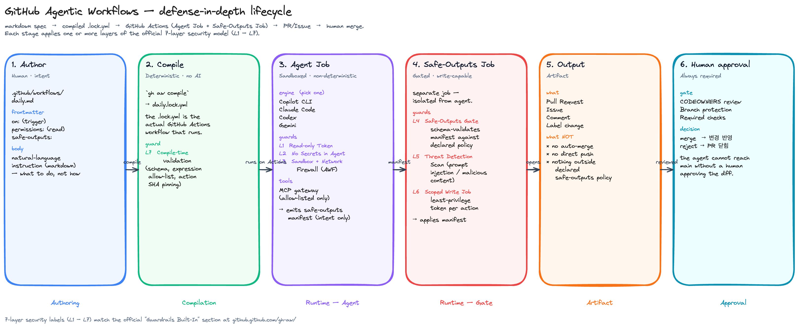

# [DEM350] GitHub Agentic Workflows: Automation That Actually Reads the Room

## TL;DR

> GitHub Actions에 **AI 에이전트를 한 잡으로 끼워 넣는 새 워크플로우 종류** — "Agentic Workflow" — 가 추가된 것. 사람은 YAML 대신 markdown으로 의도를 적고 `gh aw compile`이 일반 Actions가 실행할 `.lock.yml` 로 변환한다. 실행 시 AI 에이전트(Copilot CLI / Claude Code / Codex / Gemini 중 택1)가 그 잡에 들어와 **이슈 트리아지 · CI 실패 분석 · 문서 갱신 · 테스트 보강** 같은 저장소 유지보수 작업을 수행하고, 출력은 샌드박스 바깥의 별도 잡(**safe-outputs**)이 검증해 **리뷰 가능한 PR**로 내놓는다 — **머지는 사람**. 빌드·테스트 같은 결정론적 CI/CD를 대체하는 게 아니라, YAML로 표현하기 어려운 **주관적 작업**을 GitHub Actions 위에 얹는 보완 레이어 ("Continuous AI").

## Why it matters

- **GitHub Actions의 표현력 확장** — runner·trigger·permissions·marketplace action 같은 기존 Actions 인프라를 그대로 쓰면서, 그 위에 "주관적 판단" 영역만 LLM에 위임. 별도 자동화 플랫폼을 도입하는 게 아니라 **워크플로우 작성 언어가 markdown으로 늘어난 것**으로 보면 됨.
- **결정론 + 비결정론 분리** — 자연어 spec → 컴파일된 `.lock.yml`이 PR 리뷰 대상이 됨. 컴파일은 `gh aw compile`이 수행하는 결정론적 단계 (AI 아님). 런타임만 비결정론적 에이전트.
- **공급망 보안 모델이 처음부터 박혀 있음** — 에이전트는 read-only 토큰, secrets 접근 불가, 네트워크 egress 제한(AWF), 출력은 별도 잡에서 검증 후 적용. **PR이 자동 머지되는 일은 없음** — 사람 승인 필수.
- **엔진 portability** — 동일 markdown spec을 Copilot CLI · Claude Code · Codex · Gemini로 갈아 끼울 수 있어 LLM 벤더 락인을 피함.
- **비용 가시성 필요** — Copilot 기본 설정 시 워크플로우 1회 실행당 **premium request 2건** 소모 (agentic 작업 + safe-outputs 가드). 도입 전에 빌링 영향 계산 필요.

## Customer scenarios

공식 사이트의 [Gallery](https://github.github.com/gh-aw/) 캴 6개 카테고리가 그대로 일선 도입 시나리오.

- **Issue & PR Management** — 자동 트리아지·라벨링·프로젝트 조정. 새 이슈가 열리면 과거 이슈·코드베이스를 가로질러 중복/라벨을 코멘트/라벨 변경 PR로 제안.
- **Continuous Documentation** — 도큐멘트 유지보수 자동화. 데모의 "Mona's GitHub Info" 시나리오가 이 카테고리.
- **Continuous Improvement** — 매일 코드 단순화·리팩터링·스타일 개선. 한 번에 획일 프로젝트 전체를 바꾸는 게 아니라 소규모 PR 단위로 누적.
- **Metrics & Analytics** — 일간·주간 리포트, 트렌드 분서, 워크플로우 건강도 모니터링.
- **Quality & Testing** — CI 실패 진단, 테스트 보강, 품질 체크. 공식 TL;DR의 "fix CI failures, improve tests"가 여기에 속함.
- **Multi-Repository** — 여러 저장소 간 기능 동기와 크로스 레포 추적.

## Key announcements

| 항목 | 상태 | 날짜 | 비고 |
|------|------|------|------|
| GitHub Agentic Workflows (`gh aw`) | Public Preview | 2026-02-13 | GitHub Blog 공식 발표 · `gh.io/gh-aw` 문서 기준 "in Public Preview and may change significantly" |
| Agent Workflow Firewall (`gh-aw-firewall`) | Public Preview | — | 에이전트 잡의 네트워크 egress allow-list 제어 |
| MCP Gateway (`gh-aw-mcpg`) | Public Preview | — | 워크플로우에서 사용하는 MCP 도구 게이트웨이 |
| `gh-aw-actions` | Public Preview | — | 컴파일·런타임·safe-outputs 잡에서 호출되는 Action 모음 |
| The Agentics 샘플 팩 | Available | — | GitHub Next `githubnext/agentics` — 35+ 샘플 워크플로우 |
| GitHub Skills 연습 | Available | — | `gh.io/gh-skills-gh-aw` — Mona website updater 핸즈온 |

!!! preview "Public Preview"
    공식 문서 [gh.io/gh-aw](https://gh.io/gh-aw)에 "GitHub Agentic Workflows is in **Public Preview** and may change significantly"로 명시되어 있음. GitHub Blog (2026-02-13)는 같은 상태를 "technical preview"로 표현. 세션에서 발표자가 언급한 "다음 주 public preview"는 특정 마일스톤(스킬 연습 공개 등)을 가리키는 것으로 보이며, 제품 자체는 이미 2026-02부터 preview 상태.

## Demo highlights

세션 데모는 **GitHub Skills 연습**을 25분 압축으로 따라가는 형식이라, 실제 핸즈온은 아래 레포를 직접 따라 하는 게 빠름. 흐름 자체는 [Code & samples](#code-samples) · [Architecture](#architecture) 섹션이 더 자세함.

- **Skills 연습 (단계별 가이드)**: [`skills/agentic-workflows-that-read-the-room`](https://github.com/skills/agentic-workflows-that-read-the-room) — Mona의 GitHub Info 사이트를 **Mona's notes · GitHub Blog · GitHub Changelog** 세 개 소스로 갱신하는 PR을 에이전트가 등록하도록 단계별로 빌드. 공식 안내로는 45분 이하.
- **Build 데모 완성본**: [`microsoft/Build26-DEM350-…`](https://aka.ms/build26/DEM350) — 발표자가 무대에서 사용한 완성 코드.

> "에이전트가 직접 push 하지 않습니다. 에이전트는 출력 명세만 내고, 별도의 잡이 그 명세대로 PR을 만들어요." — 발표자 (요지)

## Code & samples

### Markdown 워크플로우 spec — frontmatter 예시

```markdown
---
on:
  schedule:
    - cron: "0 9 * * 1"   # 매주 월요일 09:00 UTC
  workflow_dispatch:

permissions:
  contents: read
  issues: read
  pull-requests: read

engine: copilot           # copilot | claude | codex | gemini

tools:
  github:
    allowed: [list_issues, get_issue, list_pulls]
  fetch:
    allowed_domains:
      - github.blog
      - github.com/changelog

safe-outputs:
  create-pull-request:
    title-prefix: "[mona-info]"
    draft: true
  create-issue:
    labels: [mona-info, automated]

max-ai-credits: 5
---

# Update Mona's GitHub Info

당신은 Mona의 GitHub Info 사이트를 매주 갱신하는 에이전트입니다.

다음을 수행하세요:

1. `github.blog` 피드에서 지난 7일간의 새 글 제목·URL·요약을 수집
2. `github.com/changelog` 에서 같은 기간의 변경 사항을 수집
3. 결과를 `docs/mona-info.md` 의 형식에 맞춰 정리
4. 변경 사항이 있으면 PR을 열고, 없으면 아무것도 하지 않음
```

핵심 포인트:

- `permissions:` 가 **read-only** 만 선언 — 에이전트 잡은 쓸 수 없음
- 쓰기는 `safe-outputs:` 에 **선언적으로 의도만** 적음 — 실제 권한은 별도 잡이 받음
- `engine:` 한 줄만 바꾸면 같은 spec을 다른 LLM으로 실행 가능
- `max-ai-credits` 로 1회 실행 비용 상한 설정

### CLI 흐름

```bash
gh extension install github/gh-aw

# 샘플 워크플로우를 그대로 추가 (interactive wizard)
gh aw add-wizard githubnext/agentics/daily-repo-status
# 또는 직접 작성: .github/workflows/daily-repo-status.md

gh aw compile                       # frontmatter 변경 시 → .lock.yml 재생성
git add .github/workflows/daily-repo-status.{md,lock.yml}
git commit -m "feat(workflows): add daily repo status"

gh aw audit                         # 토큰·도구·egress 정책 정적 분석
gh aw run daily-repo-status         # 수동 트리거
gh aw status                        # 실행 상태 확인
gh aw logs                          # 토큰·시간·AI Credits 소비 추적
```

## Architecture

세션이 직접 다이어그램을 보여주진 않았지만, 데모 흐름과 공식 문서를 합치면 라이프사이클은 다음과 같음. 각 박스 안에 공식 ["Guardrails Built-In"](https://github.github.com/gh-aw/) 7-layer 보안 모델(L1 – L7)이 어느 단계에 적용되는지 매핑되어 있음.



6 단계 흐름 (가로) + 7 layer 보안 매핑:

| 단계 | 역할 | 적용 보안 layer |
|---|---|---|
| **1. Author** | 사람이 markdown spec 작성 | — |
| **2. Compile** | `gh aw compile`로 `.lock.yml` 생성 (AI 아님) | **L7** Compile-time validation |
| **3. Agent Job** | sandboxed 컨테이너에서 엔진 실행, safe-outputs manifest만 생성 | **L1** Read-only Token · **L2** No Secrets in Agent · **L3** Sandbox + Network Firewall |
| **4. Safe-Outputs Job** | 별도 잡이 manifest 검증·실행 | **L4** Safe-Outputs Gate · **L5** Threat Detection Scan · **L6** Scoped Write Job |
| **5. Output** | PR / Issue / Comment / Label (auto-merge 없음) | — |
| **6. Human approval** | CODEOWNERS + branch protection | — |

## Caveats & open questions

- **빌링 모델** — Copilot 기본 설정 시 워크플로우 1회 실행당 premium request 2건. 운영 규모에 따라 월 수십~수백 건이 누적되면 비용 곡선이 가파를 수 있음. 사내 한도(`max-ai-credits`)와 합쳐 시뮬레이션 필요.
- **빌링 버그 이력** — 공식 레포 README에 v0.68.4 ~ v0.71.3 버전이 "bug that impacts billing" 으로 retire. 운영 입장에서 버전 고정/자동 업그레이드 정책 선결 필요.
- **상태 표현 불일치** — `gh.io/gh-aw` 문서는 "Public Preview", GitHub Blog는 "technical preview", GitHub Next 프로젝트 페이지는 여전히 "research demonstrator"로 표기. 운영 적용 시점에 GA 여부 재확인 필요.
- **GA 일정 미공개** — 세션·블로그 어디에도 일반 가용성 일자는 없음.
- **에이전트 엔진별 차이** — Copilot/Claude/Codex/Gemini 간 도구 호출·토큰 한도·신뢰성 차이에 대한 가이드는 미공개. 동일 spec을 4개 엔진에서 돌렸을 때의 정확도/비용 비교 자료 필요.
- **MCP gateway 거버넌스** — `gh-aw-mcpg`가 사내 MCP 서버를 어떻게 등록·감사하는지 세션 단계에선 디테일 없음.
- **감사 로그 보존** — 에이전트 입출력 트레이스를 OpenTelemetry로 내보낼 수 있다는 언급은 있으나, 보존 기간·SIEM 연동 가이드는 별도 확인 필요.
- **공급망 사고 발생 시 책임 분기** — safe-outputs 가드가 우회되거나 검증 누락이 일어났을 때의 incident response 가이드 부재.

## Resources

- 🎥 Session: <https://build.microsoft.com/en-US/sessions/DEM350?source=sessions>
- 💻 GitHub (제품): <https://github.com/github/gh-aw>
- 📚 Docs: <https://gh.io/gh-aw> (→ <https://github.github.com/gh-aw/>)
- 🧪 Skills 연습: <https://gh.io/gh-skills-gh-aw> (→ <https://github.com/skills/agentic-workflows-that-read-the-room>)
- 📦 Build 데모 저장소: <https://aka.ms/build26/DEM350> (→ `microsoft/Build26-DEM350-github-agentic-workflows-automation-that-actually-reads-the-room`)
- 🌱 샘플 워크플로우 팩 (The Agentics): <https://github.com/githubnext/agentics>
- 🛡️ Agent Workflow Firewall: <https://github.com/githubnext/gh-aw-firewall>
- 🔌 MCP Gateway: <https://github.com/githubnext/gh-aw-mcpg>
- 📰 발표 블로그 (2026-02-13): <https://github.blog/ai-and-ml/generative-ai/automate-repository-tasks-with-github-agentic-workflows/>
- 🔐 보안 아키텍처 블로그: <https://github.blog/engineering/under-the-hood-security-architecture-of-github-agentic-workflows/>
- 💰 토큰 효율 블로그: <https://github.blog/engineering/improving-token-efficiency-in-github-agentic-workflows/>

## Related sessions

- [BRK240 — Build context-aware agents](BRK240-build-context-aware-agents.md) — 에이전트 컨텍스트 레이어와의 관점 비교
- ODSP938 — Mitigate software supply chain risks in GitHub Actions (작성 예정)

## Notes

- 발표자 인용은 25분 세션 트랜스크립트 요지 기반으로 정리. 정확한 워딩 필요 시 build.microsoft.com 트랜스크립트 재확인.
- AI가 생성한 세션 요약에는 "CI/CD를 쉽게 한다", "다음 주 public preview" 같은 문장이 포함되어 있는데, 공식 문서 기준으로 둘 다 부정확 — 노트 본문에서는 정정해 반영함.
- Code & samples의 frontmatter / CLI 예시는 [github.github.com/gh-aw](https://github.github.com/gh-aw/) 메인 페이지 ("Daily Issues Report" 예시) 와 "Manage Cost and Capacity" 섹션에서 직접 확인된 키·명령만 사용. 그 외 frontmatter 키(`engine`, `tools.github.allowed`, `safe-outputs.create-pull-request` 등)는 공식 reference 페이지를 별도 확인 후에만 추가할 것.
- Customer scenarios는 공식 사이트의 Gallery 6 카테고리(Issue & PR Management / Continuous Documentation / Continuous Improvement / Metrics & Analytics / Quality & Testing / Multi-Repository)에 매핑.
- 다이어그램은 `tools/gen_dem350_diagrams.py`로 일괄 생성. 좌표 수정 시 같은 스크립트 재실행.
