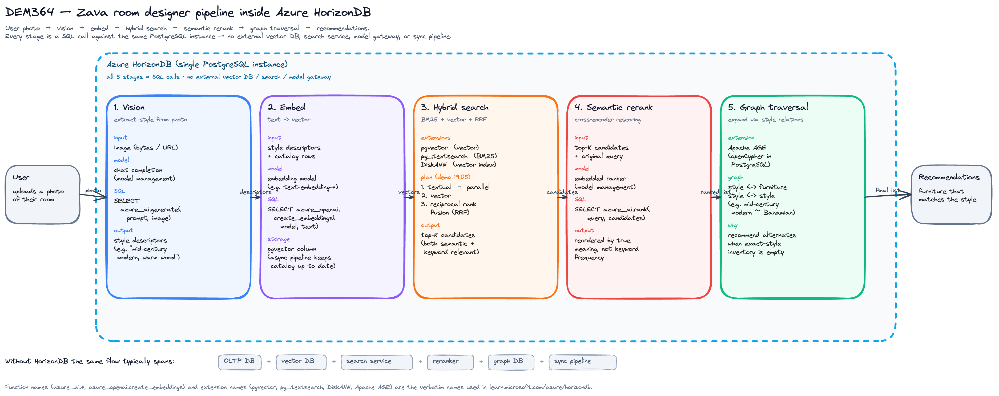
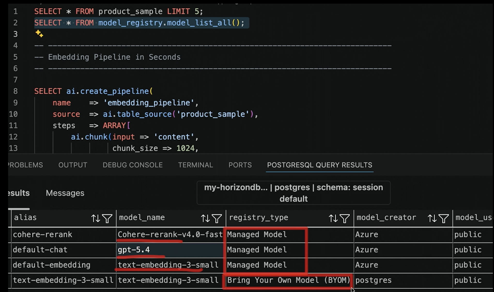

# [DEM364] Simplify app dev with cloud-native PostgreSQL in Azure HorizonDB

## TL;DR

> **Azure HorizonDB** — PostgreSQL 위에 단순히 얹은 게 아니라, **compute/storage를 분리**(disaggregated)하고 **WAL만 storage layer로 보내는 database-as-a-log** 설계를 새로 한 cloud-native PostgreSQL DBaaS. Satya 키노트에서 announce되며 **2026-06 Public Preview**. 데모(`Zava room designer`)의 핵심 메시지는 단순함: **embedding · vector search · BM25 · hybrid · semantic rerank · knowledge graph · AI 모델 호출이 모두 PostgreSQL 한 통 안에서 SQL로 끝남** — 별도의 vector DB, search service, model gateway, 동기화 파이프라인을 두지 않아도 됨. 대표적으로 **임베딩 모델 BYOM**은 `model_registry.model_add(...)` SQL 한 줄 + `managed-identity` 인증으로 완료되고, 이후는 동일 함수 `azure_openai.create_embeddings(...)`로 호출.

## Top highlights

### 1. Public Preview · 5 region · Satya 발표

- 2026-06 Public Preview ([release notes](https://learn.microsoft.com/en-us/azure/horizondb/release-notes/release-notes))
- Central US · West US 2 · West US 3 · Sweden Central · Australia East
- 세션 도입부에서 발표자가 "Satya가 announce한 직후"임을 명시

### 2. 새 아키텍처 — disaggregated compute/storage + database-as-a-log

- Compute는 stateless · WAL만 storage로 push · 데이터 페이지는 보내지 않음 · WAL이 source of truth
- Storage fleet 2개: WAL service (저지연) + data fleet (zone-resilient, Azure Blob backing)
- 효과: compute/storage 독립 스케일, replica 즉시 추가 (데이터 복제 없이), 빠른 failover, 일정한 write latency

### 3. 성능 (발표 수치 — baseline은 미공개)

- 3× higher throughput
- 3× vector search 속도
- 최대 15 read-only replicas

### 4. AI를 SQL 안으로 — 5개 함수, Managed Models 자동 등록, BYOM도 지원

- `azure_ai` extension이 함수 5개를 SQL로 제공 — `generate()` · `is_true()` · `extract()` · `rank()` · `azure_openai.create_embeddings()` ([AI functions](https://learn.microsoft.com/en-us/azure/horizondb/ai/ai-functions#use-ai-functions))
- **AI Model Management** (limited preview) 시 계정에 세 개의 Managed Model 자동 프로비저닝: `default-chat` (gpt-5.4) · `default-embedding` (text-embedding-3-small) · `default-reranker` (Cohere-rerank-v4.0-fast). Microsoft Foundry 라이프사이클/API 버전 관리까지 서비스가 대신 수행 ([model management](https://learn.microsoft.com/en-us/azure/horizondb/ai/ai-model-management#managed-models))
- **BYOM** — 커스텀 Foundry 모델은 `model_registry.model_add(...)` SQL 한 줄로 등록. Foundry / Azure OpenAI / Azure AI Services / APIM endpoint, `subscription-key` 및 `managed-identity` 인증 모두 지원 ([Manual setup](https://learn.microsoft.com/en-us/azure/horizondb/ai/ai-functions#option-2-manual-setup-with-model-registry))
- Durable AI pipelines: chunk → embed → index → search → rerank를 DB 안에서 체크포인트·재시도와 함께 실행

### 5. 검색·지식의 풀스택을 한 DB에서

- `pgvector` (vector) · `pg_textsearch` (BM25) · DiskANN(MS Research) · hybrid + RRF · `azure_ai.rank()` cross-encoder · Apache AGE(graph-RAG)

## Why it matters

- **AI 스택 파편화 비용 감소** — 일반적 RAG 스택은 OLTP DB + vector DB + search service + reranker + graph DB + 동기화 파이프라인. HorizonDB는 이 6개를 PostgreSQL 한 곳에 두어 동기화 risk · operational surface · 데이터 잔존 격차를 제거.
- **커스텀 임베딩 모델 연결이 SQL 한 줄** — `model_registry.model_add('my-embedding', endpoint, deployment, model_name, api_version, 'managed-identity', NULL)`로 등록 후 `azure_openai.create_embeddings('my-embedding', text)` 호출만으로 완료. 별도 vectorizer/skillset/Custom Web API/web hook 구성 없음.
- **PostgreSQL 호환** — 기존 PostgreSQL 앱을 코드 변경 최소화로 마이그레이션, 동시에 vector/hybrid/graph로 확장 가능 (lift-and-evolve).
- **Disaggregated 아키텍처 본연의 이점** — read scale-out을 위해 데이터 복제가 필요 없음 (shared storage). zone-resilient가 default. operational simplicity.
- **통합 과금** — BYOM·Managed Models 모두 Foundry pricing 그대로 HorizonDB 인보이스에 첨부되어 나옴 (추가 마크업 없음). Cognitive Services · OpenAI 계정별로 비용을 추적하지 않아도 됨 ([integrated billing](https://learn.microsoft.com/en-us/azure/horizondb/ai/ai-model-management#integrated-billing)).
- **SQL이 곧 AI 인터페이스** — 데이터 엔지니어가 별도 ML serving stack을 학습하지 않고 `SELECT azure_ai.generate(...)` 한 줄로 LLM 호출. 단, 함수 호출이 곧 비용/지연이 되는 만큼 가시화·예산화는 필수.

## Customer scenarios

공식 overview 페이지가 명시한 use case 4가지 ([overview](https://learn.microsoft.com/en-us/azure/horizondb/overview#azure-horizondb-use-cases)):

- **OLTP** — line-of-business 앱, 이커머스, SaaS 백엔드. 예측 가능한 throughput/latency.
- **AI 및 intelligent apps** — RAG, recommendation, semantic search를 DB 안에서 (별도 vector DB·search·orchestration 없이).
- **Massive read scale-out** — shared zone-resilient storage 덕에 read replica 즉시 추가.
- **Hybrid apps** — Azure 생태계 통합 + Fabric OneLake 미러링으로 분석 데이터 연계.


## Key announcements

| 항목 | 상태 | 날짜 | 비고 |
|------|------|------|------|
| **Azure HorizonDB** | Public Preview | 2026-06 | Satya 키노트에서 announce. 5개 region (Central US / West US 2 / West US 3 / Sweden Central / Australia East). `azure_ai` 함수·pgvector·pg_textsearch·DiskANN·Apache AGE·durable AI pipelines 포함 ([release notes](https://learn.microsoft.com/en-us/azure/horizondb/release-notes/release-notes)) |
| **AI Model Management** | Limited Preview | 2026-06 | one-select 프로비저닝으로 embedding/chat/reranking 모델을 등록·갱신. endpoint/key 관리 불요 ([AI overview](https://learn.microsoft.com/en-us/azure/horizondb/ai/ai-overview#ai-functions-in-sql)) |

!!! preview "Public Preview · 2026-06"
    Azure HorizonDB는 현재 **Public Preview**. backup 7일 고정·cross-region replica 없음·CMK 없음 등 제약이 있으므로 production 적용 전 [Limitations](https://learn.microsoft.com/en-us/azure/horizondb/overview#limitations) 확인 필요.

## Architecture

데모(`Zava room designer`)의 데이터 흐름을 정리. 핵심 메시지: **모든 단계가 하나의 PostgreSQL 인스턴스 내부의 SQL 호출** — 외부 vector DB · search service · model gateway가 없음.



각 단계와 사용 컴포넌트:

| 단계 | HorizonDB 컴포넌트 | 호출 방식 |
|------|---|---|
| 1. **Vision** — 사진에서 스타일 추출 | chat completion model (model management) | `SELECT azure_ai.generate(...)` |
| 2. **Embed** — 쿼리/카탈로그 vector화 | embedding model + pgvector | `SELECT azure_openai.create_embeddings(...)` |
| 3. **Hybrid retrieval** — BM25 + vector | pgvector + pg_textsearch + DiskANN | 단일 hybrid 함수 + RRF |
| 4. **Semantic rerank** — cross-encoder | 임베디드 ranker 모델 | `SELECT azure_ai.rank(...)` |
| 5. **Graph traversal** — 스타일 관계 확장 | Apache AGE | openCypher 쿼리 (PostgreSQL 안) |

데모에서 짚은 운영 포인트:

- 프로비저닝 시 **AI 기능은 체크박스 하나** — model management · vector search · PG extension이 함께 켜짐
- 모델 레지스트리에 embedding · chat completion · semantic ranker가 **기본 제공**
- AI 파이프라인(chunk → embed → store)은 **SQL로만 정의**되고 **비동기 실행** — 신규 카탈로그 row 추가 시 vector 자동 갱신 (데모에서 116 vectors 생성 확인)
- Hybrid search query plan은 textual + vector **병렬 실행 → reciprocal rank fusion → semantic reorder**까지 한 plan 안에서 끝남
- Knowledge graph(`Apache AGE`)로 "mid-century modern ↔ Bahamian" 같은 스타일 간 유사도를 모델링 → 재고 부족 시 대안 추천 가능, 그래도 여전히 PostgreSQL 안

기반 storage/compute 아키텍처는 별도. 핵심만 요약 ([overview](https://learn.microsoft.com/en-us/azure/horizondb/overview#architecture-of-azure-horizondb)):

- Compute는 stateless · 8 GB/core 메모리 · 로컬 NVMe SSD 캐시
- Primary 1 + standby N (zonal resilience 위해 최소 2개 권장)
- WAL service (저지연) → 비동기로 data fleet에 적용 → Azure Blob에 archive
- Read-only endpoint가 모든 standby에 load-balance

## Code & samples

데모 라이브 SQL 시퀀스 자체의 verbatim 스크립트는 미공개이므로, 아래는 모두 [`azure_ai` AI 함수 도큐먼트](https://learn.microsoft.com/en-us/azure/horizondb/ai/ai-functions)와 [Model Management](https://learn.microsoft.com/en-us/azure/horizondb/ai/ai-model-management) / [Generate vector embeddings](https://learn.microsoft.com/en-us/azure/horizondb/ai/generate-vector-embeddings)에서 그대로 인용한 공식 예시이다.

### AI 함수 카탈로그 (5개)

[AI functions](https://learn.microsoft.com/en-us/azure/horizondb/ai/ai-functions#key-features)가 명시한 5개 함수—데모에 등장하지 않은 `is_true()`도 정식 멤버:

| 함수 | 용도 | 기본 Managed Model | 공식 Supported models |
|------|------|------|------|
| `azure_openai.create_embeddings(model, input)` | 텍스트 → vector | `default-embedding` (text-embedding-3-small) | `text-embedding-3-small` · `text-embedding-3-large` · `text-embedding-ada-002` |
| `azure_ai.generate(prompt, model, json_schema?, system_prompt?)` | LLM 생성 (텍스트/JSON 구조화) | `default-chat` (gpt-5.4) | All GPT 안 o-series (except `gpt-5.4-pro`) |
| `azure_ai.extract(document, data[], model)` | 라벨 기반 구조화 추출 | `default-chat` | All GPT 안 o-series (except `gpt-5.4-pro`) |
| `azure_ai.is_true(statement, model)` | 명제 참/거짓 평가 | `default-chat` | All GPT 안 o-series (except `gpt-5.4-pro`) |
| `azure_ai.rank(query, document_contents[], document_ids?, model)` | cross-encoder rerank | `default-reranker` (Cohere-rerank-v4.0-fast) | GPT/o-series + `Cohere-rerank-v4.0-pro` / `Cohere-rerank-v4.0-fast` |

출처: [Supported models 표](https://learn.microsoft.com/en-us/azure/horizondb/ai/ai-functions#supported-models). `model` 인자를 생략하면 AIMM이 등록한 기본 alias가 자동 적용됨.

### Managed Models — AIMM이 자동 등록해주는 모델

AI Model Management (limited preview) 활성화 시 3개의 모델이 자동 등록되며 테넌트는 endpoint/키 관리가 필요 없음 ([Managed models](https://learn.microsoft.com/en-us/azure/horizondb/ai/ai-model-management#managed-models)):

| Alias | Model | Type |
|------|------|------|
| `default-embedding` | `text-embedding-3-small` | Embedding |
| `default-chat` | `gpt-5.4` | Chat completion |
| `default-reranker` | `Cohere-rerank-v4.0-fast` | Reranking |

Foundry 업데이트/API 버전/라이프사이클 정책은 HorizonDB가 대신 반영. `pgvector` 익스텐션은 임베딩 저장을 위해 함께 설치 필요 ([generate-vector-embeddings prerequisites](https://learn.microsoft.com/en-us/azure/horizondb/ai/generate-vector-embeddings#prerequisites)).

### BYOM — SQL 한 줄로 커스텀 임베딩 모델 붙이기

공식 verbatim ([Option 2: Manual setup](https://learn.microsoft.com/en-us/azure/horizondb/ai/ai-functions#option-2-manual-setup-with-model-registry)):

```sql
-- 1. 확장 설치 (allowlist 등록 후)
CREATE EXTENSION IF NOT EXISTS azure_ai;

-- 2. Foundry 모델 등록 (subscription-key 또는 managed-identity)
SELECT model_registry.model_add(
    'my-gpt',                                       -- 고유 alias
    'https://my-endpoint.services.ai.azure.com/',   -- Foundry / Azure OpenAI / AI Services / APIM endpoint
    'gpt-5-deployment',                             -- deployment name
    'gpt-5',                                        -- model name
    '2025-01-01-preview',                           -- API version (NULL이면 latest)
    'subscription-key',                             -- subscription-key | managed-identity
    '<your-endpoint-key>'                           -- managed-identity면 NULL
);

-- 3. 등록 확인
SELECT * FROM model_registry.model_list_all();
```

지원 endpoint 포맷 3개 (관리되는 커스텀 LLM/임베딩 대부분 포함):

- `https://<name>.services.ai.azure.com/` (Microsoft Foundry)
- `https://<name>.openai.azure.com/` (Azure OpenAI)
- `https://<name>.cognitiveservices.azure.com/` (Azure AI Services)

API Management 앞단에 둔 endpoint도 그대로 등록됨 — load balancing / monitoring / policy가 필요한 조직에 맞는 패턴 (`Tip` 명시, 위 도큐먼트).

### 임베딩 생성 · 저장 · DiskANN 인덱스 · 유사도 검색

[Generate vector embeddings](https://learn.microsoft.com/en-us/azure/horizondb/ai/generate-vector-embeddings#generate-embeddings) verbatim:

```sql
-- A. 테이블 채움 (Managed Models 사용 시 model 인자 생략)
UPDATE conference_sessions
SET abstract_embedding = azure_openai.create_embeddings(
    input => session_abstract
)::vector
WHERE abstract_embedding IS NULL;

-- BYOM 일 때: azure_openai.create_embeddings('my-embedding', session_abstract)

-- B. DiskANN 인덱스 (대량 유사도 검색)
CREATE EXTENSION IF NOT EXISTS pg_diskann;
CREATE INDEX ON conference_sessions
  USING diskann (abstract_embedding vector_cosine_ops);

-- C. 유사도 검색 (텍스트 입력 → 쿼리 vector 즐석 생성 → 고점 순 정렬)
SELECT session_id, title, session_abstract
FROM conference_sessions
ORDER BY abstract_embedding <=> azure_openai.create_embeddings(
    input => 'Session about building chatbots'
)::vector
LIMIT 5;
```

### `create_embeddings()` 운영 인자 (배치 · 재시도 · 타임아웃)

대량 임베딩 생성 시 도메인 서비스 호출 안정성을 함수 인자로 제어할 수 있음 ([인자 표](https://learn.microsoft.com/en-us/azure/horizondb/ai/generate-vector-embeddings#arguments)):

| 인자 | 타입 | 기본값 | 용도 |
|------|------|------|------|
| `dimensions` | `integer` | NULL | `text-embedding-3*` 이상에서 출력 차원 조절 |
| `batch_size` | `integer` | 100 | `text[]` 오버로드에서 한 번에 처리할 레코드 수 |
| `timeout_ms` | `integer` | 3600000 | 클라이언트 타임아웃 |
| `max_attempts` | `integer` | 1 | 재시도 가능 에러 시 최대 재시도 횟수 |
| `retry_delay_ms` | `integer` | 1000 | 재시도 대기 |
| `throw_on_error` | `boolean` | true | false면 예외 대신 NULL 반환 → 트랜잭션 롤백 회피 |

### 모델 단위 접근 제어

[User access management](https://learn.microsoft.com/en-us/azure/horizondb/ai/ai-functions#user-access-management) verbatim:

```sql
-- model_registry_manager role 부여
GRANT model_registry_manager TO registry_manager;

-- 특정 사용자만 사용하도록 제한 (추가 후에는 명시적 목록만 호출 가능)
SELECT model_registry.model_user_add('my-gpt', 'data_team_alice');
SELECT model_registry.model_user_set('my-gpt', ARRAY['alice', 'bob']);
SELECT model_registry.model_user_remove('my-gpt', 'alice');
```

"특정 팀·서비스 계정만 특정 모델 호출" 수준의 권한 제어가 PostgreSQL ROLE 모델과 동일 면을 사용해 끝남.

### 데모 라이브 화면 — Managed Models + BYOM 공존

{ width="640" loading=lazy }

### 오케스트레이션 면

Native connectors: Microsoft Agent Framework · LangGraph/LangChain · LlamaIndex · CrewAI · AutoGen ([AI frameworks](https://learn.microsoft.com/en-us/azure/horizondb/ai/ai-frameworks)).

확장 카탈로그 요약:

- `pgvector` — vector similarity search (이 노트의 임베딩 저장/검색의 기반)
- `pg_textsearch` — BM25 full-text (데모 호칭 “PGFTS”)
- `DiskANN` — Microsoft Research graph-based vector index
- `Apache AGE` — openCypher graph extension
- `azure_ai` — 위 AI 함수들

## Caveats & open questions

- **Preview 제약** ([공식 Limitations 표](https://learn.microsoft.com/en-us/azure/horizondb/overview#limitations)):
    - Backup retention 7일 고정 (1~35일 옵션 작업 중)
    - Cross-region read replica 없음 (DR 시나리오 제약)
    - Customer-managed keys (CMK) 미지원 — service-managed key only
    - Configurable maintenance window 없음
    - PgBouncer 내장 connection pooling 없음 (외부 pooler 필요)
    - Long-term retention (LTR) 없음
    - Index tuning 없음
    - VNet injection 없음 (Private Link만)
- **Region 5개**로 제한 — 한국/일본 region 미발표.
- **AI Model Management는 별도 Limited Preview** — 전체 HorizonDB Public Preview와 가용성이 같지 않을 수 있음. 사용 전 region/구독 자격 확인 필요.
- **성능 수치의 baseline 미공개** — "3× throughput · 3× vector search 속도"의 비교 대상이 Azure Database for PostgreSQL Flexible Server인지, self-managed PostgreSQL인지, 동일 SKU 기준인지 등 슬라이드에 명시되지 않음.
- **비용 모델** — provisioned compute (core-hour) + storage (GB/month) + backup storage 세 요소. AI 함수 호출은 등록한 Foundry 모델 사용량 기반으로 동일 Foundry 요금이 적용되며 HorizonDB 인보이스로 첨부됨 (추가 마크업 없음, [pricing note](https://learn.microsoft.com/en-us/azure/horizondb/ai/ai-model-management#price-details)). 이렕 `azure_ai.*` 호출 빈도가 곳 비용이므로 운영 시 호출량 모니터링/할당량 설계 필요. (`max-ai-credits` 같은 함수별 가드는 공식 docs에 명시되어 있지 않으므로 별도 확인 필요.)
- **데모의 "체크박스 하나"는 portal UX 메시지** — 실제 enable 시 어떤 PG 익스텐션이 어떤 SKU/region에서 default ON인지 docs로 매핑 필요.
- **데모 카탈로그 116 vector**는 매우 작은 데이터셋. 대용량 시 DiskANN 튜닝 ([vector index selection guide](https://learn.microsoft.com/en-us/azure/horizondb/)) 필수.
- **샘플 repo URL** — 영상 마지막에 안내되었다는 언급만 있고 현재는 미확정. 노트 업데이트 시 추가 예정.

## Resources

- 🎥 Session: <https://build.microsoft.com/en-US/sessions/DEM364?source=sessions>
- 🖼️ Slides / Video / Transcript: 세션 페이지에서 직접 다운로드 (Microsoft Build 로그인 필요)
- 📚 Docs:
    - [Azure HorizonDB documentation (Preview)](https://learn.microsoft.com/en-us/azure/horizondb/)
    - [What is Azure HorizonDB? — overview & architecture](https://learn.microsoft.com/en-us/azure/horizondb/overview)
    - [AI capabilities in Azure HorizonDB](https://learn.microsoft.com/en-us/azure/horizondb/ai/ai-overview)
    - [AI functions in the azure_ai extension](https://learn.microsoft.com/en-us/azure/horizondb/ai/ai-functions) — 5개 함수 verbatim, BYOM 등록 SQL, 사용자 접근 제어
    - [AI Model Management (limited preview)](https://learn.microsoft.com/en-us/azure/horizondb/ai/ai-model-management) — Managed Models 3개, 통합 과금
    - [Generate vector embeddings using `create_embeddings()`](https://learn.microsoft.com/en-us/azure/horizondb/ai/generate-vector-embeddings) — dimensions/batch/retry, DiskANN 결합 패턴
    - [Release notes (June 2026 — Preview)](https://learn.microsoft.com/en-us/azure/horizondb/release-notes/release-notes)
- 💻 GitHub: 공식 샘플 repo URL은 세션 영상 마지막에 안내 (확인 후 추가 예정)

## Related sessions

세션 페이지가 명시한 관련 세션:

- [LTG403 — MCP does way more than you think](https://build.microsoft.com/en-US/sessions/LTG403?source=sessions)
- [TT678 — AI Observability: What You Can't See (and Why It Breaks)](https://build.microsoft.com/en-US/sessions/TT678?source=sessions)
- [OD801 — Modernize intelligent apps and agents with .NET that scale as you grow](https://build.microsoft.com/en-US/sessions/OD801?source=sessions)
