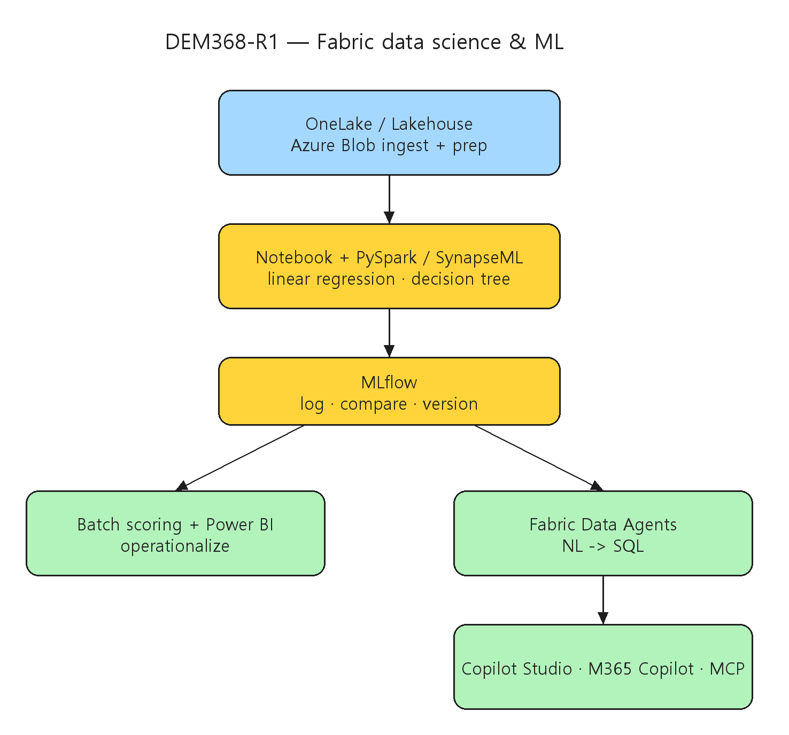

# [DEM368-R1] Data Science & Machine Learning with Microsoft Fabric

## TL;DR

> Microsoft Fabric의 통합 Data Science 경험을 end-to-end로 보인다 — **OneLake & Lakehouse**로 데이터 수집·준비, **Notebook/Spark/SynapseML**로 모델 빌드, **MLflow**로 추적·비교, 배치 스코어링 + **Power BI**로 운영화, **Fabric Data Agents**로 자연어 gen-AI Q&A까지. 당뇨 예측 모델을 직접 학습·비교·배포하며 보여준다.

- **언제 classic ML인가** — 저지연·효율·일관된 결과·비용 통제가 필요할 때 LLM보다 전통 ML이 유리 (00:01:00).
- **통합 SaaS** — Data Factory·Real-Time Intelligence·Power BI가 OneLake 위에 하나로, 데이터+AI 일원화 (00:01:36~00:03:00).
- **MLflow 비교** — linear regression vs decision tree(PySpark), MLflow로 로깅·비교 후 배포 가능 모델 저장·버저닝 (00:10:10~00:13:00).
- **Fabric Data Agents** — SQL 없이 자연어로 데이터 질의, M365 Copilot·Copilot Studio·MCP로 확산 (00:14:49~00:21:29).

## Why it matters

- Fabric은 ETL·notebook·실험 추적·BI를 하나의 **SaaS**로 묶어, 환경 구성·통합 부담을 줄이고 데이터 과학 라이프사이클 전체를 한 워크스페이스에서 수행하게 한다.
- 생성형 AI 열기 속에서도 **저지연·비용 통제·재현성**이 중요한 영역에선 classic ML이 여전히 적합하며, Fabric은 두 접근을 한 플랫폼에서 다룬다.
- **Fabric Data Agents**는 SQL을 모르는 사용자도 자연어로 데이터를 질의하게 하고, 그 결과를 Power BI·M365 Copilot·Copilot Studio·MCP server로 확산해 조직 전반의 데이터 접근을 민주화한다.

## Customer scenarios

- 의료·운영 데이터로 저지연 예측 모델(예: 당뇨 위험 예측)을 빠르게 학습·비교·배포하고 Power BI로 소비.
- 비기술 사용자가 자연어로 매출·운영 데이터를 질의(NL→SQL)하는 셀프서비스 분석.
- Fabric Data Agent를 Copilot Studio·M365 Copilot·MCP로 노출해 사내 어시스턴트에 데이터 Q&A 통합.

## Key announcements

| 항목 | 상태 | 비고 |
|------|------|------|
| Fabric 통합 Data Science (OneLake·Lakehouse·Notebook·MLflow) | 세션 시연 | end-to-end 데이터 과학 라이프사이클 |
| SynapseML / PySpark 모델링 | 세션 시연 | linear regression·decision tree (00:07:00~) |
| MLflow 추적·비교·버저닝 | 세션 시연 | 모델 비교 후 배포 가능 모델 저장 (00:10:10) |
| Fabric Data Agents (NL→SQL gen-AI) | 세션 시연 | Copilot Studio·M365 Copilot·MCP 확산 (00:14:49) |

!!! preview "Microsoft Fabric · Data Science & Data Agents"
    세션은 Fabric의 Data Science 경험과 Data Agents를 시연한다. 각 기능의 정식 가용 단계는 공식 Microsoft Fabric 문서에서 확인이 필요하다.

## Session summary

### 1. 왜 Fabric ML인가 { #sec-why }

`00:00:00` Prashant G Bhoyar가 Fabric의 ML이 가장 덜 탐구된 영역이라며 시작한다. `00:01:00` 저지연·효율·일관된 결과·비용 통제가 필요할 때 generative보다 **classic ML**이 선호됨을 설명한다. `00:01:36` Fabric이 Data Factory·Real-Time Intelligence·Power BI를 아우르며 데이터와 AI를 통합함을 보이고, `00:02:00` Fabric을 SaaS로 개관한다. `00:03:00` 데이터 과학 라이프사이클을 소개하고 `00:03:47` Fabric에 배포된 모델이 Power BI에서 소비됨을 강조한다.

### 2. 모델 빌드·비교 { #sec-build }

`00:05:21` 공개 healthcare 데이터셋으로 당뇨 예측 데모를 시작한다. `00:06:15` "Labs" 워크스페이스의 notebook에서 Azure Blob Storage로부터 데이터를 로드한다. `00:07:00` pandas DataFrame으로 70/30 train/validation 분할 후 PySpark로 **linear regression**과 **decision tree regressor**를 학습한다. `00:10:10` **MLflow**로 로깅·비교하며 decision tree가 우세함을 확인하고, `00:13:00` 배포 가능한 ML 모델을 버저닝과 함께 저장한다.

### 3. Fabric vs Azure ML, Data Agents { #sec-agents }

`00:14:20` Foundry의 Azure ML과 비교해 Fabric의 강점(단순성·통합 환경·운영 부담 감소·SaaS)을 정리한다. `00:14:49` **Fabric Data Agents**로 SQL 없이 자연어 질의가 가능한 gen-AI 경험을 소개한다. `00:16:30` New Item에서 data agent를 만들고 lakehouse/warehouse를 연결한다. `00:18:13` 자연어를 SQL로 변환해 매출 데이터의 상위 제품을 질의한다. `00:20:06` 에이전트를 Microsoft 생태계 전반에 배포하고 `00:21:29` Copilot Studio·M365 Copilot·MCP server로 노출한다. `00:23:16` 결론과 LinkedIn QR로 마무리한다.

## Architecture

OneLake/Lakehouse(데이터) → Notebook + Spark/SynapseML(모델 빌드) → MLflow(추적·비교·버저닝) → 배치 스코어링 + Power BI(운영화) / Fabric Data Agent(NL→SQL) → Copilot Studio·M365 Copilot·MCP:



| 단계 | 구성요소 | 역할 |
|------|------|------|
| 수집·준비 | OneLake, Lakehouse, Azure Blob | 데이터 적재·준비 |
| 모델 빌드 | Notebook, PySpark, SynapseML | linear regression·decision tree |
| 추적 | MLflow | 로깅·비교·버저닝 |
| 운영화 | 배치 스코어링, Power BI | 예측 소비 |
| Q&A | Fabric Data Agents | NL→SQL gen-AI |
| 확산 | Copilot Studio, M365 Copilot, MCP | 생태계 노출 |

## Demo highlights

- ⏱️ 00:05:21 — 공개 healthcare 데이터셋 당뇨 예측 데모 시작
- ⏱️ 00:07:00 — pandas 70/30 분할 + PySpark linear regression·decision tree
- ⏱️ 00:10:10 — MLflow 로깅·비교(decision tree 우세)
- ⏱️ 00:13:00 — 배포 가능 모델 버저닝 저장
- ⏱️ 00:16:30~00:18:13 — Fabric Data Agent 생성 + NL→SQL 매출 상위 제품 질의
- ⏱️ 00:21:29 — Copilot Studio·M365 Copilot·MCP server로 확산

## Code & samples

세션 notebook 흐름(개념). 정확한 API는 Microsoft Fabric 문서 확인.

```python
# Fabric Notebook (개념, 세션 데모 기준)
import pandas as pd
from pyspark.ml.regression import LinearRegression, DecisionTreeRegressor
import mlflow

# 1) OneLake/Blob에서 데이터 로드 → pandas/Spark DataFrame
# 2) 70/30 train/validation 분할
# 3) PySpark로 linear regression / decision tree 학습
# 4) MLflow로 로깅·비교
with mlflow.start_run():
    # train, log metrics, log model
    ...
# 5) 우수 모델(decision tree) 버저닝 저장 → 배치 스코어링 → Power BI
```

## Caveats & open questions

- **가용 단계** — Fabric Data Agents·Data Science 기능의 정식 GA/Preview 단계는 공식 Microsoft Fabric 문서로 재확인이 필요하다.
- **classic ML 적합성** — 저지연·비용 통제가 중요한 시나리오를 전제로 한 데모이며, 문제 성격에 따라 generative 접근이 더 적합할 수 있다.
- **데이터셋·수치** — 당뇨 예측은 공개 데이터셋 데모이며 정확도 등은 운영 데이터에서 달라질 수 있다.

## Resources

- 🎥 Session: https://build.microsoft.com/en-US/sessions/DEM368-R1?source=sessions
- 🎬 Video: https://medius.microsoft.com/video/asset/HIGHMP4/4924e612-6605-49b7-9f01-7b9fab96e6e7?referrer=Microsoft+Build-%2Fen-US%2Fsessions%2FDEM368-R1&mhid=build&loc=en-us
- 📝 Transcript: https://medius.microsoft.com/video/asset/Transcript/4924e612-6605-49b7-9f01-7b9fab96e6e7?referrer=Microsoft+Build-%2Fen-US%2Fsessions%2FDEM368-R1&mhid=build&loc=en-us
- 🔗 Next steps: https://aka.ms/build26-next-steps

## Related sessions

- [BRK246 — Foundry IQ: Fuel agents with enterprise knowledge and agentic retrieval](BRK246-foundry-iq-enterprise-knowledge-agentic-retrieval.md)
- [DEM330 — Build multimodal agents that reason, interact, and take action](DEM330-build-multimodal-agents-reason-interact-act.md)

## About the speakers

- **Prashant G Bhoyar** — AI Architect, Office of CTO, Applied Information Sciences · [LinkedIn](https://www.linkedin.com/in/pgbhoyar/) · [GitHub](https://github.com/pgbhoyar)
