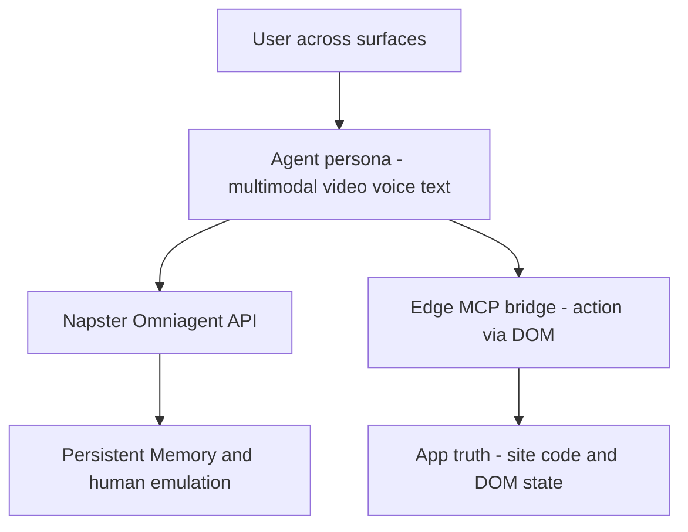

# [DEMSP390] Create multimodal AI agents with persistent memory

## TL;DR

> 웹/앱/매장/고객지원 등 채널 간 단절을 줄이기 위해, 이 세션은 persistent memory를 가진 multimodal AI agent를 실제로 어떻게 구현하는지 데모 중심으로 보여준다.

## Top highlights

- app(truth), Edge MCP bridge(action), agent(persona) 3계층으로 멀티모달 agent 런타임을 단순하게 설명한다.
- Napster Omniagent API를 통해 video/voice/text 채널을 하나의 에이전트 정체성과 메모리로 통합한다.
- Edge MCP 기반 로컬 실행 패턴으로 브라우저 DOM 상호작용과 상태 반영을 데모로 보여준다.

## Why it matters

- 고객 접점이 여러 채널로 분산된 조직에서, 매 상호작용마다 컨텍스트가 리셋되는 문제를 줄이는 아키텍처 힌트를 제공한다.
- 단순 챗봇이 아니라 video/voice/text를 아우르는 agent 패턴을 보여줘, CX 자동화와 상담 보조 시나리오에 직접 연결할 수 있다.

## Key announcements

| 항목 | 상태 | 날짜 | 비고 |
|------|------|------|------|
| DEMSP390 데모 세션 공개 (On Demand) | 공개 | 2026-06-04 | Build 세션 페이지 기준, 25분 분량 |
| Napster Omniagent API 기반 video AI agent 라이브 구현 | 데모 | 2026-06-04 | 세션 설명(About the session)에서 명시 |
| Napster offering의 Azure 연계/preview 언급 | Public Preview (확인 필요) | 2026-06-04 | 세션 페이지 AI Summary에 언급, 별도 제품 문서 재확인 권장 |

## Session summary

### 1.

세션은 "채널이 바뀔 때마다 고객 맥락이 초기화되는 문제"를 출발점으로 제시한다. 발표자는 website, app, store, support line 전반에서 기억을 유지하는 multimodal agent가 이 문제를 완화할 수 있다고 설명한다.

### 2.

Napster CTO Edo Segal이 Napster Omniagent API를 사용해 working video AI agent를 라이브로 구성한다. 세션 설명 기준으로 핵심 전달물은 다음 세 가지다.

- 아키텍처 개요: app(truth) / Edge MCP bridge(action) / agent(persona) 3계층 구성
- 코드 패턴: 프롬프트/연결 키/API 중심의 agent 구성 흐름
- 다음 액션: 조직의 여러 고객 접점(surface)에 동일한 agent 경험을 배치하기 위한 시작점

## Demo highlights

- ⏱️ 00:06~00:10 (세션 페이지 AI Summary 기준) — Omni Agent 개발 흐름 및 Edge MCP 기반 로컬 실행 패턴 소개
- ⏱️ 00:16~00:18 (세션 페이지 AI Summary 기준) — 브라우저 상호작용/상태 반영 데모 질의 응답

## Architecture / Diagram

<!-- 필요 시 mermaid 또는 이미지 -->

Mermaid가 렌더되지 않는 환경을 위한 텍스트 다이어그램 (세션에서 명시한 app/bridge/agent 3계층):

```text
[User across surfaces]
        |
        v
[Agent (persona): multimodal video/voice/text]
        |
        +--> [Napster Omniagent API] --> [Persistent Memory / human emulation]
        |
        v
[Edge MCP (bridge / action): JS 내장 MCP server, 로컬 cognition]
        |
        v
[App (truth): site code / DOM / state]
```



## Code & samples

<!-- 핵심 스니펫이 있다면 -->

세션 리소스에 슬라이드/영상/트랜스크립트가 제공되며, 구현 코드는 세션 내 패턴 설명 중심이다. 사내 PoC에서는 아래 순서로 재현을 권장한다.

1. 단일 채널(Web)에서 agent + memory 저장소 먼저 검증
2. 동일 identity로 App/Support 채널 확장
3. memory read/write 정책(보존 기간, 개인정보 마스킹) 적용

## Caveats / Open questions

- AI Summary에 포함된 일부 제품 상태(Public Preview, 가격/성능 수치)는 공식 제품 문서로 재확인이 필요하다.
- persistent memory 구현 시 개인정보/보존정책/삭제요청(DSR) 처리 모델이 필수인데, 본 세션은 기술 데모 중심이라 거버넌스 상세는 제한적이다.

## Customer takeaways

- [ ] 우리 조직의 고객 접점(웹/앱/오프라인/상담)을 기준으로, 어떤 컨텍스트를 "공유 메모리"로 관리할지 정의했다.
- [ ] memory 저장/삭제/감사 추적 정책을 먼저 정한 뒤, 멀티모달 agent PoC 범위를 1개 채널부터 시작한다.

## Resources

- 🎥 Session: https://build.microsoft.com/en-US/sessions/DEMSP390?source=sessions
- 🖼️ Slides: https://static.rainfocus.com/microsoft/build26/static/staticfile/staticfile/Live%20Demo_1779385317341001sOfV_1780513463412001YxSh.pptx
- 💻 GitHub: (세션 페이지에 전용 리포지토리 직접 링크는 확인되지 않음)
- 📚 Docs: https://build.microsoft.com/en-US/sessions

## About the speakers

- Edo Segal - CTO, Napster

## Notes

<!-- 내부 메모. 고객 배포 시 제거 가능 -->

- 근거 출처: Build 세션 페이지의 About the session, speaker metadata, session tags, resources.
- AI Summary 기반 내용은 본문/타임스탬프에 "기준"으로 표시했고, 확정 정보와 분리해 기술함.
