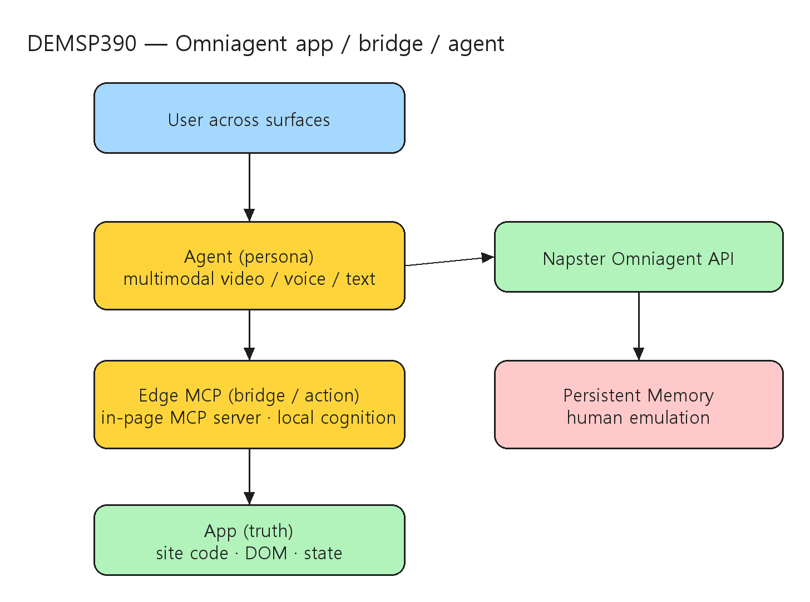

# [DEMSP390] Create multimodal AI agents with persistent memory

## TL;DR

> Napster CTO Edo Segal이 **Omniagent API**로 persistent memory를 가진 multimodal(video·voice·text) AI agent를 라이브로 구현하고, **Edge MCP**(브라우저에 임베드된 로컬 MCP server)로 DOM·state를 직접 조작하는 패턴을 보인다. 세션 중 Napster가 **native Azure offering으로 public preview**됨이 발표된다.

- **Omniagent API** — text·video·phone·chat을 하나의 에이전트로 통합하고 memory를 영속화해 사용자와의 관계를 유지하는 "human emulation" 패러다임 (00:03:38, 00:04:00~00:04:16).
- **Edge MCP** — JavaScript에 임베드된 로컬 MCP server가 외부 호출 없이 DOM을 통해 작업을 수행하는 "local cognition" 패턴 (00:07:28~00:08:09).
- **app·bridge·agent 3계층** — app(truth)·Edge MCP bridge(action)·agent(persona)의 3계층으로 브라우저 제어와 상태 인식을 구성 (00:13:06~00:14:00).
- **native Azure offering** — Napster가 Azure Marketplace 통합 과금·Azure portal 프로비저닝과 함께 native Azure offering으로 public preview (00:04:38~00:05:05).

## Top highlights

### 1. Omniagent API — 멀티모달 + persistent memory { #sec-hl-omniagent }

- text·video·phone·chat 모달리티를 하나의 에이전트로 통합하고 memory를 영속화한다. 단순 챗봇이 아니라 사용자와의 관계를 유지하는 relational intelligence("human emulation")를 지향한다.
- [세부 → §2 Omniagent API와 Azure 통합](#sec-omniagent)

### 2. Edge MCP — 로컬 cognition + DOM 제어 { #sec-hl-edge-mcp }

- JavaScript에 임베드된 MCP server("Edge MCP")가 외부 호출 없이 DOM을 통해 작업을 수행한다. 에이전트가 Git repo의 사이트 코드를 직접 이해하고 브라우저를 실시간 제어한다.
- [세부 → §3 라이브 데모와 개발자 워크플로](#sec-demo)

### 3. app·bridge·agent 3계층 + 20x 비용 절감 { #sec-hl-architecture }

- app(truth)·Edge MCP bridge(action)·agent(persona) 3계층이 브라우저 제어·상태 인식을 구성한다. 비디오 에이전트 비용을 20배 절감해 분당 1센트 수준까지 낮춰 웹사이트 video avatar 대규모 배포를 가능케 한다.
- [세부 → §4 아키텍처와 적용 사례](#sec-architecture)

## Why it matters

- 사용자는 website·app·store·support line 등 여러 채널로 접근하지만, 매 채널이 매번 0에서 시작한다. persistent memory를 가진 multimodal agent는 그 간극을 메우고 지금 바로 가동할 수 있다는 것이 세션의 출발점이다.
- Omniagent API + Edge MCP 조합은 외부 API 호출 없이 브라우저 로컬에서 cognition을 수행해, 단순 챗봇을 넘어 실제 비즈니스 기능(소매 매장 고객 응대, 병원 환자 보조 등)을 같은 프레임워크로 수행하는 AI coworker 패턴을 제시한다 (00:15:18~00:15:58).
- Napster가 native Azure offering으로 public preview되면서 Azure Marketplace 통합 과금·portal 프로비저닝이 가능해져, 실험적 데모가 아니라 enterprise 배포 경로를 갖춘다 (00:04:38~00:05:05).

## Customer scenarios

- website·app·store·support line 등 분산된 접점에서 동일 identity와 persistent memory로 컨텍스트를 유지하는 CX 에이전트를 구성한다.
- 소매 매장 키오스크나 병원 안내처럼 공공 환경에서 video avatar로 고객을 응대하고, 같은 프레임워크로 여러 surface에 배치한다.
- video·voice·text를 아우르는 멀티모달 상담 보조를 단일 채널 PoC부터 시작해 점진 확장한다.

## Key announcements

| 항목 | 상태 | 비고 |
|------|------|------|
| Napster native Azure offering | Public Preview | Azure Marketplace 통합 과금·portal 프로비저닝 (00:04:38~00:05:05) |
| Omniagent API | 세션 발표 | text·video·phone·chat 통합 + persistent memory (00:03:38) |
| Edge MCP (로컬 MCP server) | 세션 시연 | JS 임베드, 외부 호출 없이 DOM 제어 (00:07:28~00:08:09) |
| 비디오 에이전트 20x 비용 절감 | 세션 발표 | 분당 약 1센트, web video avatar 대규모 배포 (00:11:18~00:12:00) |

!!! preview "Public Preview · Napster on Azure"
    세션 중 Microsoft 측이 Napster의 native Azure offering public preview를 발표했다(00:04:38~00:05:05). Azure Marketplace 통합 과금·Azure portal 프로비저닝이 언급되었으며, 정확한 가용 리전·과금 단가는 공식 제품/Marketplace 문서에서 확인이 필요하다.

## Session summary

### 1. 도입과 비전 { #sec-intro }

`00:00:00` 세션은 Build 환영으로 시작해 Microsoft의 하드웨어·클라우드 전반 혁신 폭을 강조한다(`00:00:08`~`00:00:17`). 발표자는 향후 사용자가 챗봇이 아니라 "사람처럼 행동하는 에이전트"와 상호작용할 것이라는 전망을 제시한다. `00:00:44` Napster 소개로 전환해, 사용자의 작업을 돕는 "crew of AI agents"를 보인다(`00:00:48`~`00:01:17`). 이들은 물리적으로 존재하지 않는 완전 디지털 AI 페르소나로, Foundry가 video·voice·text 멀티모달 페르소나를 몇 번의 클릭으로 만들 수 있게 한다. `00:01:38`~`00:01:56` "The View" 홀로그래픽 디스플레이와 공공 환경용 키오스크 등 하드웨어 스택을 소개한다.

### 2. Omniagent API와 Azure 통합 { #sec-omniagent }

`00:03:38` 기술 기반인 **Omni Agent API**로 들어간다 — text·video·phone·chat을 하나의 에이전트로 통합하고 memory를 영속화해 사용자와의 관계를 유지하는 "human emulation" 패러다임(`00:04:00`~`00:04:16`)을 만든다. `00:04:38`~`00:05:05` Microsoft 측 발표자가 합류해 Napster의 native Azure offering public preview를 발표한다. Azure Marketplace 통합 과금, Azure portal 프로비저닝, Napster의 경험 계층과 Foundry의 지능 계층 간 연결로 enterprise 배포를 단순화한다.

### 3. 라이브 데모와 개발자 워크플로 { #sec-demo }

`00:06:03`~`00:07:06` Omni Agent 개발을 시연한다 — 개발자가 프롬프트와 API 키만 추가하면 Git repo의 사이트 코드를 직접 이해하는 지능형 어시스턴트를 만든다. `00:07:28`~`00:08:09` JavaScript에 임베드된 MCP server("Edge MCP")가 로컬에서 모든 것을 자동화해, 외부 호출 없이 DOM을 통해 작업을 수행하는 real-time local cognition을 구현한다. `00:09:12`~`00:10:38` Opus 4.8 같은 모델이 전체 코드베이스에서 사용자 행동을 예측하고 Azure-hosted 비주얼 에이전트를 수 분 내에 자동 생성하는 과정을 설명한다.

### 4. 엔지니어링 혁신과 적용 사례 { #sec-architecture }

`00:11:18`~`00:12:00` 비디오 에이전트 비용을 20배 절감(분당 약 1센트)해 웹사이트 video avatar의 대규모 배포를 가능케 했음을 강조한다. `00:13:06`~`00:14:00` app·agent·Edge MCP server가 **app(truth)·bridge(action)·agent(persona) 3계층**을 이뤄 브라우저 제어와 state 인식을 구현하는 다이어그램을 보인다. `00:15:18`~`00:15:58` 같은 프레임워크로 소매 매장 고객 응대, 병원 환자 보조 등 실제 비즈니스 기능을 수행하는 AI coworker로 확장한다.

### 5. 마무리 데모와 클로징 { #sec-wrap }

`00:16:40`~`00:18:20` "$2000 이하 OLED TV 검색" 같은 실시간 질의를 시연해 Edge MCP server가 동적 상호작용과 컨텍스트 인식을 가능케 함을 보인다. 라이브 capability 호출과 AI-agent 브라우저 제어 시스템의 자율 state 업데이트를 확인한다. `00:19:02`~`00:19:40` 토큰·프롬프트·해커톤 참여용 QR 코드 안내로 세션을 마무리한다.

## Architecture

세션에서 명시한 app·bridge·agent 3계층 — User → Agent(persona)가 Omniagent API·Persistent Memory와 연결되고, Edge MCP(bridge)가 App(truth)의 DOM·state를 조작:



| 계층 | 역할 |
|------|------|
| App (truth) | 실제 웹 앱/사이트, DOM·state의 source of truth |
| Edge MCP (bridge / action) | JS 임베드 로컬 MCP server, 외부 호출 없이 DOM 조작·local cognition |
| Agent (persona) | Omniagent API 기반 멀티모달 페르소나, persistent memory로 관계 유지 |
| Omniagent API | text·video·phone·chat 통합, memory 영속화 |
| Azure (Marketplace / portal) | native offering 과금·프로비저닝, Foundry 지능 계층 연결 |

## Demo highlights

- ⏱️ 00:06:03~00:07:06 — 프롬프트·API 키만으로 Git repo 코드를 이해하는 Omni Agent 개발
- ⏱️ 00:07:28~00:08:09 — Edge MCP 로컬 cognition, 외부 호출 없는 DOM 작업
- ⏱️ 00:09:12~00:10:38 — Opus 4.8 기반 사용자 행동 예측 + Azure-hosted 비주얼 에이전트 자동 생성
- ⏱️ 00:13:06~00:14:00 — app·bridge·agent 3계층 다이어그램
- ⏱️ 00:16:40~00:18:20 — "$2000 이하 OLED TV 검색" 실시간 질의, 자율 브라우저 제어 시연

## Code & samples

세션은 데모 중심이며, Omniagent API + Edge MCP 패턴은 다음 개념 흐름을 따른다(정확한 SDK·API는 Napster Azure offering 문서 확인).

```text
# Omni Agent 개발 개념 (세션 데모 기준)
# 1) 프롬프트 + API 키 추가 → Git repo 사이트 코드 자동 이해
# 2) Edge MCP server(JS 임베드) 가 DOM/state 를 로컬에서 조작 (외부 호출 없음)
# 3) Azure-hosted 멀티모달 페르소나(video/voice/text) 로 배포
```

실무 PoC 권장 순서:

1. 단일 채널(Web)에서 agent + persistent memory 저장소 먼저 검증.
2. 동일 identity로 App·Support 채널 확장.
3. memory read/write 정책(보존 기간, 개인정보 마스킹, 삭제 요청 처리)을 적용.
4. Azure Marketplace 프로비저닝으로 과금·배포 경로를 표준화.

## Caveats & open questions

- **Preview 상태·단가 재확인** — native Azure offering public preview·"분당 1센트"·"20x 절감" 등 수치는 세션 발표 기준이며, 공식 제품/Marketplace 문서로 재확인이 필요하다.
- **거버넌스 상세 제한** — persistent memory 구현 시 개인정보·보존정책·삭제요청(DSR) 처리 모델이 필수이나, 본 세션은 기술 데모 중심이라 거버넌스 상세는 제한적이다.
- **AI Summary 표기 오류** — 세션 페이지 AI Summary 일부에 "Build 2027" 등 자동 생성 오기가 있어, 본 노트는 세션 메타데이터(Build 2026, Thu Jun 4) 기준으로 정리했다.
- **GitHub 리포지토리** — 세션 페이지에 전용 코드 리포지토리 직접 링크는 확인되지 않았다.

## Resources

- 🎥 Session: https://build.microsoft.com/en-US/sessions/DEMSP390?source=sessions
- 🎬 Video: https://medius.microsoft.com/video/asset/HIGHMP4/9228bcee-53b2-4fd0-b6a7-83ca65070cfd?referrer=Microsoft+Build-%2Fen-US%2Fsessions%2FDEMSP390&mhid=build&loc=en-us
- 🖼️ Slides: https://static.rainfocus.com/microsoft/build26/static/staticfile/staticfile/Live%20Demo_1779385317341001sOfV_1780513463412001YxSh.pptx
- 📝 Transcript: https://medius.microsoft.com/video/asset/Transcript/9228bcee-53b2-4fd0-b6a7-83ca65070cfd?referrer=Microsoft+Build-%2Fen-US%2Fsessions%2FDEMSP390&mhid=build&loc=en-us

## Related sessions

- [BRK246 — Foundry IQ: Fuel agents with enterprise knowledge and agentic retrieval](BRK246-foundry-iq-enterprise-knowledge-agentic-retrieval.md)
- [BRK250 — Observe and control agents across any framework with open source tools](BRK250-observe-control-agents-open-source-tools.md)
- [BRK251 — Build secure, enterprise-ready agents with Agent 365](BRK251-build-secure-enterprise-ready-agents-agent-365.md)

## About the speakers

- **Edo Segal** — CTO, Napster · [LinkedIn](https://www.linkedin.com/in/edo-segal/)
