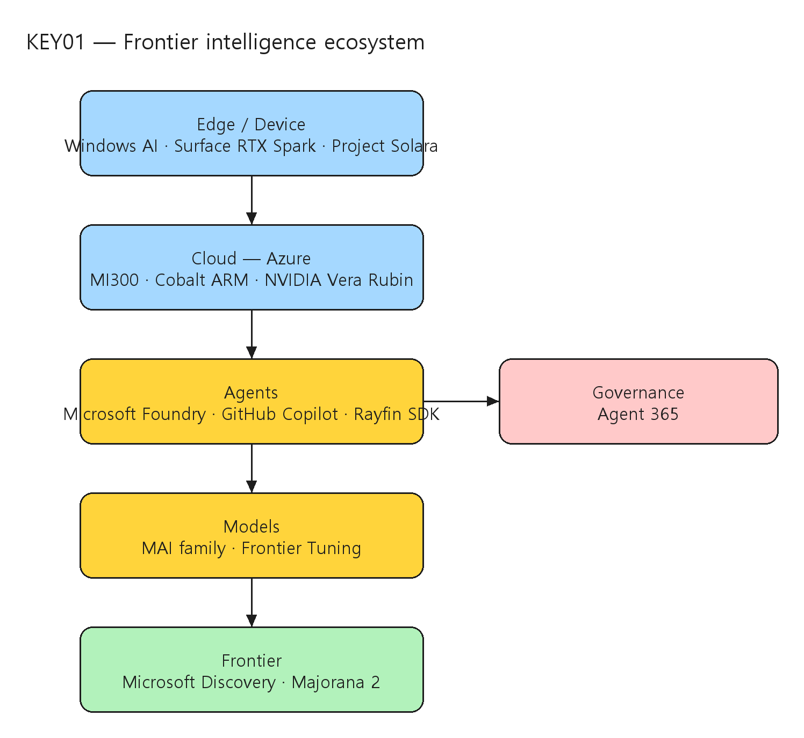

# [KEY01] Microsoft Build opening keynote

## TL;DR

> Satya Nadella와 Microsoft 리더들이 **edge → cloud → agents → governance**로 이어지는 "frontier intelligence ecosystem"을 제시한다. Windows AI(로컬 추론)·Azure 인프라(tokens per dollar per watt)·Microsoft Foundry/Agent 365(에이전트 빌드·거버넌스)·MAI 모델·Microsoft Discovery·양자(Majorana 2)까지 전체 AI 스택을 한 자리에서 펼친다.

- **AI 스택은 한 플랫폼이 아니라 그 위에 복리로 가치를 쌓는 생태계** — compute infrastructure부터 agents·governance·개발 도구까지 (00:01:23~00:03:20).
- **Edge: Windows AI** — NPU/GPU 로컬 추론(Outlook 요약·PowerPoint 시각화), Windows ML/Windows AI 확장, Surface RTX Spark Dev Box(petaflop급 로컬 AI) (00:03:20~00:12:08).
- **Cloud: Azure** — 글로벌 확장·near-zero water 데이터센터, AMD MI300·ARM Cobalt CPU, NVIDIA Vera Rubin, "tokens per dollar per watt" (00:19:00).
- **Agents: Foundry + Agent 365** — 장기 실행 에이전트 빌드·호스팅·거버넌스, GitHub Copilot이 애플리케이션 레이어로 확장, MAI 모델 패밀리 + Frontier Tuning (01:16:00~01:49:00).
- **Frontier: Discovery + Quantum** — AI+HPC+lab automation으로 단백질 발견, Majorana 2 양자 칩 (02:11:09~02:19:04).

## Top highlights

### 1. Frontier intelligence ecosystem — 전체 AI 스택 { #sec-hl-stack }

- 키노트의 중심 메시지는 "한 플랫폼에 묶이지 않고 그 위에 복리(compounding)로 가치를 쌓는 frontier intelligence ecosystem"이다. compute infrastructure → agents → governance → 개발 도구로 이어지는 신흥 AI 스택을 풀어낸다.
- [세부 → §1 비전과 AI 스택](#sec-vision)

### 2. Edge-to-cloud compute fabric { #sec-hl-fabric }

- Windows가 edge에서 로컬 AI(NPU/GPU)를 호스팅하고, Azure가 training·inference·agent runtime에 최적화된 cloud를 제공한다. Surface RTX Spark Dev Box와 데이터센터(Vera Rubin)를 잇는 "unmetered intelligence" 흐름을 보인다.
- [세부 → §2 Edge: Windows AI](#sec-edge) · [§3 Cloud: Azure](#sec-cloud)

### 3. Foundry·Agent 365로 가는 에이전트 플랫폼 { #sec-hl-agents }

- Microsoft Foundry가 장기 실행 에이전트의 빌드·호스팅·거버넌스를 담당하고, Agent 365가 containment·security·compliance를 보장한다. GitHub Copilot은 애플리케이션 레이어로 확장되고 MAI 모델 + Frontier Tuning이 맞춤 강화학습을 가능케 한다.
- [세부 → §5 Foundry & Frontier AI](#sec-foundry)

## Why it matters

- 키노트는 개별 제품 발표를 넘어 **Microsoft가 보는 AI 스택의 전체 지형**을 제시한다. edge(Windows AI)·cloud(Azure)·agents(Foundry/Agent 365)·models(MAI)·frontier(Discovery/Quantum)가 하나의 연속된 fabric으로 묶이는 방향성을 읽을 수 있다.
- 아키텍트 관점에서 핵심 프레이밍은 **"tokens per dollar per watt"** — 모델 성능 경쟁이 아니라 단위 비용·전력당 토큰 효율로 인프라 의사결정이 옮겨가고 있음을 시사한다 (00:19:00).
- 에이전트가 단일 디바이스를 넘어 cloud·device·edge에 걸쳐 동작하는 **agentic platform layer**(Project Solara)와, 거버넌스를 기본 레이어로 두는 **Agent 365**가 동시에 강조되어, 프로덕션 에이전트의 통제·컴플라이언스가 1급 관심사로 자리잡았음을 보여준다.

## Customer scenarios

- 개발자 디바이스에서 로컬로 에이전트를 빌드·테스트(privacy·cost 효율)하고, Azure로 확장해 장기 실행 워크로드를 운영하는 하이브리드 개발 루프.
- Foundry에서 에이전트를 만들고 Agent 365로 containment·compliance를 적용해 enterprise 시스템에 통합하는 거버넌스 우선 배포.
- Microsoft Discovery로 AI 에이전트+HPC+lab automation을 결합해 신소재·신약 등 과학적 발견 주기를 단축하는 R&D 시나리오.

## Key announcements

| 항목 | 상태 | 비고 |
|------|------|------|
| Windows ML / Windows AI 확장 (onboard 추론·agentic 모델) | 키노트 발표 | 로컬 추론 모델, NPU/GPU 활용 (00:03:20~) |
| Surface RTX Spark Dev Box | 키노트 발표 | petaflop급 로컬 AI 개발 머신, NVIDIA RTX Spark SoC (00:08:06) |
| Project Solara (agent-first computing) | 키노트 발표 | 고정형 agent terminal + 휴대형 smart badge 프로토타입 (00:38:36) |
| Microsoft Foundry + Agent 365 (에이전트 빌드·거버넌스) | 키노트 발표 | 장기 실행 에이전트, GitHub Copilot 애플리케이션 레이어 (01:16:00) |
| MAI 모델 패밀리 + Frontier Tuning | 키노트 발표 | 추론·이미징·음성 모델, bespoke RL 환경 (01:49:00) |
| Microsoft Discovery | 키노트 발표 | AI 에이전트+HPC+lab automation, 단백질 발견 데모 (02:11:09) |
| Majorana 2 양자 칩 | 키노트 발표 | 신뢰성·밀도 향상 (02:19:04) |

!!! event "Event · Microsoft Build 2026 opening keynote (2026-06-03)"
    위 항목은 키노트에서 소개된 발표를 세션 페이지 AI Summary 기준으로 정리한 것이다. 일부 제품·코드네임(예: Ion 계열 모델, RTX Spark SoC, Vera Rubin, Frontier Tuning)은 AI Summary의 음성 전사에서 비롯되어 **정식 명칭·GA/Preview 단계·일자는 공식 발표 및 제품 문서로 재확인이 필요**하다. 본 노트는 추측 일자를 기록하지 않는다.

## Session summary

### 1. 비전과 AI 스택 { #sec-vision }

`00:01:23` Satya Nadella가 San Francisco의 개발자를 맞이하며 개발자 컨퍼런스가 기술 전환의 순간을 포착한다는 점을 강조한다. 중심 아이디어는 한 플랫폼에 묶이지 않고 그 위에 복리로 가치를 쌓는 **"frontier intelligence ecosystem"**에 참여하는 것이다. `00:03:20` Nadella는 AI 스택의 토대로 edge에서 cloud까지 이어지는 상호연결된 compute fabric을 제시하고, compute infrastructure → agents → governance → 개발 도구의 층위를 풀어낸다.

### 2. Edge: Windows AI { #sec-edge }

`00:03:20` Windows가 edge에서 강력한 로컬 AI를 호스팅한다 — Outlook 요약, PowerPoint 시각화 등이 NPU/GPU 위 로컬 모델로 동작한다. Microsoft는 Windows ML과 Windows AI를 확장하며 onboard 추론 모델과 agentic 모델을 도입한다. 하드웨어는 AMD·Intel·Qualcomm·NVIDIA와 협업하며, NVIDIA가 새 RTX Spark SoC와 Surface Laptop Ultra를 구동한다. `00:08:06` **Surface RTX Spark Dev Box**가 소프트웨어 제작 전용 petaflop급 AI compute 머신으로 소개되어, 사용자 디바이스 위의 "unmetered intelligence"를 표방한다. `00:12:08` Kayla가 Surface RTX Spark 위에서 vertical taskbar, 성능 최적화 dev drive, GitHub Copilot 통합 지능형 터미널, 전체 GPU를 쓰는 WSL 컨테이너 등 distraction-free AI 개발 환경을 시연한다 — 로컬에서 정교한 AI 에이전트를 빌드·테스트하면서 생산성·프라이버시·비용을 유지한다.

### 3. Cloud: Azure { #sec-cloud }

`00:19:00` 초점이 cloud로 이동하며 Nadella가 Azure의 글로벌 확장과 환경 책임(near-zero water 운영·지속가능 전력 설계)을 논한다. AMD MI300, 커스텀 ARM 기반 **Cobalt CPU**와 네트워크가 training·inference·agent runtime이라는 지배적 AI 워크로드를 겨냥한다. NVIDIA와의 협업에서 **"tokens per dollar per watt"**로 튜닝된 cloud 아키텍처를 강조하고, Nadella와 Jensen Huang이 AI PC(RTX Spark)와 **Vera Rubin** 기반 데이터센터의 시너지 — secure confidential computing과 대규모 agent 워크로드 — 를 함께 논한다.

### 4. Agentic devices: Project Solara { #sec-solara }

`00:38:36` **Project Solara**로 큰 전환이 소개된다. Stevie Bathiche와 팀이 이를 "agent-first" 컴퓨팅 플랫폼 — Azure를 통해 전문화된 디바이스를 연결하는 생태계 — 으로 공개한다. 고정형 agent terminal과 휴대형 smart badge 두 프로토타입이 컨텍스트 기반으로 에이전트와 상호작용하는 방식을 보인다. voice·vision 기반 실시간 지능을 healthcare·retail 등 산업에 적용하는 시연이 이어지고, Qualcomm의 Cristiano Amon이 원격으로 합류해 분산 지능에 맞춘 실리콘 아키텍처를 논한다. Solara는 단일 디바이스에서 cloud·device·edge에 걸친 상호연결 개인 에이전트로의 진화를 시사한다.

### 5. Foundry & Frontier AI { #sec-foundry }

`01:16:00` 초점이 **Microsoft Foundry**로 돌아온다 — 장기 실행 AI 에이전트의 빌드·호스팅·거버넌스 플랫폼이다. GitHub Copilot이 완전한 애플리케이션 레이어로 진화해 Foundry·Rayfin SDK와 연결되어 coding agent용 백엔드 서비스를 제공한다. 라이브 데모는 enterprise 시스템에 통합된 영속적·자율 워크플로 생성을 보인다. 이어 Foundry의 거버넌스 레이어 **Agent 365**가 모든 agentic 시스템에 containment·security·compliance를 보장한다. `01:49:00` Mustafa Suleyman이 **MAI 모델 패밀리**(추론·이미징·음성)를 소개하고, **Frontier Tuning**으로 개발자·기업이 운영 데이터를 자사 목표에 맞춘 독점 "hill climbing" 지능으로 바꾸는 맞춤 강화학습 환경을 제시한다.

### 6. Discovery·Quantum과 마무리 { #sec-frontier }

`02:11:09` Satya가 **Microsoft Discovery**를 발표한다 — AI 에이전트·HPC·lab automation을 결합해 실세계 과학 진보를 가속하는 플랫폼이다. 라이브 데모에서 Discovery가 지속가능 플라스틱 재활용용 신규 단백질을 자율적으로 가설·모델링·검증하며 디지털 AI 추론과 자동 wet lab을 잇는다. `02:19:04` **Majorana 2** 양자 칩 공개로 마무리하며 신뢰성·밀도의 돌파를 표방한다. Nadella는 frontier 기술(AI·자율 에이전트·양자)을 책임감 있게 인간 기회 확장에 쓴다는 north star로 키노트를 닫는다.

## Architecture

키노트가 제시한 frontier intelligence ecosystem — Edge(Windows AI/디바이스) → Cloud(Azure compute fabric) → Agents(Foundry + Agent 365) → Models(MAI/Frontier Tuning) → Frontier(Discovery·Quantum):

| 레이어 | 구성요소 | 핵심 메시지 |
|------|------|------|
| Edge / Device | Windows ML·Windows AI, Surface RTX Spark, Project Solara | NPU/GPU 로컬 추론, agent-first 디바이스 |
| Cloud | Azure, AMD MI300, Cobalt ARM CPU, NVIDIA Vera Rubin | tokens per dollar per watt, confidential computing |
| Agents | Microsoft Foundry, GitHub Copilot, Rayfin SDK | 장기 실행 에이전트 빌드·호스팅 |
| Governance | Agent 365 | containment·security·compliance |
| Models | MAI 모델 패밀리, Frontier Tuning | 추론·이미징·음성, bespoke RL |
| Frontier | Microsoft Discovery, Majorana 2 | AI+HPC+lab, 양자 |

## Demo highlights

- ⏱️ 00:12:08 — Kayla, Surface RTX Spark 위 Windows AI 개발 환경(지능형 터미널·GitHub Copilot·WSL GPU)
- ⏱️ 00:19:00 — Nadella × Jensen Huang, AI PC ↔ Vera Rubin 데이터센터 시너지
- ⏱️ 00:38:36 — Stevie Bathiche, Project Solara agent terminal·smart badge 프로토타입 (Cristiano Amon 원격)
- ⏱️ 01:16:00 — Foundry + GitHub Copilot 애플리케이션 레이어, 자율 워크플로 라이브 생성
- ⏱️ 02:11:09 — Microsoft Discovery, 플라스틱 재활용 단백질 자율 발견 데모

## Caveats & open questions

- **제품명·코드네임 검증 필요** — AI Summary의 음성 전사 기반이라 Ion(onboard/agentic 모델), RTX Spark SoC, Vera Rubin, Frontier Tuning, Project Solara, Majorana 2 등 일부 명칭은 정식 표기와 다를 수 있다. 공식 발표·제품 문서로 재확인이 필요하다.
- **GA/Preview 단계·일자 미확정** — 키노트는 비전·발표 중심이라 각 기능의 가용 단계와 일자는 명시되지 않았다. 본 노트는 추측 일자를 기록하지 않는다.
- **MAI 모델 세부 미상** — MAI 패밀리의 모델별 사양·벤치마크·접근 경로는 키노트 수준에서 제한적이며 별도 세션/문서 확인이 필요하다.
- **발표자 직함** — 일부 발표자(Kayla 등)는 세션 페이지에 직함이 명시되지 않아 본 노트에서 직함을 생략했다.

## Resources

- 🎥 Session: https://build.microsoft.com/en-US/sessions/KEY01?source=sessions
- 🎬 Video: https://medius.microsoft.com/video/asset/HIGHMP4/9b6fd85d-e64f-46a4-b8b2-23811087192f?referrer=Microsoft+Build-%2Fen-US%2Fsessions%2FKEY01&mhid=build&loc=en-us
- 📝 Transcript: https://medius.microsoft.com/video/asset/Transcript/9b6fd85d-e64f-46a4-b8b2-23811087192f?referrer=Microsoft+Build-%2Fen-US%2Fsessions%2FKEY01&mhid=build&loc=en-us

## Related sessions

- [BRK251 — Build secure, enterprise-ready agents with Agent 365](BRK251-build-secure-enterprise-ready-agents-agent-365.md)
- [BRK243 — Claw and agent harness in Microsoft Foundry](BRK243-claw-agent-harness-microsoft-foundry.md)
- [BRK246 — Foundry IQ: Fuel agents with enterprise knowledge and agentic retrieval](BRK246-foundry-iq-enterprise-knowledge-agentic-retrieval.md)
- [BRK226 — Inside Azure innovations with Mark Russinovich](BRK226-inside-azure-innovations.md)

## About the speakers

- **Satya Nadella** — Chairman & CEO, Microsoft · [LinkedIn](https://www.linkedin.com/in/satyanadella/)
- **Mustafa Suleyman** — CEO, Microsoft AI · [LinkedIn](https://www.linkedin.com/in/mustafa-suleyman/)
- **Stevie Bathiche** — Technical Fellow, Microsoft
- **Jensen Huang** — Founder & CEO, NVIDIA
- **Cristiano Amon** — President & CEO, Qualcomm · [LinkedIn](https://www.linkedin.com/in/cristianoamon/)
