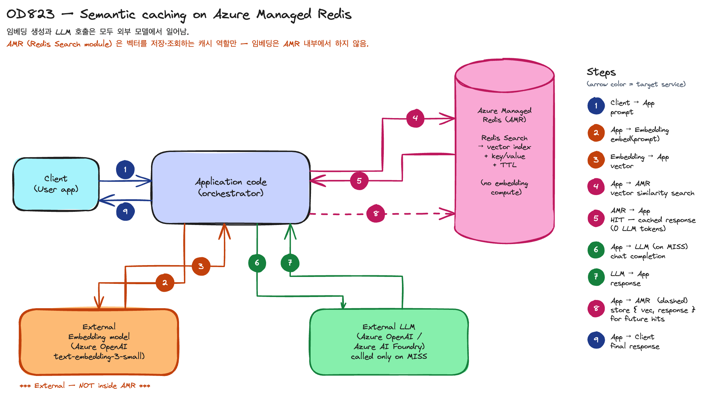

# [OD823] Faster AI Responses with Semantic Caching in Azure Managed Redis

## TL;DR

> Pre-recorded 데모 세션. **Azure Managed Redis (AMR)** 의 두 가지 AI 활용을 라이브 데모로 보여줌:
>
> 1. **Semantic caching** — 직전 LLM 응답을 임베딩 벡터로 저장하고, 새 prompt가 들어오면 cosine 유사도로 cache hit 판단. 같은 의도의 다른 표현도 hit 처리 → token / latency / 비용 절감.
> 2. **Agent memory** — short-term (대화 상태) + long-term (preferences · durable facts · interests) 메모리를 AMR에 vector hash로 저장. TTL · per-user 키 격리 · Microsoft Agent Framework 네이티브 통합.
>
> 공통 비결: AMR의 **Redis Search module** (추가 비용 없음) 으로 vector similarity search 활성화. **임베딩 생성과 LLM 호출은 모두 외부 모델 — AMR은 vector cache 역할만 함.**

## Why it matters

- **LLM 비용·지연의 가장 큰 단일 절감 레버 중 하나** — 같은 의도가 다른 워딩으로 반복되는 production LLM 워크로드(고객 지원, 검색, FAQ 봇 등)에서 exact key-value cache는 거의 못 잡지만 semantic cache는 hit rate가 충분히 나옴. 손익분기가 **약 1.2% cache hit** 으로 매우 낮아 도입 부담이 작음 (Philip 데모 계산기 가정 기준 — 자세한 가정은 아래 "Cost calculator" 참고).
- **Agent를 production으로 옮길 때 부딪히는 두 벽 — 비용 폭주와 컨텍스트 부재 — 을 같은 데이터 계층(AMR)으로 해결** — 캐싱·세션·메모리·벡터 검색이 별도 시스템이었던 것을 한 in-memory store로 묶음. 멀티 에이전트 간 컨텍스트 공유의 백본 역할.
- **AMR은 이미 first-party GA 서비스** — Azure Cache for Redis와 별도 SKU. Redis Enterprise software 기반, 4 tier(Memory Optimized · Balanced · Compute Optimized · Flash Optimized), 지원 region에서 zone-redundant 기본.

## Customer scenarios

데모와 발표 멘트에서 직접 언급된 시나리오:

- **e-commerce 검색·추천 봇** — 변형 prompt가 많이 들어오는 도메인 (데모 prompt: "How do I improve product search relevance using vector embeddings?" ↔ "How can vector embeddings make product search more relevant?"). 의도 동일 → semantic cache hit으로 같은 답변·0 token.
- **FAQ / 고객 지원 봇 (글로벌 캐시)** — 인증 없는 방문자가 비슷한 질문을 반복. 사용자 무관한 답변이므로 글로벌 캐시 키로 share, hit rate 극대화.
- **per-user 챗 (사용자별 격리 캐시)** — 답변이 사용자 데이터에 의존. Redis 키 naming convention으로 검색 범위를 사용자 prefix로 한정 → 다른 사용자 응답 누출 방지. 데모는 "Merchandiser Mia" / "Platform Priya" 두 페르소나로 시연.
- **개인화된 AI assistant / travel companion** — 사용자 발화에서 자동으로 work · interests · preferences를 추출해 long-term memory에 vector hash로 저장. 이후 "What activities do I enjoy?" 같은 질의에 사용자 도메인 지식으로 응답.
- **멀티 에이전트 컨텍스트 공유** — 에이전트 A가 저장한 컨텍스트를 에이전트 B가 즉시 조회. 별도 RAG store 또는 ETL 없이 in-memory 공유.

## Key announcements

| 항목 | 상태 | 비고 |
|------|------|------|
| **Azure Managed Redis (AMR)** | GA | Microsoft first-party offering, Redis Enterprise software 기반. 지원 region에서 zone-redundant 기본. |
| **Redis Search module on AMR** | GA · 추가 비용 없음 | Vector similarity search 활성화 — semantic cache, agent memory, lightweight vector store, RAG 모두의 기반. (Flash Optimized tier는 미지원 — 아래 모듈 표 참고) |
| **Microsoft Agent Framework × AMR 네이티브 통합** | 발표 멘트 | Roy 마무리 발언: *"fully integrates with the Microsoft Agent Framework, natively embedded and supported"* — 에이전트 메모리 백엔드로 AMR 사용 가능. 정확한 SDK API는 Agent Framework 공식 docs로 cross-check 권장. |

!!! ga "Azure Managed Redis"
    AMR은 본 세션이 처음 발표하는 것이 아니라 이미 GA 된 first-party Azure 서비스. 본 세션은 AMR 위에서 **Redis Search module을 활용한 두 가지 AI 패턴(semantic cache · agent memory)** 을 데모로 보여주는 데 초점.

## AMR modules

AMR은 Redis Enterprise를 기반으로 하므로 community Redis의 핵심 모듈을 **추가 라이선스 비용 없이** 제공합니다. 모듈은 tier별로 지원 여부가 다름 (Microsoft Learn [Feature comparison](https://learn.microsoft.com/en-us/azure/redis/overview#feature-comparison) 기준):

| 모듈 | 역할 | Mem Opt / Balanced / Compute Opt | Flash Optimized |
|---|---|:---:|:---:|
| **Redis Search** (vector + full-text) | 본 세션의 핵심 — 벡터 인덱스 · cosine/L2 유사도 · 하이브리드 full-text 검색 | ✅ | ❌ |
| **Redis JSON** | JSON 도큐먼트를 1급 시민으로 저장 · 쿼리 (예: 세션 state · agent 컨텍스트) | ✅ | ✅ |
| **Redis Bloom** (probabilistic) | Bloom · Cuckoo · Count-Min-Sketch · Top-K 등 확률적 자료구조 — dedup, hot-key 검출 | ✅ | ❌ |
| **Redis TimeSeries** | 시계열 데이터(메트릭·이벤트·센서) 적재·압축·downsample | ✅ | ❌ |

Flash Optimized tier 에서 **공식 지원되는 모듈은 RedisJSON 하나** — 나머지 세 모듈(Search · Bloom · TimeSeries)은 Memory Optimized / Balanced / Compute Optimized 에서만 사용 가능 (Microsoft Learn [Use Redis modules with AMR](https://learn.microsoft.com/en-us/azure/redis/redis-modules) 기준).

본 세션에서 직접 활용한 것은 **Redis Search** 하나(벡터 cache + agent memory 두 패턴 모두). 나머지 모듈은 같은 AMR 인스턴스 안에서 동시 활용 가능 — 예: agent 시스템에서 Search로 벡터 검색 + JSON으로 대화 state 저장 + Bloom으로 중복 prompt 검출 + TimeSeries로 응답 latency 메트릭 기록 (단 위 표의 tier 제약 확인).

## Architecture

{ width="780" loading=lazy }

**오해 방지 — AMR은 임베딩을 만들지 않습니다.**

- **임베딩 생성과 LLM 호출은 모두 외부 모델** (위 다이어그램의 노란/보라 박스) 에서 일어남. 일반적으로 Azure OpenAI 의 `text-embedding-3-small` 같은 embedding deployment + chat 모델 deployment 를 별도로 둠.
- AMR(Redis Search module)은 그 외부 모델이 반환한 **벡터를 받아 저장·조회**하는 **vector cache** 역할만 함. cosine 유사도 비교는 AMR 내부에서 빠르게 수행되지만 임베딩 자체는 외부.
- 따라서 cache MISS 일 때 **호출 비용**은 (embedding API 1회) + (LLM API 1회), cache HIT 일 때는 (embedding API 1회 + AMR vector search) 만 발생 → LLM 호출 1회 비용이 통째로 절약. 이게 "cache hit률 ≈ 토큰 절감률" 이 성립하는 이유.
- **Agent memory** 흐름도 동일 — 사용자 메시지를 embedding 모델에 보내 벡터 얻고, AMR에서 vector search로 short-term(대화) + long-term(facts) 조회, LLM 응답 생성 후 새 fact만 vector hash로 다시 AMR에 저장.

## Cost calculator (Philip 데모 발췌)

발표자가 라이브로 보여준 계산기 — *흥미용 시뮬레이션이며 가정에 강하게 의존*. 그래도 도입 의사결정의 감을 잡기에 유용:

| 입력 | 값 |
|---|---|
| Daily queries | 200,000 |
| Semantic cache hit rate | 70% |
| LLM 가격 가정 | GPT-5 |
| Annual LLM spend (cache 없이) | ~$300,000 |
| Cache 적용 후 LLM spend | ~$90,000 |
| Embedding + AMR 인스턴스 비용 포함 **순절감** | **$200,000+ / 연** |
| **Break-even cache hit rate** | **~1.2%** (100 query 중 1.2개만 hit이어도 손익분기) |

> 핵심 규칙 (Philip 데모 멘트 verbatim): **"whatever your cache hit rate percentage is, that is your net savings."**
>
> → 실제 production에서는 hit rate가 입력 분포 / threshold / 사용자 격리 정책에 따라 크게 변합니다. 위 수치 자체보다 **"hit rate ≈ 절감률"** 이라는 방향성과 **break-even이 1.2% 수준으로 낮다**는 점을 인용 가능한 사실로 보세요.

## Code & samples

데모는 코드 페이지를 거의 노출하지 않고 동작 데모 중심이었습니다. 세션 종료 멘트에서 *"different samples of the demos on GitHub"* 만 언급되었고 정확한 데모 repo URL은 미공개. 관련 리소스 링크만 정리:

- **Microsoft 공식 docs**
    - AMR 모듈 docs — [Use Redis modules with Azure Managed Redis](https://learn.microsoft.com/en-us/azure/redis/redis-modules)
    - AMR vector search 튜토리얼 — [Tutorial: Use vector search in Azure Managed Redis](https://learn.microsoft.com/en-us/azure/redis/tutorial-vector-similarity)
- **Redis Inc 커뮤니티 프로젝트** *(Microsoft 공식 sample 아님 — `redis-developer` org는 Redis Inc 소유)*
    - Redis AI 통합 큐레이션 — [redis-developer/redis-ai-resources](https://github.com/redis-developer/redis-ai-resources) (semantic cache · vector search · RAG · agent memory 노트북 모음)
    - LangGraph + Redis (agent memory backend) — [redis-developer/langgraph-redis](https://github.com/redis-developer/langgraph-redis) (checkpointer + store for memory management)
    - 발표자 Philip의 GitHub — [github.com/redis-phil](https://github.com/redis-phil) (위 두 repo를 fork 보유)

## Caveats & open questions

- **"15× more performant than Azure Cache for Redis"** — Shruti 발표 멘트. 자기 발화 중에 "15% 가 아니라 15 times" 로 정정함. 정확한 측정 조건(워크로드 / SKU / 메트릭)은 Microsoft Learn AMR 공식 docs에서 cross-check 권장.
- **Gartner "40% of enterprise applications will have specific AI agents by 2026"** — 발표 멘트 인용. Gartner 원자료 출처는 세션에서 미공개.
- **비용 시뮬레이션 ($300K → $90K, break-even 1.2%)** — 200K daily query · GPT-5 가격 · 70% cache hit · 데모용 embedding cost · 가정한 AMR tier 라는 **특정 입력 조건** 하의 계산기 결과. 실제 비용은 모델·region·embedding 모델·Redis tier·query 분포에 따라 변동. **방향성 (cache hit률 ≈ 비용 절감률 · break-even이 매우 낮음)** 만 인용 가능.
- **Microsoft Agent Framework × AMR 네이티브 통합** — 발표 멘트만. 정확한 SDK API · 패키지 · 샘플 repo URL은 세션에서 미공개. `learn.microsoft.com/microsoft-agent-framework/` URL은 현재 404 응답 — 공식 docs landing이 아직 게시되지 않은 것으로 보임. 확인 가능한 인접 통합은 [Azure Managed Redis integration with Microsoft Foundry (Public Preview, 2025-11)](https://azure.microsoft.com/en-us/updates?id=532188) — Agent Framework 통합 자체는 별도 cross-check 필요.
- **데모 GitHub samples repo** — Roy 종료 발언에서 언급되지만 정확한 URL 미공개. 위 Code & samples 에 적은 [redis-developer/redis-ai-resources](https://github.com/redis-developer/redis-ai-resources) · [redis-developer/langgraph-redis](https://github.com/redis-developer/langgraph-redis) 는 **Redis Inc 가 운영하는 커뮤니티 repo** 로, Microsoft 공식 sample 아님. 발표자 fork 이력에 근거한 관련 리소스로만 참고.
- **Speaker affiliation 차이** — Build 세션 페이지는 Philip Laussermair 를 "Microsoft" 로 표기, transcript에서는 본인이 *"Senior Solutions Architect at Redis"* 로 자기 소개. 본 노트는 transcript verbatim 우선. Shruti 와 Roy 는 페이지 speaker 목록에 별도 등재되지 않았지만 transcript에 직접 자기 소개를 함.

## Resources

- 🎥 Session: <https://build.microsoft.com/en-US/sessions/OD823?source=sessions>
- 📥 Video / Transcript: 세션 페이지의 "Download Video" / "Download Transcript" (Microsoft Build 로그인 필요)
- 📚 Azure Managed Redis docs (overview): <https://learn.microsoft.com/en-us/azure/redis/overview>
- 📚 AMR Redis modules: <https://learn.microsoft.com/en-us/azure/redis/redis-modules>
- 📚 AMR vector search tutorial: <https://learn.microsoft.com/en-us/azure/redis/tutorial-vector-similarity>
- 👤 Speakers:
    - [Philip Laussermair — LinkedIn](https://www.linkedin.com/in/philip-laussermair/) · [GitHub (redis-phil)](https://github.com/redis-phil)

## Related sessions

세션 페이지가 명시한 관련 세션:

- [TT622 — Scaling PostgreSQL for Agentic Apps: Patterns and Tradeoffs](https://build.microsoft.com/en-US/sessions/TT622?source=sessions)
- [LTG461 — AI building using the Foundry Extension for VS Code](https://build.microsoft.com/en-US/sessions/LTG461?source=sessions)
- [TT697 — Ignite Research Focus Group](https://build.microsoft.com/en-US/sessions/TT697?source=sessions)

본 사이트에 작성된 연관 세션:

- [DEM364 — Simplify app dev with cloud-native PostgreSQL in Azure HorizonDB](DEM364-horizondb-postgresql.md) — HorizonDB도 동일한 "벡터 검색 + AI 함수" 패턴을 PG 위에서 제공. AMR(semantic cache · agent memory)과 비교하면 *데이터 레이어 vs in-memory 가속 레이어* 의 역할 분담을 그릴 수 있음.
- [BRK240 — Build context-aware agents](BRK240-build-context-aware-agents.md) — 에이전트 컨텍스트/메모리의 상위 개념. AMR은 그 컨텍스트 레이어의 백엔드 후보 중 하나.
