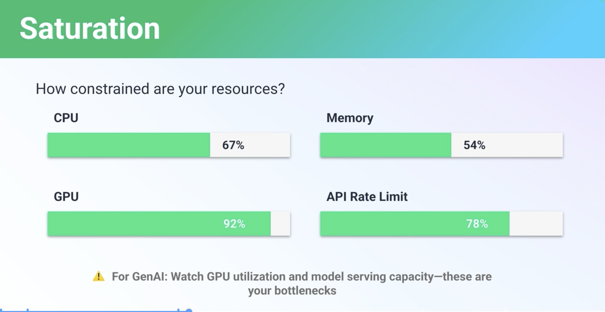
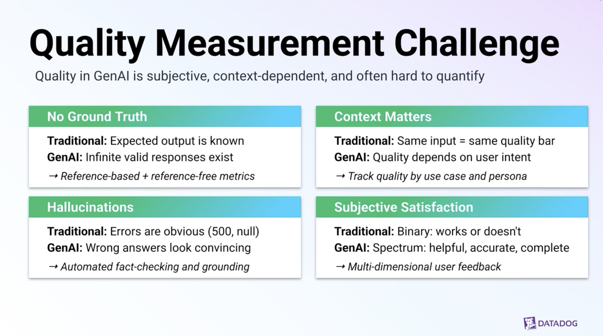
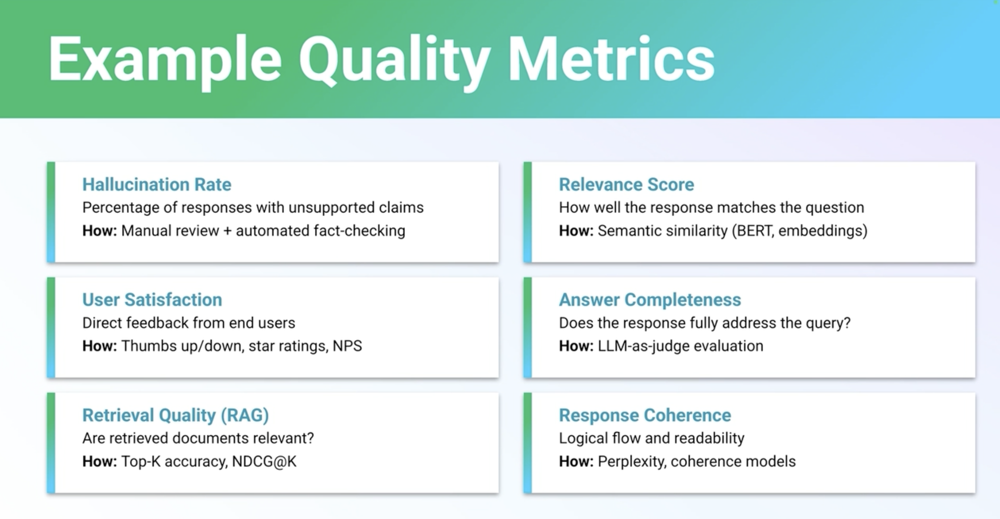

# [ODSP907] Monitor GenAI applications beyond golden signals

## TL;DR

> 12분짜리 Datadog 스폰서 세션 — GenAI 앱에는 전통적 **LETS** (Latency · Errors · Traffic · Saturation) 만으로는 빈 곳이 너무 많다는 가이드.
>
> - **LETS는 유지하되 더 잘게 잘라야 함** — latency는 RAG 검색 / LLM 호출 / 총 응답 단계별로, errors는 4xx/5xx 외에 *model error* (context length, safety filter, overload) 까지, traffic은 feature·user·model 단위로, saturation은 GPU·rate-limit 중심으로.
> - **3개 새 차원 추가** — Cost (token creep · model drift · uncached calls), Safety (PII leak / prompt injection / jailbreak / denial-of-wallet / model extraction), Quality (hallucination · relevance · retrieval · coherence).

## Why it matters

200 OK 의미가 무너지는 첫 세대 워크로드. 응답이 빠르고 에러 없이 돌아와도 — 환각·PII 유출·예산 초과가 동시에 진행 중일 수 있다. SRE/Platform 팀이 기존 대시보드만 보고 "정상" 으로 판단하면 비용·보안·품질 사고를 동시에 놓침. 세션은 product-agnostic 가이드로 시작해 마지막 1–2분만 Datadog LLM Observability 광고로 닫는 구조이므로, **체크리스트 자체는 어떤 옵저버빌리티 스택에서도 그대로 적용 가능**.

## Customer scenarios

- **플랫폼/SRE 팀** — 기존 latency/error 대시보드를 LLM 단계 분해 + per-model · per-feature 라벨로 재설계.
- **FinOps/Platform** — token-level 비용 attribution 부재로 갑작스러운 OpenAI/Foundry bill spike. feature · user · model · endpoint 4축 태깅 도입.
- **Security 팀** — prompt injection · PII 누출이 4xx/5xx 코드로 잡히지 않음 → 별도 보안 메트릭 정의 필요.
- **Product/AI 팀** — eval 점수 (hallucination, relevance, retrieval quality) 를 실시간 메트릭으로 승격해 회귀 감지.

## Session summary

### 1. 전통 LETS — 그대로 두되 더 세밀하게

| Signal | Traditional | GenAI 추가 |
|---|---|---|
| **Latency** | median · P95 · P99 (예: 850 ms) | RAG retrieval · LLM 호출 · total request 단계별 분해 |
| **Errors** | 4xx · 5xx | model error: context length · safety filter · model overloaded |
| **Traffic** | RPS over time | per feature (chatbot vs summarization) · per user type · per model |
| **Saturation** | CPU · memory · queue depth | **GPU 사용률** · **API rate limit** (Azure OpenAI / Foundry 모델 RPM/TPM) |

핵심 메시지: *LETS는 사라지지 않는다. 그러나 같은 이름의 메트릭을 GenAI 파이프라인 단위로 잘게 쪼개 측정해야 의미가 있다.*

Saturation 측면에서 **GPU 사용률과 모델 serving capacity** 가 새 병목으로 등장한 것이 널리 표준화되는 중 — 상용 옥서버빌리티 제품들이 공통으로 제시하는 구도가 아래 슬라이드와 비슷하게 수렴되고 있다.

{ width="540" loading=lazy }

### 2. 새 차원 #1 — Cost monitoring

비용이 dynamic 하고 unpredictable. 세 가지 패턴이 가장 큰 cost spike 원인:

- **Token creep** — 품질 개선 명목으로 context window 가 슬쩍 늘어남. 사용량 변동 없이도 단가 상승.
- **Model drift** — 더 좋은 응답을 위해 cheaper → expensive 모델로 갈아탐. 호출 수 그대로지만 비용 폭증.
- **Uncached calls** — 동일 입력이 캐시 없이 LLM API에 반복 호출. *(이 부분은 [OD823 의 semantic cache](OD823-managed-redis-semantic-caching.md) 가 정확히 해결하는 문제와 동일.)*

**Cost attribution 태깅 4축**:

| 태그 | 용도 |
|---|---|
| `feature` | summarization · text-to-speech 등 어느 기능이 비용을 끌어가는지 |
| `user` / `org_id` | chargeback · 비정상 사용 감지 |
| `model` / `provider` | 모델 간 비용 벤치마크 |
| `endpoint` / `region` / `env` | staging vs prod · region별 분산 비용 |

### 3. 새 차원 #2 — Safety & security

위협 분류:

| Risk | 항목 |
|---|---|
| Critical | **PII leakage** · **Data exfiltration** |
| High | **Prompt injection** · **Jailbreaking** |
| Medium | **Denial-of-wallet** (예산 공격) · **Model extraction** (쿼리로 역공학) |

추적해야 하는 4개 보안 메트릭: *prompt injection rate · PII detection rate · content moderation score · jailbreak attempts*. 모두 기존 HTTP 에러 코드로는 잡히지 않으므로 별도 시그널로 분리해 정의.

### 4. 새 차원 #3 — Quality monitoring

Cost·Safety 다음으로 소개되지만, 마지막에 온 것이 중요도가 낮아서는 아니다 — 세션은 *"마지막이 사실상 가장 중요한 차원"* 이라고 명시. 온라인 출력이 200 OK이더라도 응답 품질이 나브면 비즈니스 관점에서는 사실상 장애.

{ width="540" loading=lazy }

품질이 본질적으로 주관적이라 측정이 어려운 4가지 이유 (슬라이드 Traditional vs GenAI 대비):

| 이슈 | Traditional | GenAI | 권장 접근 |
|---|---|---|---|
| **No ground truth** | Expected output is known | Infinite valid responses exist | Reference-based + reference-free 메트릭 혼용 |
| **Context matters** | Same input = same quality bar | Quality depends on user intent | use case · persona별 품질 추적 |
| **Hallucinations** | Errors are obvious (500, null) | Wrong answers look convincing | Automated fact-checking + grounding |
| **Subjective satisfaction** | Binary: works or doesn't | Spectrum: helpful, accurate, complete | 다차원 사용자 feedback |

**6개 핵심 메트릭 — 어떻게 측정하나** (슬라이드 *Example Quality Metrics* 기준):

| 메트릭 | 의미 | 추천 측정 방법 |
|---|---|---|
| **Hallucination rate** | 근거 없는(unsupported) 주장을 포함하는 응답의 비율 | Manual review + automated fact-checking |
| **Relevance score** | 응답이 질문에 얼마나 맞는지 | Semantic similarity (BERT · embeddings) |
| **User satisfaction** | 최종 사용자의 직접 feedback | Thumbs up/down · star rating · NPS |
| **Answer completeness** | 질문에 완전히 답했는가 | LLM-as-judge evaluation |
| **Retrieval quality (RAG)** | RAG가 가져온 문서가 실제로 관련 있는가 | Top-K accuracy · NDCG@K |
| **Response coherence** | 논리적 흐름·가독성 | Perplexity · coherence 모델 |

{ width="540" loading=lazy }

### 5. 통합 모델

발표 정리: LETS (서비스가 *살아 있는가?*) + Cost (예산 안에서 *효율적인가?*) + Safety (외부 공격에 *안전한가?*) + Quality (사용자에게 *유용한가?*). 이 네 축이 동시에 그린이어야 GenAI 앱이 진짜 "정상" 상태.

마지막 1–2분은 Datadog LLM Observability 광고 — latency/error/token-per-second/rate-limit 자동 캡처 + cost/quality eval + PII masking · prompt injection 탐지가 한 화면.

## Caveats & open questions

- **스폰서 (Datadog) on-demand 세션** — Microsoft 자체 제품 발표가 아님. 가이드 자체는 product-agnostic 이지만 마지막 클로징은 Datadog 제품 광고. 동등 기능은 Azure Monitor · Application Insights · Foundry observability · OpenTelemetry 기반 솔루션에서도 구성 가능.
- **발표자 정보** — Build 세션 페이지에 speaker 등재 없음 (스폰서 세션 관례). 본 노트는 transcript 한 명의 화자를 *Speaker* 로만 표기.
- **"LETS" 약어** — Latency/Errors/Traffic/Saturation. Google SRE Book 의 "Four Golden Signals" 와 동일하지만 약어는 발표자가 사용한 표현.
- **메트릭 임계값·계산식 세부 미공개** — hallucination rate · relevance score 의 권장 측정 기법은 슬라이드(*Example Quality Metrics*)에 언급되지만 특정 프로덕션 임계값·계산 공식은 세션에서 다루지 않음. 외부 참고: [Microsoft Foundry evaluators (groundedness, relevance, coherence)](https://learn.microsoft.com/azure/ai-foundry/concepts/evaluation-metrics-built-in), [RAGAS](https://docs.ragas.io/), [TruLens](https://www.trulens.org/).
- **GenAI 보안 메트릭의 산업 표준 부재** — prompt injection rate · jailbreak 탐지의 *공식* 측정 표준은 아직 정착 중. 참고 가능한 frameworks: [OWASP Top 10 for LLM Applications](https://owasp.org/www-project-top-10-for-large-language-model-applications/), [MITRE ATLAS](https://atlas.mitre.org/).

## Resources

- 🎥 Session: <https://build.microsoft.com/en-US/sessions/ODSP907?source=sessions>
- 📥 Video / Transcript: 세션 페이지의 "Download Video" / "Download Transcript" (Microsoft Build 로그인 필요)
- 📚 Microsoft 공식 옵저버빌리티 docs (관련):
    - Azure Monitor for AI workloads: <https://learn.microsoft.com/azure/azure-monitor/app/opentelemetry-overview>
    - Application Insights for LLM/GenAI: <https://learn.microsoft.com/azure/azure-monitor/app/genai>
    - Foundry observability (traces · evaluations): <https://learn.microsoft.com/azure/ai-foundry/concepts/observability>
    - Azure AI Content Safety (PII · jailbreak · prompt shield): <https://learn.microsoft.com/azure/ai-services/content-safety/overview>
- 📚 외부 참고 (Microsoft 외):
    - Google SRE Book — Monitoring Distributed Systems (The Four Golden Signals): <https://sre.google/sre-book/monitoring-distributed-systems/>
    - OWASP Top 10 for LLM Applications: <https://owasp.org/www-project-top-10-for-large-language-model-applications/>
    - MITRE ATLAS (AI threat matrix): <https://atlas.mitre.org/>

## Related sessions

Build 세션 페이지가 명시한 관련 세션:

- [LAB520-R1 — Get Started with Models in Microsoft Foundry to Build AI Apps](https://build.microsoft.com/en-US/sessions/LAB520-R1?source=sessions)
- [DEM323 — Under the hood of Microsoft AI models](https://build.microsoft.com/en-US/sessions/DEM323?source=sessions)
- [LIVE156 — Designing VS Code's UX for the Agentic Era](https://build.microsoft.com/en-US/sessions/LIVE156?source=sessions)

본 저장소의 인접 노트:

- [OD823 — Reduce AI cost using semantic caching](OD823-managed-redis-semantic-caching.md) — 본 세션 Cost 섹션의 "uncached calls" 문제를 AMR Semantic Cache로 해결하는 구체 패턴.
- [BRK240 — Build context-aware agents](BRK240-build-context-aware-agents.md) — Foundry/IQ 기반 에이전트 운영의 컨텍스트, 본 세션 가이드를 적용할 워크로드.
