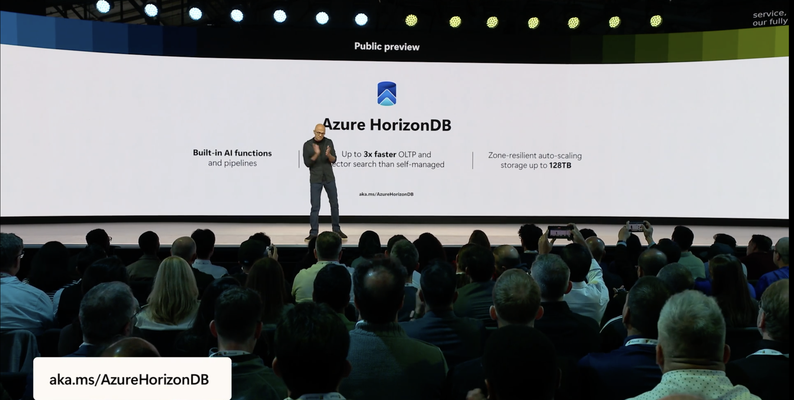
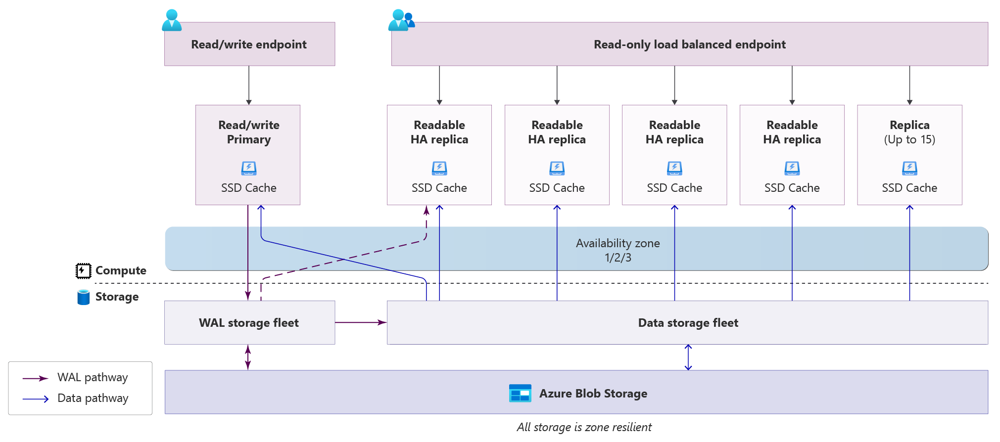
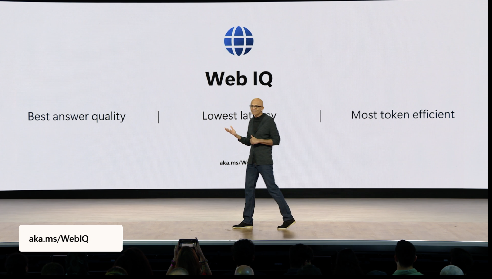
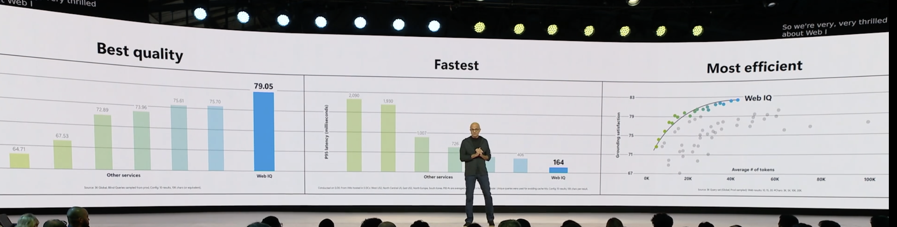
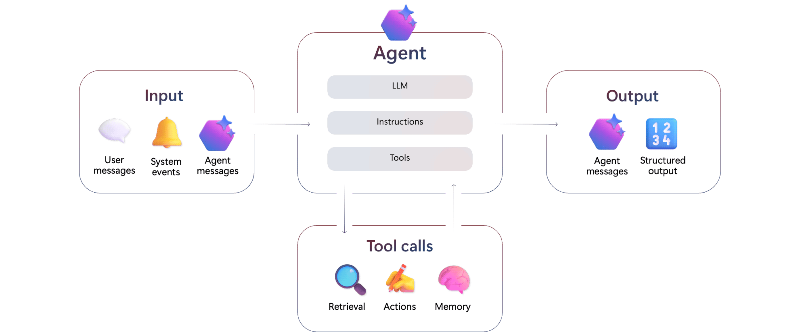
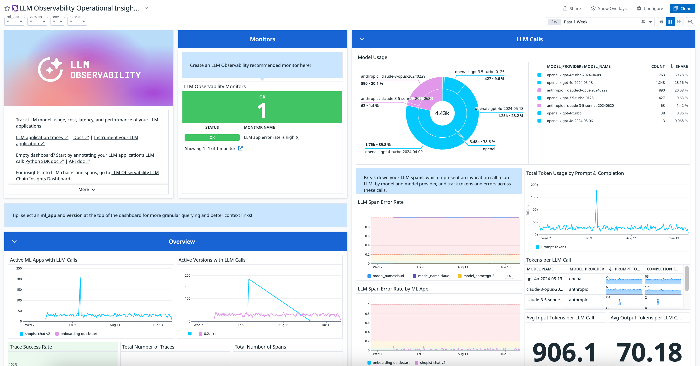
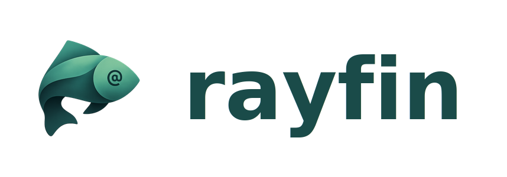

# Build 2026 Recap

## 1. PostgreSQL 안으로 통합되는 AI 데이터 스택 — Azure HorizonDB

AI 서비스를 한 번이라도 만들어 봤다면 익숙한 풍경이 있습니다. OLTP DB · vector DB · full-text search · reranker · graph DB, 그리고 이들 사이를 묶는 동기화 파이프라인. 데이터가 한 군데 바뀌면 다섯 군데로 전파해야 하고, 결국 SLA 가 가장 약한 컴포넌트가 전체 응답 품질을 결정합니다.

Satya 가 Build 2026 키노트에서 announce 한 **Azure HorizonDB** 는 그 다섯을 **PostgreSQL 한 엔진 안에서 처리**하겠다는 제안입니다 — **2026-06 Public Preview**, 5개 region 에서 시작.

<figure markdown="span">{ loading=lazy width="640" }<figcaption>슬라이드 출처: Microsoft Build 2026 keynote · <a href="https://aka.ms/AzureHorizonDB">aka.ms/AzureHorizonDB</a></figcaption></figure>

엔진 안을 들여다보면, `SELECT azure_ai.generate(...)` 한 줄로 LLM 을 부르고 `model_registry.model_add(...)` 로 BYOM 임베딩 모델을 등록합니다. compute / storage 가 분리돼 있어 **read replica 는 데이터 복제 없이 즉시** 추가되고 — 최대 15 replicas, 발표 수치 기준 throughput 3× · vector search 3× — 가 가능합니다.

<figure markdown="span">{ loading=lazy width="560" }<figcaption>아키텍처 다이어그램 출처: <a href="https://learn.microsoft.com/en-us/azure/horizondb/overview">Microsoft Learn · Azure HorizonDB overview</a></figcaption></figure>

*database-as-a-log* 가 어떻게 read replica 의 즉시 확장을 가능하게 하는지, `Zava room designer` 데모(벡터 + BM25 hybrid → cross-encoder rerank → Apache AGE graph traversal)가 한 PostgreSQL 안에서 어떻게 완결되는지는 — 세션 노트에.

- → [DEM364 — HorizonDB 데모 & 아키텍처 deep dive](../sessions/DEM364-horizondb-postgresql.md)
- → [LIVE143 — HorizonDB + Rayfin 15분 라이브 패널](../sessions/LIVE143-azure-data-horizondb-rayfin.md)

## 2. Bing Grounding 의 종료와 그 자리에 들어선 Web Search tool — Web IQ

Foundry 에이전트에 외부 웹을 붙여 본 적이 있다면 **Grounding with Bing Search** 를 사용했을 텐데, 해당 도구는 **2027-03-31 에 retire** 됩니다. 그 자리에 새 **Web Search tool** 이 들어왔고, Microsoft 는 이를 *Microsoft IQ Platform* 의 외부 컨텍스트 평면 — **Web IQ** — 으로 정리했습니다.

<figure markdown="span">{ loading=lazy width="640" }<figcaption>슬라이드 출처: Microsoft Build 2026 keynote · <a href="https://aka.ms/WebIQ">aka.ms/WebIQ</a></figcaption></figure>

운영 입장에서 변화 폭이 작지 않습니다. **Bing 리소스를 더 이상 고객이 직접 프로비저닝하지 않으며**(Microsoft 가 관리), 별도 도구였던 **Deep Research 는 같은 web search tool + `o3-deep-research` 모델** 조합으로 흡수됐고, 도메인 allow / block 리스트도 `custom_search_configuration` 안으로 통합됐습니다. *외부 웹 grounding 을 구성하는 컴포넌트 수가 줄어드는* 방향의 변화입니다.

발표에서 같이 공개된 benchmark 슬라이드는 Microsoft 가 내세운 세 축 — *quality · latency · grounding satisfaction* — 의 실제 수치 비교를 보여줍니다.

<figure markdown="span">{ loading=lazy width="640" }<figcaption>슬라이드 출처: Microsoft Build 2026 keynote</figcaption></figure>

Foundry SDK 관점에서 보면, Web Search 는 별도 endpoint 가 아니라 agent 에 붙는 도구 카탈로그의 한 항목 — 즉, *Bing Grounding 처럼 외부 리소스* 가 아니라 *agent 의 tool 평면 안* 으로 위치가 바뀌었습니다.

<figure markdown="span">{ loading=lazy width="560" }<figcaption>이미지 출처: <a href="https://learn.microsoft.com/en-us/azure/ai-foundry/agents/overview">Microsoft Learn · What is Microsoft Foundry Agent Service?</a></figcaption></figure>

*Work · Fabric · Foundry · Web* 네 개의 IQ 레이어를 Microsoft 가 어떻게 분리·정의했는지, *기존 Bing Grounding vs. 새 Web Search tool* 의 7축 비교는 — 세션 노트에.

- → [BRK240 — Microsoft IQ 4 레이어 & Web Search 비교](../sessions/BRK240-build-context-aware-agents.md)

## 3. 200 OK 가 안전을 보장하지 않는 운영 환경 — GenAI observability

기존 웹 서비스에서 *200 OK · p95 850 ms · error rate 0.1%* 는 "정상" 의 다른 이름이었습니다. GenAI 워크로드에서는 그 셋이 모두 초록불인 상태에서, 응답이 **환각이거나 · PII 가 누출되거나 · 비용이 조용히 폭증하거나 · denial-of-wallet 공격이 진행 중** 일 수 있습니다. 동일한 대시보드로는 사고 세 개를 동시에 놓치게 됩니다.

원인은 단순합니다 — *traffic 이 생성형이 되는 순간 출력 자체가 SLA 의 일부* 가 됩니다. HTTP status · latency · error rate 만으로는 "응답 내용이 옳은가" 를 측정할 수 없고, 토큰당 비용·모델 사용량 같은 비용 축은 기존 골든 시그널 안에 들어 있지 않습니다. 그래서 업계가 합의해 가는 방향은 **LETS (Latency · Errors · Traffic · Saturation) 는 유지하되 더 잘게 쪼개고** (Saturation 에 GPU · API rate limit 포함), 그 위에 **Cost · Safety · Quality 세 차원을 새로 얹는** 것입니다. 특히 *Quality* 는 ground truth 가 없는 응답 공간이라 — *Hallucination · Relevance · UserSat · Completeness · Retrieval · Coherence* 같은 부분 지표로 분해해 측정합니다.

<figure markdown="span">{ loading=lazy width="640" }<figcaption>이미지 출처: <a href="https://docs.datadoghq.com/llm_observability/">Datadog Docs · Agent Observability</a>. 같은 방향의 메트릭 셋은 OpenTelemetry GenAI semantic conventions 를 사용하는 다른 옵저버빌리티 스택에서도 동일하게 노출됩니다.</figcaption></figure>

이 변화는 product-agnostic 입니다 — vendor 특이 기능이 아니라 *AI 워크로드를 운영하는 모든 팀이 한 번은 통과하는 모델 변화* 입니다. **모니터링 전문 업체인 Datadog** 이 Build 2026 ODSP907 에서 이 변화를 어떤 체크리스트로 정리하는지 — LETS 의 재해석, Cost·Safety·Quality 각 메트릭의 구체적 측정 방법은 세션 노트에.

- → [ODSP907 — LETS 확장 + Cost/Safety/Quality 체크리스트](../sessions/ODSP907-monitor-genai-beyond-golden-signals.md)

## 4. Prototype 와 production 사이의 코드 경계 — Rayfin

{ loading=lazy width="200" }

Copilot 또는 Replit 으로 빠르게 만든 프로토타입을 production 으로 옮기는 과정에는 **같은 애플리케이션을 다시 한 번 작성하는** 구간이 반복적으로 등장합니다. 인증·거버넌스·스케일링이 붙는 순간 프로토타입 코드가 그대로 살아남지 못하기 때문입니다. 이 "다시 짜기" 가 production 이전을 미루는 가장 비싼 비용 요인입니다.

Build 2026 에서 announce 된 **Rayfin** 은 이 갭을 다루는 Microsoft 의 새 오픈소스 프로젝트입니다. TypeScript decorator 로 데이터 모델을 *한 번* 정의하면, **같은 코드가 로컬 백엔드(prototype) → Microsoft Fabric 위의 governed 서비스(production)** 로 그대로 이어집니다. **MIT 라이선스로 [microsoft/rayfin](https://github.com/microsoft/rayfin) 에 공개**되어 있고, `npm create @microsoft/rayfin@latest` 로 시작 · `npx rayfin up` 으로 배포합니다.

Fabric SaaS 를 런타임으로 사용한다는 것이 왜 *데이터 이동·재구축 없이 governance 를 상속한다* 는 의미인지는 — 세션 노트에.

- → [LIVE143 — Rayfin announce & backend-as-code 메시지](../sessions/LIVE143-azure-data-horizondb-rayfin.md)
